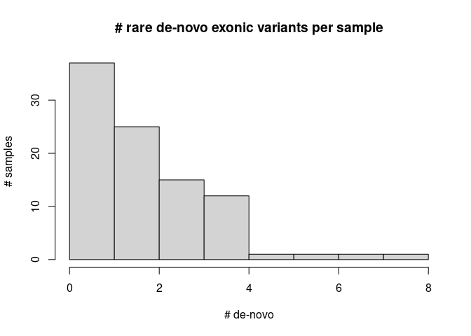

## De-novo variants

Analysis of de-novo variants from 93 child-parents trios

### Impact of the variants

Genic variants fall into LOW, MODERATE, and HIGH categories

| impact   |     n |
|:---------|------:|
| HIGH     |     8 |
| LOW      |    72 |
| MODERATE |   114 |
| MODIFIER | 32045 |

Counts per sample

| impact   |        mean | min | max |
|:---------|------------:|----:|----:|
| HIGH     |   0.0860215 |   0 |   1 |
| LOW      |   0.7741935 |   0 |   3 |
| MODERATE |   1.2258065 |   0 |   6 |
| MODIFIER | 344.5698925 | 280 | 456 |

### Consequence counts

| conseq                                                             |     n |
|:-------------------------------------------------------------------|------:|
| 3_prime_UTR_variant                                                |   180 |
| 3_prime_UTR_variant,NMD_transcript_variant                         |     3 |
| 5_prime_UTR_variant                                                |    32 |
| downstream_gene_variant                                            |  2147 |
| intergenic_variant                                                 | 11338 |
| intron_variant                                                     | 10357 |
| intron_variant,NMD_transcript_variant                              |   154 |
| intron_variant,non_coding_transcript_variant                       |  4407 |
| missense_variant                                                   |   113 |
| missense_variant,splice_region_variant                             |     1 |
| non_coding_transcript_exon_variant                                 |   255 |
| regulatory_region_variant                                          |   881 |
| splice_acceptor_variant                                            |     1 |
| splice_acceptor_variant,non_coding_transcript_variant              |     1 |
| splice_donor_variant                                               |     1 |
| splice_donor_variant,non_coding_transcript_variant                 |     1 |
| splice_region_variant,5_prime_UTR_variant                          |     1 |
| splice_region_variant,intron_variant                               |    12 |
| splice_region_variant,intron_variant,non_coding_transcript_variant |     5 |
| splice_region_variant,synonymous_variant                           |     1 |
| stop_gained                                                        |     4 |
| synonymous_variant                                                 |    53 |
| TF_binding_site_variant                                            |    75 |
| upstream_gene_variant                                              |  2216 |

| conseq                                                             |   n |
|:-------------------------------------------------------------------|----:|
| missense_variant                                                   | 113 |
| missense_variant,splice_region_variant                             |   1 |
| splice_acceptor_variant                                            |   1 |
| splice_acceptor_variant,non_coding_transcript_variant              |   1 |
| splice_donor_variant                                               |   1 |
| splice_donor_variant,non_coding_transcript_variant                 |   1 |
| splice_region_variant,5_prime_UTR_variant                          |   1 |
| splice_region_variant,intron_variant                               |  12 |
| splice_region_variant,intron_variant,non_coding_transcript_variant |   5 |
| splice_region_variant,synonymous_variant                           |   1 |
| stop_gained                                                        |   4 |
| synonymous_variant                                                 |  53 |

### Rare coding de-novo per-sample

|     mean | min | max |
|---------:|----:|----:|
| 2.086022 |   0 |   8 |

