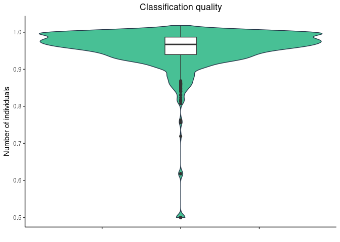
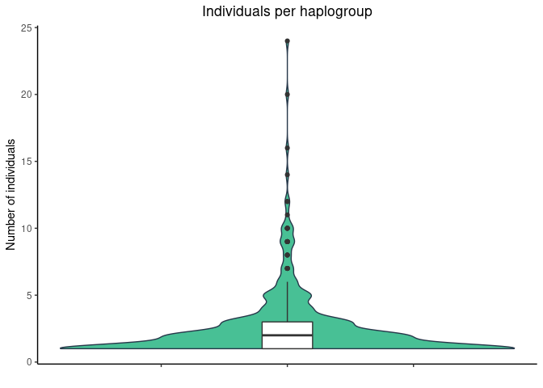
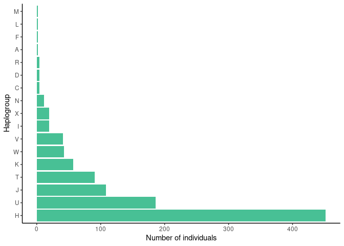

Variants in disease causing genes
================

    ## Warning: Removed 2 rows containing non-finite values (stat_ydensity).

    ## Warning: Removed 2 rows containing non-finite values (stat_boxplot).

<!-- --><!-- --><!-- -->
