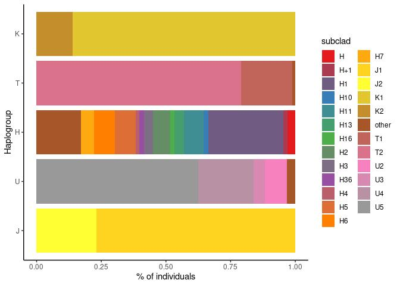

Haplogroups
================

1.  Classification quality

<!-- -->

    ## Warning: Removed 2 rows containing non-finite values (stat_ydensity).

    ## Warning: Removed 2 rows containing non-finite values (stat_boxplot).

<!-- -->

2.  Haplogroups distribution

<!-- -->

3.  % individuals per haplogroup

<!-- -->

4.  Subclades

<!-- -->

    ## `summarise()` has grouped output by 'Haplogroup'. You can override using the `.groups` argument.
    ## `summarise()` has grouped output by 'Haplogroup'. You can override using the `.groups` argument.

<!-- -->
