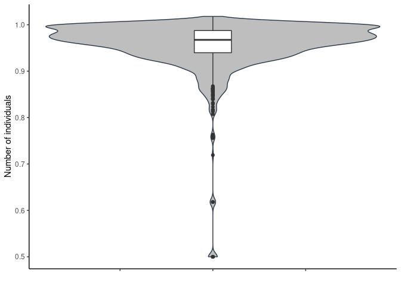
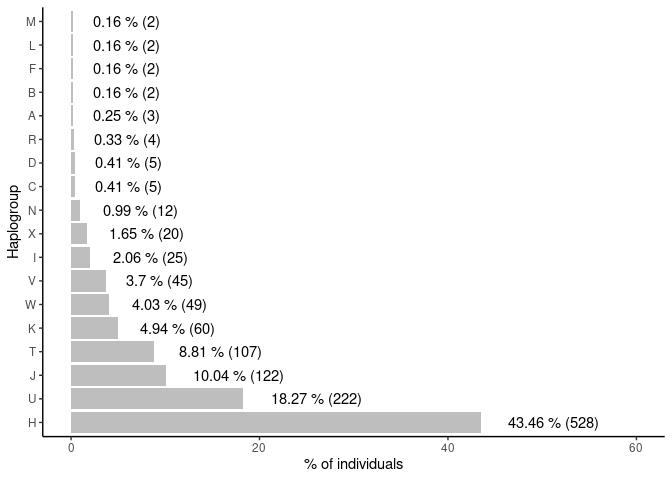
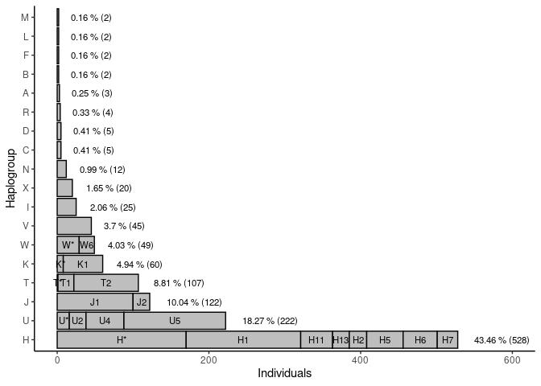

Haplogroups
================

1.  Classification quality

<!-- -->

    ## Warning: Removed 2 rows containing non-finite values (stat_ydensity).

    ## Warning: Removed 2 rows containing non-finite values (stat_boxplot).

<!-- -->

``` r
haplo_summary <- haplo_input %>% filter(Quality > 0.80) %>% 
                 group_by(clad) %>% 
                 summarise(n=n()) %>% arrange(n)

haplo_summary$n_perc <- (haplo_summary$n/sum(haplo_summary$n)) * 100
```

2.  % individuals per haplogroup

<!-- -->

4.  Subclades

<!-- -->

    ## `summarise()` has grouped output by 'subclad'. You can override using the `.groups` argument.

    ## `summarise()` has grouped output by 'clad'. You can override using the `.groups` argument.

    ## `summarise()` has grouped output by 'clad', 'subclad'. You can override using the `.groups` argument.

<!-- -->
