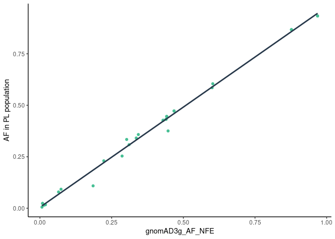
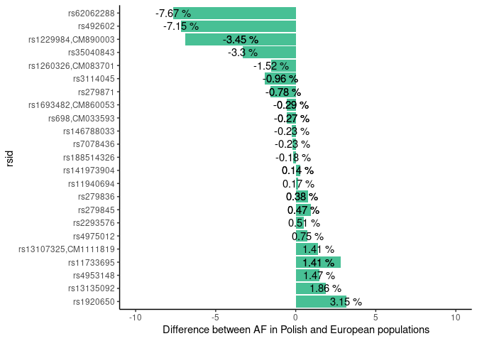

Alcohol metabolism
================

Known variants related to alcohol metabolism

| Existing\_variation  | Location       | PL\_AF | AF\_NFE | nfe\_diff |
|:---------------------|:---------------|-------:|--------:|----------:|
| rs62062288           | chr17:46019187 |  0.109 |   0.185 |    -0.077 |
| rs492602             | chr19:48703160 |  0.375 |   0.447 |    -0.071 |
| rs1229984,CM890003   | chr4:99318162  |  0.934 |   0.968 |    -0.034 |
| rs1229984,CM890003   | chr4:99318162  |  0.934 |   0.968 |    -0.034 |
| rs35040843           | chr8:92329269  |  0.253 |   0.286 |    -0.033 |
| rs1260326,CM083701   | chr2:27508073  |  0.585 |   0.601 |    -0.015 |
| rs3114045            | chr4:99331403  |  0.867 |   0.877 |    -0.010 |
| rs3114045            | chr4:99331403  |  0.867 |   0.877 |    -0.010 |
| rs279871             | chr4:46303716  |  0.432 |   0.440 |    -0.008 |
| rs279871             | chr4:46303716  |  0.432 |   0.440 |    -0.008 |
| rs698,CM033593       | chr4:99339632  |  0.427 |   0.430 |    -0.003 |
| rs1693482,CM860053   | chr4:99342808  |  0.427 |   0.430 |    -0.003 |
| rs698,CM033593       | chr4:99339632  |  0.427 |   0.430 |    -0.003 |
| rs1693482,CM860053   | chr4:99342808  |  0.427 |   0.430 |    -0.003 |
| rs146788033          | chr4:99019987  |  0.017 |   0.019 |    -0.002 |
| rs188514326          | chr4:100261610 |  0.005 |   0.007 |    -0.002 |
| rs7078436            | chr10:30089934 |  0.309 |   0.311 |    -0.002 |
| rs141973904          | chr4:99341085  |  0.015 |   0.013 |     0.001 |
| rs141973904          | chr4:99341085  |  0.015 |   0.013 |     0.001 |
| rs11940694           | chr4:39413373  |  0.604 |   0.603 |     0.002 |
| rs279836             | chr4:46337053  |  0.446 |   0.442 |     0.004 |
| rs279836             | chr4:46337053  |  0.446 |   0.442 |     0.004 |
| rs279845             | chr4:46327706  |  0.472 |   0.468 |     0.005 |
| rs2293576            | chr11:47413435 |  0.341 |   0.336 |     0.005 |
| rs279845             | chr4:46327706  |  0.472 |   0.468 |     0.005 |
| rs4975012            | chr4:39421892  |  0.230 |   0.223 |     0.007 |
| rs11733695           | chr4:99201759  |  0.023 |   0.009 |     0.014 |
| rs13107325,CM1111819 | chr4:102267552 |  0.079 |   0.065 |     0.014 |
| rs11733695           | chr4:99201759  |  0.023 |   0.009 |     0.014 |
| rs4953148            | chr2:44925383  |  0.358 |   0.343 |     0.015 |
| rs13135092           | chr4:102276925 |  0.092 |   0.074 |     0.019 |
| rs1920650            | chr3:160617800 |  0.334 |   0.302 |     0.032 |

Top 10 and bottom 10 differences between AF in PL and gnomAD Non Finnish
European

| Existing\_variation | Location                |    PL\_AF | gnomADg\_AF\_NFE | Association |  nfe\_diff |
|:--------------------|:------------------------|----------:|-----------------:|:------------|-----------:|
| rs185596576         | chr21:37757016          | 0.0017401 |        1.0000000 | unconfirmed | -0.9982599 |
| rs34323784          | chr7:70577809           | 0.0005302 |        0.7796300 | unconfirmed | -0.7790998 |
| rs34025736          | chr4:46265393-46265394  | 0.0010661 |        0.5052230 | unconfirmed | -0.5041569 |
| rs1422852714        | chr7:70585877-70585878  | 0.0084836 |        0.5038460 | unconfirmed | -0.4953624 |
| rs113871139         | chr21:37645960          | 0.0593849 |        0.5121050 | unconfirmed | -0.4527201 |
| rs1481474613        | chr7:70071991-70071992  | 0.0005302 |        0.4500000 | unconfirmed | -0.4494698 |
| rs796232263         | chr21:37614388-37614389 | 0.0005319 |        0.3347600 | unconfirmed | -0.3342281 |
| rs200172179         | chr7:69870446-69870447  | 0.0301974 |        0.3590650 | unconfirmed | -0.3288676 |
| rs199953817         | chr4:99137137-99137138  | 0.3052020 |        0.5716250 | unconfirmed | -0.2664230 |
| rs113587330         | chr21:37731100-37731101 | 0.0005302 |        0.2465210 | unconfirmed | -0.2459908 |
| rs1310244526        | chr21:38106141          | 0.9483870 |        0.7169780 | unconfirmed |  0.2314090 |
| rs555099546         | chr21:37688370-37688371 | 0.2941180 |        0.0524927 | unconfirmed |  0.2416253 |
| rs3787815           | chr21:37688381          | 0.3657460 |        0.1166510 | unconfirmed |  0.2490950 |
| rs3787816           | chr21:37688382          | 0.2658860 |        0.0026563 | unconfirmed |  0.2632297 |
| rs149812780         | chr21:37614360-37614361 | 0.2725820 |        0.0025850 | unconfirmed |  0.2699970 |
| rs73220486          | chr21:37614386          | 0.2797430 |        0.0067188 | unconfirmed |  0.2730243 |
| rs2898318           | chr21:37614388          | 0.2776600 |        0.0030666 | unconfirmed |  0.2745934 |
| rs62221628          | chr21:37685596          | 0.7216610 |        0.4086290 | unconfirmed |  0.3130320 |
| rs324611            | chr7:136973668          | 0.9453290 |        0.0920783 | unconfirmed |  0.8532507 |
| rs324609            | chr7:136973606          | 0.8727970 |        0.0013161 | unconfirmed |  0.8714809 |

<!-- ```{r echo=FALSE, message=F} -->
<!-- af_comp %>%  -->
<!--   ggplot(aes(y=PL_AF,x=EUR_AF)) + geom_point(col='#27384A') +  -->
<!--   geom_smooth(method='lm',se = F,col='#48C095') + theme_classic() +  -->
<!--   xlab('AF in 1000 Genomes EUR population') + -->
<!--   ylab('AF in PL population') +  -->
<!--   ggtitle('Polish vs 1000 genomes European') + -->
<!--   theme(plot.title = element_text(hjust = 0.5)) -->
<!-- ``` -->
1.  Polish vs gnomAD Non-Finnish European for 29520 variants in genes:

| SYMBOL  | variants |
|:--------|---------:|
| ADH1A   |      251 |
| ADH1B   |      789 |
| ADH1C   |      420 |
| ADH4    |      660 |
| ADH5    |      377 |
| ADH6    |      258 |
| ADH7    |      433 |
| ALDH1A1 |     1930 |
| ALDH2   |      594 |
| AUTS2   |    12998 |
| CHRM2   |     1843 |
| GABRA2  |     2652 |
| KCNJ6   |     6315 |

<!-- -->

2.  Polish vs gnomAD Non-Finnish European for 23 variants with know
    association:

<!-- -->

3.  Top 10 and bottom 10 between Polish and gnomAD Non Finnish European
    for all genes

<!-- -->

4.  Differences between Polish and gnomAD Non Finnish European for
    associated variants

<!-- -->
