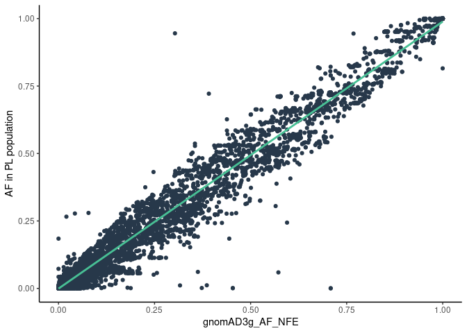
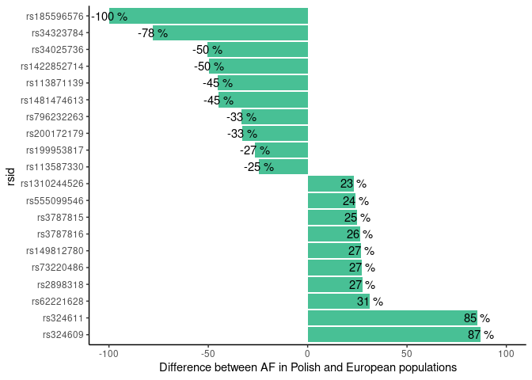

Alcohol metabolism
================

<!-- Top 10 and bottom 10 differences between AF in PL and 1000 Genomes European -->
<!-- ```{r echo=FALSE} -->
<!-- kable(af_outlier_1k %>%  -->
<!--         mutate(PL_AF =  round(af_outlier_1k$PL_AF,2), -->
<!--                EUR_AF = round(af_outlier_1k$EUR_AF,2), -->
<!--                eur_diff = round(af_outlier_1k$eur_diff,2)) %>% -->
<!--         arrange(eur_diff) -->
<!--         ) -->
<!-- ``` -->

Known variants related to alcohol metabolism

| Existing\_variation | SYMBOL | Allele | PL\_AF | AF\_NFE | CLIN\_SIG    | nfe\_diff |
|:--------------------|:-------|:-------|-------:|--------:|:-------------|----------:|
| rs11733695          | ADH6   | A      |   0.02 |    0.01 | \-           |      0.01 |
| rs279871            | GABRA2 | C      |   0.43 |    0.38 | risk\_factor |      0.05 |
| rs279845            | GABRA2 | A      |   0.47 |    0.41 | risk\_factor |      0.07 |
| rs279836            | GABRA2 | A      |   0.45 |    0.38 | risk\_factor |      0.07 |

Top 10 and bottom 10 differences between AF in PL and gnomAD Non Finnish
European

| Existing\_variation | SYMBOL  | Allele   | VARIANT\_CLASS | PL\_AF | AF\_NFE | nfe\_diff |
|:--------------------|:--------|:---------|:---------------|-------:|--------:|----------:|
| rs34323784          | AUTS2   | \-       | deletion       |   0.00 |    0.71 |     -0.71 |
| rs113871139         | KCNJ6   | A        | SNV            |   0.06 |    0.57 |     -0.51 |
| rs34025736          | GABRA2  | AC       | insertion      |   0.00 |    0.45 |     -0.45 |
| rs75795377          | KCNJ6   | A        | SNV            |   0.01 |    0.39 |     -0.37 |
| rs145670479         | KCNJ6   | TGTGTGTG | insertion      |   0.00 |    0.37 |     -0.37 |
| rs374324696         | AUTS2   | \-       | deletion       |   0.24 |    0.59 |     -0.35 |
| rs6951599           | AUTS2   | A        | SNV            |   0.01 |    0.32 |     -0.31 |
| rs6947326           | AUTS2   | C        | SNV            |   0.06 |    0.36 |     -0.30 |
| rs1169607163        | ALDH1A1 | \-       | deletion       |   0.94 |    0.77 |      0.18 |
| rs7805341           | AUTS2   | T        | SNV            |   0.54 |    0.36 |      0.18 |
| rs2851299           | ADH1C   | C        | SNV            |   0.43 |    0.25 |      0.18 |
| rs1539905           | KCNJ6   | C        | SNV            |   0.18 |    0.00 |      0.18 |
| rs2178044           | AUTS2   | C        | SNV            |   0.63 |    0.44 |      0.19 |
| rs73220486          | KCNJ6   | C        | SNV            |   0.28 |    0.08 |      0.20 |
| rs2898318           | KCNJ6   | G        | SNV            |   0.28 |    0.04 |      0.23 |
| rs3787816           | KCNJ6   | T        | SNV            |   0.27 |    0.02 |      0.25 |
| rs62221628          | KCNJ6   | T        | SNV            |   0.72 |    0.39 |      0.33 |
| rs324611            | CHRM2   | C        | SNV            |   0.95 |    0.30 |      0.64 |

<!-- ```{r echo=FALSE, message=F} -->
<!-- af_comp %>%  -->
<!--   ggplot(aes(y=PL_AF,x=EUR_AF)) + geom_point(col='#27384A') +  -->
<!--   geom_smooth(method='lm',se = F,col='#48C095') + theme_classic() +  -->
<!--   xlab('AF in 1000 Genomes EUR population') + -->
<!--   ylab('AF in PL population') +  -->
<!--   ggtitle('Polish vs 1000 genomes European') + -->
<!--   theme(plot.title = element_text(hjust = 0.5)) -->
<!-- ``` -->
Polish vs gnomAD Non-Finnish European

<!-- -->

<!-- af_outlier_1k %>% -->
<!--   ggplot(aes(x=eur_diff,y = reorder(Existing_variation,-eur_diff))) +  -->
<!--   geom_bar(stat = 'identity',fill='#48C095') + theme_classic() + -->
<!--   ylab('rsid ') + xlab('Difference between Polish and 1000 Genomes European populations') + -->
<!--   ggtitle('Top 10 and bottom 10 between Polish and 1000 Genomes European') + -->
<!--   theme(plot.title = element_text(hjust = 0.5)) + -->
<!--   xlim(c(-1,1)) -->

Top 10 and bottom 10 between Polish and gnomAD Non Finnish European

<!-- -->
