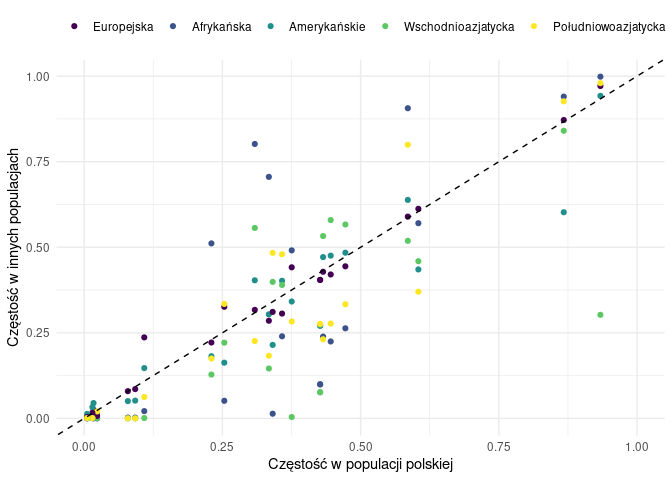

Alcohol metabolism
================

<!-- -->

Wykres korelacji częstości wariantów pomiędzy populacją polską, a
populacjami 1000genomes. Zielone pole oznacza warianty występujące
częściej u Polaków niż reszty świata, czerwone - warianty występujące u
Polaków rzadziej

<!-- -->

Wykres korelacji częstości wariantów pomiędzy populacją polską, a
populacjami 1000genomes. Warianty poniżej przekątnej występują częściej
u Polaków niż reszty populacji

Warianty powiązane z metabolizmem alkoholu

| Existing\_variation  | Allele |    PL\_AF | AFR\_AF | AMR\_AF | EAS\_AF | EUR\_AF | SAS\_AF |
|:---------------------|:-------|----------:|--------:|--------:|--------:|--------:|--------:|
| rs1260326,CM083701   | C      | 0.5853660 |  0.9062 |  0.6383 |  0.5188 |  0.5895 |  0.7996 |
| rs4953148            | T      | 0.3579000 |  0.2398 |  0.4020 |  0.3899 |  0.3062 |  0.4796 |
| rs1920650            | C      | 0.3340400 |  0.7057 |  0.3040 |  0.1458 |  0.2853 |  0.1830 |
| rs11940694           | G      | 0.6044540 |  0.5703 |  0.4352 |  0.4593 |  0.6123 |  0.3701 |
| rs4975012            | A      | 0.2301170 |  0.5113 |  0.1816 |  0.1280 |  0.2217 |  0.1748 |
| rs279871             | C      | 0.4321310 |  0.2390 |  0.4712 |  0.5327 |  0.4284 |  0.2311 |
| rs279845             | A      | 0.4724280 |  0.2632 |  0.4841 |  0.5665 |  0.4443 |  0.3333 |
| rs279836             | A      | 0.4459170 |  0.2247 |  0.4755 |  0.5794 |  0.4205 |  0.2771 |
| rs146788033          | G      | 0.0169671 |  0.0000 |  0.0447 |  0.0010 |  0.0249 |  0.0031 |
| rs11733695           | A      | 0.0233298 |  0.0000 |  0.0159 |  0.0010 |  0.0070 |  0.0204 |
| rs1229984,CM890003   | C      | 0.9337220 |  0.9985 |  0.9424 |  0.3026 |  0.9712 |  0.9796 |
| rs3114045            | C      | 0.8674440 |  0.9402 |  0.6023 |  0.8403 |  0.8718 |  0.9264 |
| rs698,CM033593       | C      | 0.4268290 |  0.0991 |  0.2709 |  0.0764 |  0.4046 |  0.2761 |
| rs141973904          | T      | 0.0148462 |  0.0008 |  0.0331 |  0.0010 |  0.0159 |  0.0010 |
| rs1693482,CM860053   | T      | 0.4267520 |  0.0998 |  0.2709 |  0.0764 |  0.4046 |  0.2751 |
| rs188514326          | C      | 0.0053022 |  0.0000 |  0.0130 |  0.0000 |  0.0040 |  0.0010 |
| rs13107325,CM1111819 | T      | 0.0790032 |  0.0023 |  0.0504 |  0.0000 |  0.0795 |  0.0000 |
| rs13135092           | G      | 0.0922588 |  0.0023 |  0.0519 |  0.0000 |  0.0855 |  0.0000 |
| rs35040843           | T      | 0.2534460 |  0.0514 |  0.1628 |  0.2212 |  0.3260 |  0.3344 |
| rs7078436            | G      | 0.3085900 |  0.8018 |  0.4035 |  0.5565 |  0.3171 |  0.2260 |
| rs2293576            | A      | 0.3409330 |  0.0136 |  0.2147 |  0.3988 |  0.3111 |  0.4836 |
| rs62062288           | A      | 0.1086960 |  0.0212 |  0.1470 |  0.0010 |  0.2366 |  0.0624 |
| rs492602             | G      | 0.3753980 |  0.4909 |  0.3415 |  0.0040 |  0.4414 |  0.2832 |

<!-- 2. Polish vs gnomAD Non-Finnish European for 23 variants with know association: -->
<!-- ```{r known_variants_plot, echo=FALSE} -->
<!-- alko_df %>% filter(Association=='confirmed') %>% -->
<!--   ggplot(aes(y=PL_AF,x=as.numeric(EUR_AF))) +  -->
<!--   geom_point(col="#48C095") +  -->
<!--   geom_smooth(method = 'lm',se=F,col='#27384A',formula = 'y~x') + -->
<!--   theme_classic() +  -->
<!--   xlab('gnomAD3g_AF_NFE') + -->
<!--   ylab('AF in PL population')  -->
<!-- ``` -->
<!-- \newpage -->
<!-- 3. Top 10 and bottom 10 between Polish and gnomAD Non Finnish European for all genes -->
<!-- ```{r, 10_diff_barplot, echo=FALSE, message=F} -->
<!-- af_outlier_gnomad %>% -->
<!--   ggplot(aes(x=nfe_diff*100,y = reorder(Existing_variation,-nfe_diff*100))) +  -->
<!--   geom_bar(stat = 'identity',fill='#48C095') + theme_classic() + -->
<!--   ylab('rsid ') + xlab('Difference between AF in Polish and European populations') + -->
<!--   geom_text(aes(label=paste(round(nfe_diff*100),'%'))) + -->
<!--   xlim(c(-100,100)) -->
<!-- ``` -->
<!-- \newpage -->
<!-- 4. Differences between Polish and gnomAD Non Finnish European for associated variants -->
<!-- ```{r, known_diff_barplot, echo=FALSE, message=F} -->
<!-- alko_df%>% filter(Association=='confirmed') %>% -->
<!--   ggplot(aes(x=nfe_diff*100,y = reorder(Existing_variation,-nfe_diff*100))) +  -->
<!--   geom_bar(stat = 'identity',fill='#48C095') + theme_classic() + -->
<!--   ylab('rsid ') + xlab('Difference between AF in Polish and European populations') + -->
<!--   geom_text(aes(label=paste(round(nfe_diff*100,2),'%'))) + -->
<!--   xlim(c(-10,10)) -->
<!-- ``` -->
