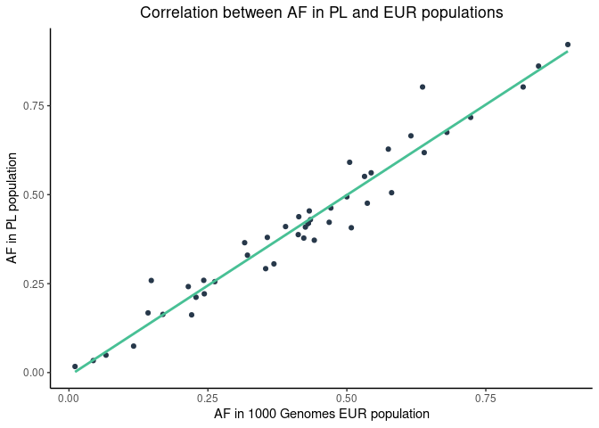
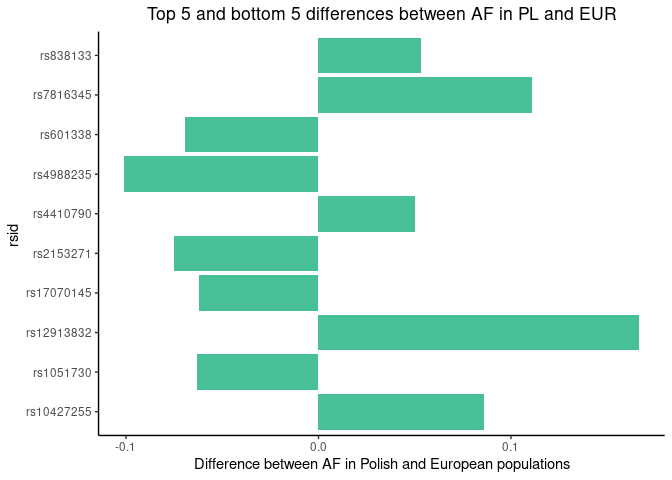
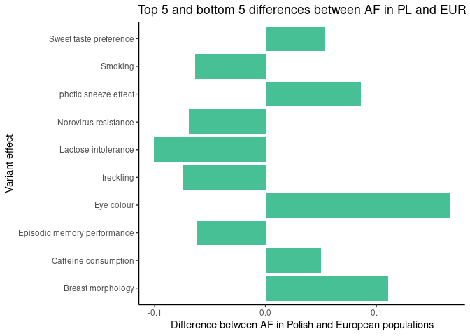

Top 5 and bottom 5 differences between AF in PL and EUR

|rsid       |REF |ALT |effect                      |CLIN_SIG                  |IMPACT   |    PL_AF| EUR_AF|  eur_diff|
|:----------|:---|:---|:---------------------------|:-------------------------|:--------|--------:|------:|---------:|
|rs4988235  |G   |A   |Lactose intolerance         |association               |MODIFIER | 0.407116| 0.5080| -0.100884|
|rs2153271  |C   |T   |freckling                   |-                         |MODIFIER | 0.505545| 0.5805| -0.074955|
|rs601338   |G   |A   |Norovirus resistance        |association,benign        |HIGH     | 0.371996| 0.4414| -0.069404|
|rs1051730  |G   |A   |Smoking                     |risk_factor,drug_response |LOW      | 0.305453| 0.3688| -0.063347|
|rs17070145 |C   |T   |Episodic memory performance |association               |MODIFIER | 0.292052| 0.3539| -0.061848|
|rs4410790  |T   |C   |Caffeine consumption        |-                         |MODIFIER | 0.665434| 0.6153|  0.050134|
|rs838133   |A   |G   |Sweet taste preference      |-                         |LOW      | 0.628004| 0.5746|  0.053404|
|rs10427255 |C   |T   |photic sneeze effect        |-                         |MODIFIER | 0.591035| 0.5050|  0.086035|
|rs7816345  |C   |T   |Breast morphology           |-                         |MODIFIER | 0.258780| 0.1481|  0.110680|
|rs12913832 |A   |G   |Eye colour                  |association               |MODIFIER | 0.802680| 0.6362|  0.166480|

<!-- --><!-- --><!-- -->
