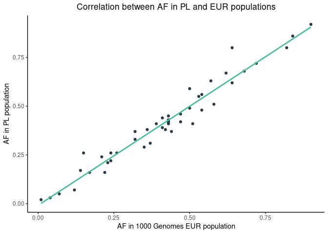
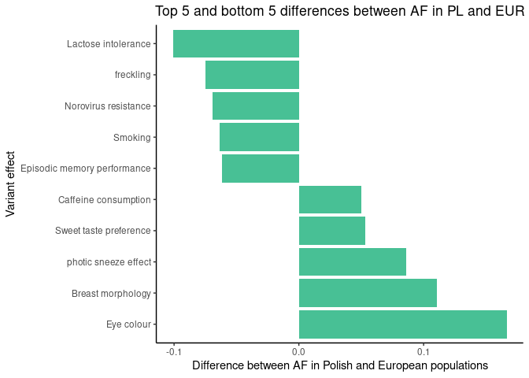

Lifestyle\_variants
================

Top 5 and bottom 5 differences between AF in PL and EUR

| rsid       | REF | ALT | effect                      |   PL\_AF | EUR\_AF | eur\_diff |
|:-----------|:----|:----|:----------------------------|---------:|--------:|----------:|
| rs4988235  | G   | A   | Lactose intolerance         | 0.407116 |  0.5080 | -0.100884 |
| rs2153271  | C   | T   | freckling                   | 0.505545 |  0.5805 | -0.074955 |
| rs601338   | G   | A   | Norovirus resistance        | 0.371996 |  0.4414 | -0.069404 |
| rs1051730  | G   | A   | Smoking                     | 0.305453 |  0.3688 | -0.063347 |
| rs17070145 | C   | T   | Episodic memory performance | 0.292052 |  0.3539 | -0.061848 |
| rs4410790  | T   | C   | Caffeine consumption        | 0.665434 |  0.6153 |  0.050134 |
| rs838133   | A   | G   | Sweet taste preference      | 0.628004 |  0.5746 |  0.053404 |
| rs10427255 | C   | T   | photic sneeze effect        | 0.591035 |  0.5050 |  0.086035 |
| rs7816345  | C   | T   | Breast morphology           | 0.258780 |  0.1481 |  0.110680 |
| rs12913832 | A   | G   | Eye colour                  | 0.802680 |  0.6362 |  0.166480 |

<!-- --><!-- --><!-- -->
