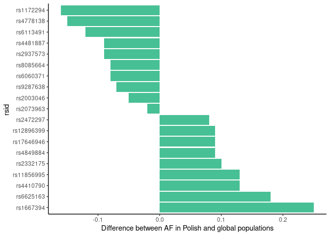

Lifestyle\_variants
================

Top 10 and bottom 10 differences

| Existing\_variation | Allele | effect                               | PL\_AF | gnomAD3g\_AF | world\_diff |
|:--------------------|:-------|:-------------------------------------|-------:|-------------:|------------:|
| rs1172294           | G      | Childhood and adolescent growth rate |   0.42 |         0.58 |       -0.16 |
| rs4778138           | G      | freckling                            |   0.16 |         0.31 |       -0.15 |
| rs6113491           | C      | Male Pattern Baldness                |   0.46 |         0.58 |       -0.12 |
| rs4481887           | G      | asparagus anosmia                    |   0.71 |         0.80 |       -0.09 |
| rs2937573           | A      | Sensitivity to the sound of chewing  |   0.55 |         0.64 |       -0.09 |
| rs6060371           | T      | Height                               |   0.41 |         0.49 |       -0.08 |
| rs8085664           | A      | Male Pattern Baldness                |   0.25 |         0.33 |       -0.08 |
| rs9287638           | A      | Male Pattern Baldness                |   0.33 |         0.40 |       -0.07 |
| rs2003046           | A      | Male Pattern Baldness                |   0.21 |         0.26 |       -0.05 |
| rs2073963           | G      | Male Pattern Baldness                |   0.41 |         0.43 |       -0.02 |
| rs2472297           | T      | Caffeine consumption                 |   0.24 |         0.16 |        0.08 |
| rs12896399          | T      | Blond hair                           |   0.41 |         0.32 |        0.09 |
| rs12896399          | T      | Eye colour - modificator             |   0.41 |         0.32 |        0.09 |
| rs17646946          | A      | Hair curl                            |   0.26 |         0.17 |        0.09 |
| rs4849884           | C      | Breast morphology                    |   0.92 |         0.83 |        0.09 |
| rs2332175           | A      | Finger length                        |   0.56 |         0.46 |        0.10 |
| rs11856995          | C      | photic sneeze effect                 |   0.36 |         0.23 |        0.13 |
| rs4410790           | C      | Caffeine consumption                 |   0.67 |         0.54 |        0.13 |
| rs6625163           | A      | Male Pattern Baldness                |   0.80 |         0.62 |        0.18 |
| rs1667394           | T      | Blond hair                           |   0.86 |         0.61 |        0.25 |

Correlation between AF in PL and EUR populations

<!-- -->

Top 10 and bottom 10 differences

<!-- -->
