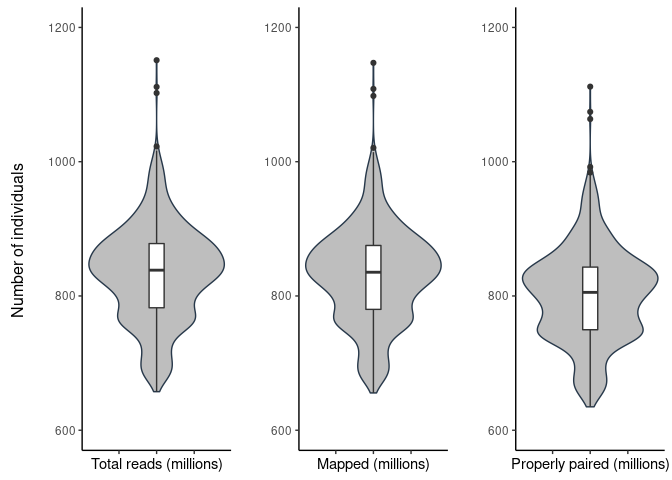

qc
================

## 1. Sequencing statistics (in millions)

| stat                    |    min | median |   mean |     max |
|:------------------------|-------:|-------:|-------:|--------:|
| flagstat\_total         | 678.45 | 844.96 | 845.01 | 1111.49 |
| mapped\_passed          | 676.71 | 841.98 | 842.18 | 1108.49 |
| properly.paired\_passed | 653.95 | 812.50 | 811.85 | 1074.30 |

<!-- -->

Total reads outliers

| sample | flagstat\_total |
|-------:|----------------:|
|     51 |        689.2717 |
|     87 |       1001.3480 |
|    599 |        994.6147 |
|    600 |       1012.2932 |
|    601 |       1001.0540 |
|    605 |       1001.4843 |
|    614 |       1111.4918 |
|    637 |       1016.6088 |
|    651 |       1003.9415 |
|    658 |       1003.2027 |
|    660 |       1022.7702 |
|    759 |       1004.9815 |
|    923 |        695.0610 |
|    944 |        680.1506 |
|    946 |        688.7022 |
|    947 |        695.3860 |
|    948 |        679.1973 |
|    949 |        685.0972 |
|    950 |        693.9583 |
|    951 |        678.4532 |
|    952 |        688.2522 |
|    953 |        681.4599 |
|    954 |        686.0841 |
|    957 |        696.3860 |
|    958 |        688.1526 |
|    960 |        693.8154 |
|    962 |        697.1672 |

### Call rate


Call rate missing outliers

| sample | F\_MISS |
|-------:|--------:|
|     40 | 0.07783 |
|     15 | 0.07784 |
|     17 | 0.07801 |
|     18 | 0.07805 |
|     22 | 0.07811 |
|      1 | 0.07812 |
|      9 | 0.07812 |
|     13 | 0.07814 |
|     37 | 0.07824 |
|      6 | 0.07827 |
|     29 | 0.07831 |
|      8 | 0.07832 |
|     31 | 0.07833 |
|     19 | 0.07834 |
|      5 | 0.07849 |
|     27 | 0.07864 |
|     35 | 0.07872 |
|     24 | 0.07880 |
|     10 | 0.07882 |
|      7 | 0.07883 |
|     21 | 0.07884 |
|     32 | 0.07888 |
|      3 | 0.07891 |
|      4 | 0.07893 |
|     16 | 0.07894 |
|     12 | 0.07895 |
|     25 | 0.07896 |
|     28 | 0.07913 |
|     34 | 0.07915 |
|     11 | 0.07917 |
|     38 | 0.07918 |
|      2 | 0.07925 |
|     30 | 0.07935 |
|     26 | 0.07943 |
|     36 | 0.07950 |
|     39 | 0.07952 |
|     14 | 0.07956 |
|     20 | 0.07998 |
|     33 | 0.08050 |
|     23 | 0.08487 |

## 2. Depth statistics

| stat                  |   min | median |  mean |   max |
|:----------------------|------:|-------:|------:|------:|
| average\_depth        | 29.09 |  35.75 | 35.72 | 45.75 |
| percentage\_above\_10 | 91.40 |  91.98 | 91.92 | 92.34 |
| percentage\_above\_20 | 85.61 |  89.27 | 89.37 | 91.27 |
| percentage\_above\_30 | 53.66 |  79.59 | 78.41 | 90.00 |

Average depth outliers

| sample | average\_depth |
|-------:|---------------:|
|     51 |          29.09 |
|    576 |          42.05 |
|    645 |          42.14 |
|    651 |          42.23 |
|    658 |          42.39 |
|    600 |          42.95 |
|    660 |          42.99 |
|    637 |          43.17 |
|    614 |          45.75 |

    ## `stat_bin()` using `bins = 30`. Pick better value with `binwidth`.

<!-- -->

<!-- -->

## 3. Per sample count (PSC)

| stat           |       min |    median |       mean |       max |
|:---------------|----------:|----------:|-----------:|----------:|
| average\_depth |      30.5 |      37.6 |      37.64 |      47.9 |
| nHets          | 2164166.0 | 2298296.5 | 2308941.86 | 2445661.0 |
| nIndels        |  797694.0 |  810671.0 |  810529.96 |  823059.0 |
| nMissing       |  140389.0 |  151153.5 |  151124.03 |  162078.0 |
| nNonRefHom     | 1468590.0 | 1573465.0 | 1570905.33 | 1634096.0 |
| nRefHom        |    1023.0 |    1164.0 |    1164.31 |    1349.0 |
| nSingletons    | 4596353.0 | 4686810.5 | 4690486.03 | 4766110.0 |
| nTransitions   | 2532633.0 | 2584326.0 | 2586966.12 | 2630499.0 |
| nTransversions | 1265629.0 | 1291660.0 | 1292881.07 | 1316387.0 |

<!-- -->

PSC outliers

| sample | nRefHom |
|-------:|--------:|
|    159 |    1023 |
|    940 |    1025 |
|    472 |    1037 |
|    486 |    1295 |
|    614 |    1349 |

| sample | nNonRefHom |
|-------:|-----------:|
|    580 |    1468590 |
|    171 |    1634096 |

| sample |   nHets |
|-------:|--------:|
|    171 | 2164166 |
|    580 | 2445661 |

<!-- ### Outlier samples reccuring in other statistics: -->
<!-- ```{r echo=FALSE} -->
<!-- final_out <- imiss_out %>%  -->
<!--   left_join(depth_out,by = "sample") %>%  -->
<!--   left_join(flagstat_out,by = "sample") %>% -->
<!--   left_join(psc_nref_out,by = "sample") %>% -->
<!--   left_join(psc_nonref_out,by = "sample") %>% -->
<!--   left_join(psc_hets_out,by = "sample")  -->
<!-- final_out <- final_out %>% filter(!is.na(average_depth) | !is.na(flagstat_total) | !is.na(nRefHom)  | -->
<!--            !is.na(nNonRefHom) | !is.na(nHets)) %>%  -->
<!--   pivot_longer(-sample)  -->
<!-- final_out$value <-  ifelse(is.na(final_out$value), -->
<!--                                    'not_outlier', -->
<!--                                    final_out$value)  -->
<!-- final_out <- final_out %>% pivot_wider() -->
<!-- kable(final_out) -->
<!-- ``` -->
