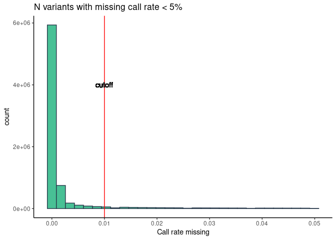
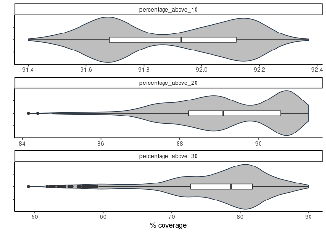

qc
================

## 1. Sequencing statistics (in millions)

| stat                    |    min | median |   mean |     max |
|:------------------------|-------:|-------:|-------:|--------:|
| flagstat\_total         | 678.45 | 844.96 | 845.01 | 1111.49 |
| mapped\_passed          | 676.71 | 841.98 | 842.18 | 1108.49 |
| properly.paired\_passed | 653.95 | 812.50 | 811.85 | 1074.30 |

<!-- -->

Total reads outliers

| sample         | flagstat\_total |
|:---------------|----------------:|
| 180\_20770\_20 |        689.2717 |
| 262\_22542\_20 |       1001.3480 |
| COV237X052A    |        994.6147 |
| COV238Y053B    |       1012.2932 |
| COV239X053B    |       1001.0540 |
| COV247X054B    |       1001.4843 |
| COV258X060B    |       1111.4918 |
| COV288X073A    |       1016.6088 |
| COV306Y080B    |       1003.9415 |
| COV313Y083A    |       1003.2027 |
| COV315Y083A    |       1022.7702 |
| COV428X126B    |       1004.9815 |
| COV623X206B    |        695.0610 |
| COV645Y214A    |        680.1506 |
| COV647Y215B    |        688.7022 |
| COV648X215A    |        695.3860 |
| COV649Y215A    |        679.1973 |
| COV650Y216B    |        685.0972 |
| COV651X216A    |        693.9583 |
| COV652X216A    |        678.4532 |
| COV653Y217A    |        688.2522 |
| COV654X217A    |        681.4599 |
| COV655X217B    |        686.0841 |
| COV658X219A    |        696.3860 |
| COV659Y219B    |        688.1526 |
| COV661X220A    |        693.8154 |
| COV663X221B    |        697.1672 |

### Call rate

<!-- -->

    ## `stat_bin()` using `bins = 30`. Pick better value with `binwidth`.

<!-- -->

Call rate missing outliers

| sample           | F\_MISS |
|:-----------------|--------:|
| COV747Y253B      | 0.07783 |
| 323-PORCOVKOM    | 0.07784 |
| 327\_PORCOV\_KOM | 0.07801 |
| 328\_PORCOV\_KOM | 0.07805 |
| 35\_19267\_20    | 0.07811 |
| 147\_PorCOV\_KOM | 0.07812 |
| 24\_PorCOV       | 0.07812 |
| 309-PORCOVKOM    | 0.07814 |
| COV744Y252A      | 0.07824 |
| 22\_PorCOV\_KOM  | 0.07827 |
| COV733X247A      | 0.07831 |
| 231\_PorCOV\_KOM | 0.07832 |
| COV738Y250A      | 0.07833 |
| 340-PORCOVKOM    | 0.07834 |
| 2041\_COVID      | 0.07849 |
| COV731X246A      | 0.07864 |
| COV742Y252B      | 0.07872 |
| COV704X237B      | 0.07880 |
| 304-PORCOVKOM    | 0.07882 |
| 231\_COV99\_20   | 0.07883 |
| 342-PORCOVKOM    | 0.07884 |
| COV739X250B      | 0.07888 |
| 19\_PorCOV\_KOM  | 0.07891 |
| 20\_PorCOV\_KOM  | 0.07893 |
| 324-PORCOVKOM    | 0.07894 |
| 308\_PORCOV\_KOM | 0.07895 |
| COV706Y237A      | 0.07896 |
| COV732Y247B      | 0.07913 |
| COV741X251A      | 0.07915 |
| 306-PORCOVKOM    | 0.07917 |
| COV745Y253A      | 0.07918 |
| 180\_20770\_20   | 0.07925 |
| COV737X249B      | 0.07935 |
| COV730X246B      | 0.07943 |
| COV743X252A      | 0.07950 |
| COV746X253B      | 0.07952 |
| 322-PORCOVKOM    | 0.07956 |
| 341-PORCOVKOM    | 0.07998 |
| COV740Y251B      | 0.08050 |
| COV215X042A      | 0.08487 |

## 2. Depth statistics

| stat                  |   min | median |  mean |   max |
|:----------------------|------:|-------:|------:|------:|
| average\_depth        | 29.09 |  35.75 | 35.72 | 45.75 |
| percentage\_above\_10 | 91.40 |  91.98 | 91.92 | 92.34 |
| percentage\_above\_20 | 85.61 |  89.27 | 89.37 | 91.27 |
| percentage\_above\_30 | 53.66 |  79.59 | 78.41 | 90.00 |

Average depth outliers

| sample         | average\_depth |
|:---------------|---------------:|
| 180\_20770\_20 |          29.09 |
| COV208X039A    |          42.05 |
| COV299X077A    |          42.14 |
| COV306Y080B    |          42.23 |
| COV313Y083A    |          42.39 |
| COV238Y053B    |          42.95 |
| COV315Y083A    |          42.99 |
| COV288X073A    |          43.17 |
| COV258X060B    |          45.75 |

<!-- -->

<!-- -->

## 3. Per sample count (PSC)

| stat           |       min |    median |       mean |       max |
|:---------------|----------:|----------:|-----------:|----------:|
| average\_depth |      30.5 |      37.6 |      37.64 |      47.9 |
| nHets          | 2164166.0 | 2298296.5 | 2308941.86 | 2445661.0 |
| nIndels        |  797694.0 |  810671.0 |  810529.96 |  823059.0 |
| nMissing       |  140389.0 |  151153.5 |  151124.03 |  162078.0 |
| nNonRefHom     | 1468590.0 | 1573465.0 | 1570905.33 | 1634096.0 |
| nRefHom        |    1023.0 |    1164.0 |    1164.31 |    1349.0 |
| nSingletons    | 4596353.0 | 4686810.5 | 4690486.03 | 4766110.0 |
| nTransitions   | 2532633.0 | 2584326.0 | 2586966.12 | 2630499.0 |
| nTransversions | 1265629.0 | 1291660.0 | 1292881.07 | 1316387.0 |

<!-- -->

PSC outliers

| sample         | nRefHom |
|:---------------|--------:|
| 365\_23988\_20 |    1023 |
| COV641Y213A    |    1025 |
| COV031K        |    1037 |
| COV045K        |    1295 |
| COV258X060B    |    1349 |

| sample         | nNonRefHom |
|:---------------|-----------:|
| COV215X042A    |    1468590 |
| 389\_24332\_20 |    1634096 |

| sample         |   nHets |
|:---------------|--------:|
| 389\_24332\_20 | 2164166 |
| COV215X042A    | 2445661 |

### Outlier samples reccuring in other statistics:

| sample         | F\_MISS | average\_depth | flagstat\_total | nRefHom      | nNonRefHom   | nHets        |
|:---------------|:--------|:---------------|:----------------|:-------------|:-------------|:-------------|
| 180\_20770\_20 | 0.07925 | 29.09          | 689.271743      | not\_outlier | not\_outlier | not\_outlier |
| COV215X042A    | 0.08487 | not\_outlier   | not\_outlier    | not\_outlier | 1468590      | 2445661      |

<!-- ## 4. ROHs -->
<!-- Summary -->
<!-- ```{r echo=FALSE} -->
<!-- roh <- fread('input/roh_concat.txt', showProgress = T) -->
<!-- colnames(roh) <- c("Chromosome", "Start", 'End', 'Length', 'Number_of_markers', 'Quality','sample_id') -->
<!-- roh$sample_id <-gsub(".*/(.*)\\..*", "\\1", roh$sample_id) -->
<!-- kable(roh %>% select(Length,Number_of_markers,Quality) %>% -->
<!--   pivot_longer(cols = everything(), names_to = 'stat',values_to = 'value') %>% -->
<!--   group_by(stat) %>%  -->
<!--   summarise(min = round(min(value),2),median=round(median(value),2),mean=round(mean(value),2), -->
<!--             max=round(max(value),2)) -->
<!-- ) -->
<!-- ``` -->
<!-- ```{r echo=FALSE} -->
<!-- roh  %>% ggplot(aes(x=1,y=Quality)) +  -->
<!--     geom_violin(fill='#48C095', col='#27384A') +  -->
<!--   geom_boxplot(width=0.1) + -->
<!--      theme_classic() + theme(axis.text.x = element_blank()) + -->
<!--   ggtitle('ROHs quality histogram') +  -->
<!--   theme(plot.title = element_text(hjust = 0.5)) + -->
<!--   xlab('') -->
<!-- ``` -->
<!-- ```{r roh, echo=FALSE}  -->
<!-- test1 <- roh$Length > 5e+06  -->
<!-- test2 <- roh$Length < 25000 -->
<!-- roh <- roh %>%  -->
<!--     mutate(group = case_when(test1 ~ ">5Mb",  -->
<!--                              (test2) ~ "<25Kb" ,  -->
<!--                              !test1 & !test2 ~ "25Kb-5Mb"  -->
<!--     )) -->
<!-- roh  %>%  -->
<!--   ggplot(aes(x=1,y=Length)) +  -->
<!--     geom_violin(fill='#48C095', col='#27384A') + geom_boxplot(width=0.1) + -->
<!--      theme_classic() + theme(axis.text.x = element_blank()) +  -->
<!--   facet_wrap(~group, ncol=3, scales = 'free_y') + xlab('') + -->
<!--   ggtitle('Number of ROHs with length in specific ranges') +  -->
<!--   theme(plot.title = element_text(hjust = 0.5)) -->
<!-- ``` -->
<!-- ROH span across chromosome 1 -->
<!-- ```{r echo=FALSE} -->
<!-- library(viridis) -->
<!-- roh %>% filter(Chromosome == 'chr1') %>% -->
<!--   ggplot(aes(x=Start/1e+06,y=Length/1e+06,col=sample_id)) +  -->
<!--   geom_line() +  -->
<!--   theme_classic() + -->
<!--   theme(legend.position = "none") +  -->
<!--   ylab('ROH length (Mb)')  + -->
<!--   xlab('Chromosome coordinates (Mb)') +  -->
<!--   scale_color_viridis(discrete = TRUE, option = "D") -->
<!-- ``` -->
<!-- to do: ROH fst -->
