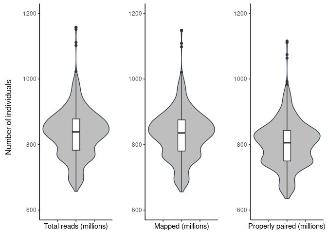

qc
================

## 1. Sequencing statistics (in millions)

| stat                    |    min | median |   mean |     max |
|:------------------------|-------:|-------:|-------:|--------:|
| flagstat\_total         | 657.46 | 838.53 | 833.66 | 1158.11 |
| mapped\_passed          | 655.58 | 835.38 | 830.84 | 1148.59 |
| properly.paired\_passed | 634.89 | 805.31 | 801.00 | 1115.78 |

<!-- -->

Total reads outliers

| sample | flagstat\_total |
|-------:|----------------:|
|     72 |        1102.320 |
|    237 |        1151.191 |
|    725 |        1111.492 |
|    771 |        1022.770 |
|   1176 |        1158.111 |
|   1177 |        1155.883 |

### Call rate


<!-- ```{r filtered_variant_missing_call_rate, echo=FALSE} -->
<!-- library(png) -->
<!-- img1_path <- "qc_files/figure-gfm/filtered_var_miss.png" -->
<!-- img1 <- readPNG(img1_path, native = TRUE, info = TRUE) -->
<!-- include_graphics(img1_path) -->
<!-- ``` -->
<!-- ```{r samples_missing_call_rate, echo=FALSE} -->
<!-- library(png) -->
<!-- img1_path <- "qc_files/figure-gfm/samples_miss.png" -->
<!-- img1 <- readPNG(img1_path, native = TRUE, info = TRUE) -->
<!-- include_graphics(img1_path) -->
<!-- ``` -->
<!-- ```{r filtered_samples_missing_call_rate, echo=FALSE} -->
<!-- library(png) -->
<!-- img1_path <- "qc_files/figure-gfm/filtered_samples_miss.png" -->
<!-- img1 <- readPNG(img1_path, native = TRUE, info = TRUE) -->
<!-- include_graphics(img1_path) -->
<!-- ``` -->
<!-- Call rate missing outliers  -->
<!-- ```{r echo=FALSE} -->
<!-- imiss <- fread('../output/plink_stats/plink.imiss') -->
<!-- colnames(imiss)[2] <- 'sample' -->
<!-- imiss_out <- imiss %>% select(sample,F_MISS) %>%  -->
<!--         filter(F_MISS %in% outlier(imiss$F_MISS)) %>% arrange(F_MISS) %>% -->
<!--   mutate(sample = as.numeric(factor(sample))) -->
<!-- kable(imiss_out)  -->
<!-- ``` -->

## 2. Depth statistics

| stat                  |   min | median |  mean |   max |
|:----------------------|------:|-------:|------:|------:|
| average\_depth        | 28.40 |  35.41 | 35.26 | 48.10 |
| percentage\_above\_10 | 91.40 |  91.93 | 91.90 | 92.41 |
| percentage\_above\_20 | 84.15 |  89.11 | 89.19 | 91.27 |
| percentage\_above\_30 | 49.05 |  78.69 | 76.84 | 90.00 |

Average depth outliers

| sample | average\_depth |
|-------:|---------------:|
|    709 |          42.95 |
|    771 |          42.99 |
|    748 |          43.17 |
|   1176 |          45.19 |
|   1177 |          45.26 |
|    725 |          45.75 |
|     72 |          46.01 |
|    237 |          48.10 |

    ## `stat_bin()` using `bins = 30`. Pick better value with `binwidth`.

<!-- -->

<!-- -->

## 3. Per sample count (PSC)

| stat           |       min |    median |       mean |       max |
|:---------------|----------:|----------:|-----------:|----------:|
| average\_depth |      30.2 |      37.4 |      37.36 |      50.8 |
| nHets          | 2054243.0 | 2298485.0 | 2309068.41 | 2445661.0 |
| nIndels        |  792212.0 |  810419.0 |  809993.53 |  823059.0 |
| nMissing       |  131373.0 |  150815.0 |  150664.07 |  162078.0 |
| nNonRefHom     | 1468590.0 | 1572835.0 | 1570618.31 | 1703573.0 |
| nRefHom        |    1023.0 |    1162.0 |    1162.60 |    1349.0 |
| nSingletons    | 4550115.0 | 4686524.0 | 4689789.11 | 4766110.0 |
| nTransitions   | 2505851.0 | 2584424.0 | 2586949.43 | 2630499.0 |
| nTransversions | 1251965.0 | 1291490.0 | 1292737.29 | 1316387.0 |

<!-- -->

PSC outliers

| sample | nRefHom |
|-------:|--------:|
|    185 |    1023 |
|   1001 |    1025 |
|    532 |    1037 |
|    713 |    1287 |
|    592 |    1288 |
|    108 |    1289 |
|    665 |    1290 |
|    546 |    1295 |
|   1116 |    1307 |
|    675 |    1349 |

| sample | nNonRefHom |
|-------:|-----------:|
|    640 |    1468590 |
|    200 |    1634096 |
|     96 |    1703573 |

| sample |   nHets |
|-------:|--------:|
|     96 | 2054243 |
|    200 | 2164166 |
|    640 | 2445661 |
