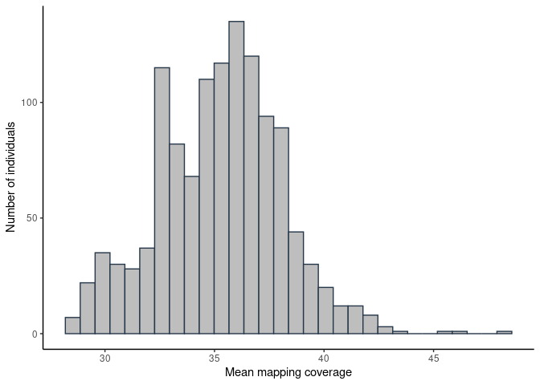

qc
================

## 1. Sequencing statistics (in millions)

| stat                   |    min | median |   mean |     max |
|:-----------------------|-------:|-------:|-------:|--------:|
| flagstat_total         | 657.46 | 838.47 | 833.13 | 1151.19 |
| mapped_passed          | 655.58 | 835.37 | 830.32 | 1147.28 |
| properly.paired_passed | 634.89 | 805.36 | 800.51 | 1111.85 |

<!-- -->

Total reads outliers

| sample | flagstat_total |
|-------:|---------------:|
|     70 |       1102.320 |
|    234 |       1151.191 |
|    718 |       1111.492 |
|    764 |       1022.770 |

<!-- ### Call rate -->
<!-- ```{r variant_missing_call_rate, echo=FALSE} -->
<!-- library(png) -->
<!-- img1_path <- "qc_files/figure-gfm/var_miss.png" -->
<!-- img1 <- readPNG(img1_path, native = TRUE, info = TRUE) -->
<!-- include_graphics(img1_path) -->
<!-- ``` -->
<!-- ```{r filtered_variant_missing_call_rate, echo=FALSE} -->
<!-- library(png) -->
<!-- img1_path <- "qc_files/figure-gfm/filtered_var_miss.png" -->
<!-- img1 <- readPNG(img1_path, native = TRUE, info = TRUE) -->
<!-- include_graphics(img1_path) -->
<!-- ``` -->
<!-- ```{r samples_missing_call_rate, echo=FALSE} -->
<!-- library(png) -->
<!-- img1_path <- "qc_files/figure-gfm/samples_miss.png" -->
<!-- img1 <- readPNG(img1_path, native = TRUE, info = TRUE) -->
<!-- include_graphics(img1_path) -->
<!-- ``` -->
<!-- ```{r filtered_samples_missing_call_rate, echo=FALSE} -->
<!-- library(png) -->
<!-- img1_path <- "qc_files/figure-gfm/filtered_samples_miss.png" -->
<!-- img1 <- readPNG(img1_path, native = TRUE, info = TRUE) -->
<!-- include_graphics(img1_path) -->
<!-- ``` -->
<!-- Call rate missing outliers  -->
<!-- ```{r echo=FALSE} -->
<!-- imiss <- fread('../output/plink_stats/plink.imiss') -->
<!-- colnames(imiss)[2] <- 'sample' -->
<!-- imiss_out <- imiss %>% select(sample,F_MISS) %>%  -->
<!--         filter(F_MISS %in% outlier(imiss$F_MISS)) %>% arrange(F_MISS) %>% -->
<!--   mutate(sample = as.numeric(factor(sample))) -->
<!-- kable(imiss_out)  -->
<!-- ``` -->

## 2. Depth statistics

| stat                |   min | median |  mean |   max |
|:--------------------|------:|-------:|------:|------:|
| average_depth       | 28.40 |  35.40 | 35.25 | 48.10 |
| percentage_above_10 | 91.40 |  91.93 | 91.90 | 92.37 |
| percentage_above_20 | 84.15 |  89.10 | 89.18 | 91.27 |
| percentage_above_30 | 49.05 |  78.70 | 76.82 | 90.00 |

Average depth outliers

| sample | average_depth |
|-------:|--------------:|
|    702 |         42.95 |
|    764 |         42.99 |
|    741 |         43.17 |
|    718 |         45.75 |
|     70 |         46.01 |
|    234 |         48.10 |

    ## `stat_bin()` using `bins = 30`. Pick better value with `binwidth`.

<!-- -->

<!-- -->

## 3. Per sample count (PSC)

| stat           |        min |     median |        mean |        max |
|:---------------|-----------:|-----------:|------------:|-----------:|
| average_depth  |       26.1 |       29.9 |       29.96 |       40.6 |
| nHets          |  1972575.0 |  2213956.0 |  2224784.62 |  2367896.0 |
| nIndels        |   737369.0 |   764415.0 |   764796.61 |   777759.0 |
| nMissing       |   118154.0 |   154138.0 |   163614.79 |   385948.0 |
| nNonRefHom     |  1380158.0 |  1493329.0 |  1489948.72 |  1637009.0 |
| nRefHom        | 34416873.0 | 34650179.0 | 34643796.04 | 34768856.0 |
| nSingletons    |     3202.0 |    15536.0 |    15877.03 |   123142.0 |
| nTransitions   |  2414461.0 |  2491680.0 |  2493688.50 |  2556378.0 |
| nTransversions |  1181616.0 |  1220362.5 |  1221044.84 |  1250840.0 |

<!-- -->

PSC outliers

| sample |  nRefHom |
|-------:|---------:|
|   1012 | 34416873 |
|    513 | 34481136 |
|     90 | 34488359 |
|    138 | 34497146 |
|    658 | 34502907 |
|    155 | 34504710 |
|    233 | 34506196 |
|     86 | 34511535 |
|    207 | 34514003 |
|     61 | 34516923 |
|    139 | 34522796 |
|    149 | 34526772 |
|    194 | 34527426 |
|    141 | 34527828 |
|   1024 | 34528074 |
|     91 | 34529684 |
|     56 | 34531574 |
|    231 | 34533006 |
|     93 | 34534559 |
|   1010 | 34535110 |
|    498 | 34535445 |
|    982 | 34535790 |
|    676 | 34536944 |
|   1017 | 34537082 |
|     92 | 34537280 |
|    112 | 34539593 |
|   1020 | 34541003 |
|   1018 | 34541159 |
|   1028 | 34542042 |
|    104 | 34542922 |
|   1015 | 34543006 |
|    232 | 34546653 |
|     98 | 34546887 |
|    140 | 34547451 |
|   1016 | 34547631 |
|    147 | 34548486 |
|    153 | 34548588 |
|    998 | 34551969 |
|     80 | 34552621 |
|    990 | 34553063 |
|   1026 | 34553154 |
|    675 | 34553303 |
|    214 | 34554043 |
|   1008 | 34554207 |
|   1025 | 34554763 |
|   1014 | 34555696 |
|    221 | 34556335 |
|   1023 | 34556404 |
|   1002 | 34557303 |
|    218 | 34757877 |
|    115 | 34768856 |

| sample | nNonRefHom |
|-------:|-----------:|
|    658 |    1380158 |
|    218 |    1555838 |
|    115 |    1623502 |
|    508 |    1637009 |

| sample |   nHets |
|-------:|--------:|
|    658 | 2367896 |
|    218 | 2080638 |
|    508 | 2077887 |
|    115 | 1972575 |
