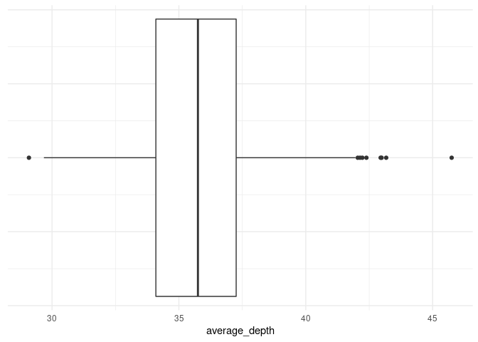
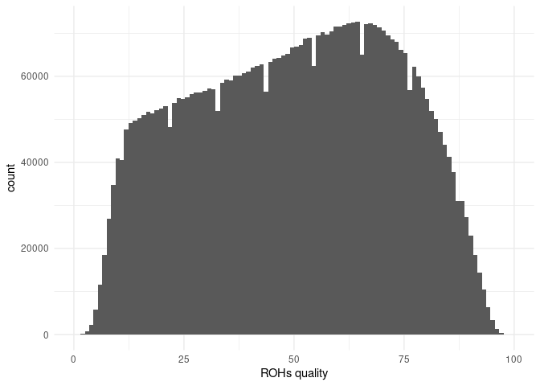
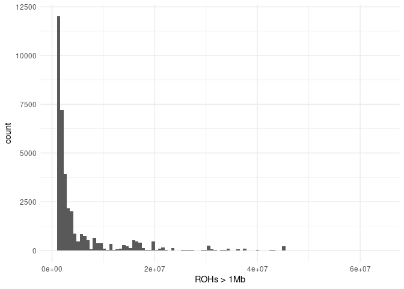
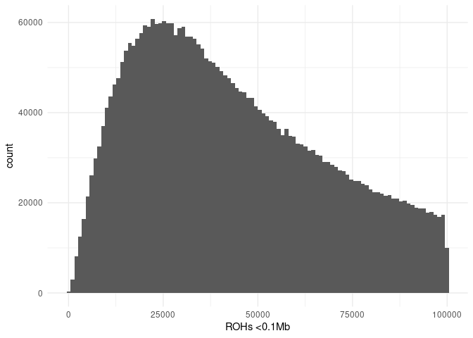

naszegenomy\_raport
================

## 1. Sequencing statistics (in millions)

|     | flagstat\_total | mapped\_passed | properly.paired\_passed |
|:----|:----------------|:---------------|:------------------------|
|     | Min. : 678.5    | Min. : 676.7   | Min. : 653.9            |
|     | 1st Qu.: 808.7  | 1st Qu.: 804.9 | 1st Qu.: 767.2          |
|     | Median : 845.0  | Median : 842.0 | Median : 812.5          |
|     | Mean : 845.0    | Mean : 842.2   | Mean : 811.9            |
|     | 3rd Qu.: 882.8  | 3rd Qu.: 880.2 | 3rd Qu.: 846.7          |
|     | Max. :1111.5    | Max. :1108.5   | Max. :1074.3            |

<!-- -->

## 2. Depth statistics

|     | average\_depth | percentage\_above\_10 | percentage\_above\_20 | percentage\_above\_30 |
|:----|:---------------|:----------------------|:----------------------|:----------------------|
|     | Min. :29.09    | Min. :91.40           | Min. :85.61           | Min. :53.66           |
|     | 1st Qu.:34.09  | 1st Qu.:91.69         | 1st Qu.:88.39         | 1st Qu.:75.23         |
|     | Median :35.75  | Median :91.98         | Median :89.27         | Median :79.58         |
|     | Mean :35.72    | Mean :91.92           | Mean :89.37           | Mean :78.41           |
|     | 3rd Qu.:37.26  | 3rd Qu.:92.14         | 3rd Qu.:90.63         | 3rd Qu.:82.05         |
|     | Max. :45.75    | Max. :92.34           | Max. :91.27           | Max. :90.00           |

Average depth outliers

| sample         | average\_depth |
|:---------------|---------------:|
| 180\_20770\_20 |          29.09 |
| COV208X039A    |          42.05 |
| COV238Y053B    |          42.95 |
| COV258X060B    |          45.75 |
| COV288X073A    |          43.17 |
| COV299X077A    |          42.14 |
| COV306Y080B    |          42.23 |
| COV313Y083A    |          42.39 |
| COV315Y083A    |          42.99 |

<!-- -->

<!-- -->

## 3. Per sample count (PSC)

|     | nRefHom      | nNonRefHom      | nHets           | nTransitions    | nTransversions  | nIndels        | average\_depth | nSingletons     | nHapRef   | nHapAlt   | nMissing       |
|:----|:-------------|:----------------|:----------------|:----------------|:----------------|:---------------|:---------------|:----------------|:----------|:----------|:---------------|
|     | Min. :1023   | Min. :1468590   | Min. :2164166   | Min. :2532633   | Min. :1265629   | Min. :797694   | Min. :30.50    | Min. :4596353   | Min. :0   | Min. :0   | Min. :140389   |
|     | 1st Qu.:1133 | 1st Qu.:1556525 | 1st Qu.:2278984 | 1st Qu.:2576166 | 1st Qu.:1287263 | 1st Qu.:807813 | 1st Qu.:35.60  | 1st Qu.:4671882 | 1st Qu.:0 | 1st Qu.:0 | 1st Qu.:148866 |
|     | Median :1164 | Median :1573465 | Median :2298296 | Median :2584326 | Median :1291660 | Median :810671 | Median :37.60  | Median :4686810 | Median :0 | Median :0 | Median :151154 |
|     | Mean :1164   | Mean :1570905   | Mean :2308942   | Mean :2586966   | Mean :1292881   | Mean :810530   | Mean :37.64    | Mean :4690486   | Mean :0   | Mean :0   | Mean :151124   |
|     | 3rd Qu.:1196 | 3rd Qu.:1584332 | 3rd Qu.:2342930 | 3rd Qu.:2599176 | 3rd Qu.:1299106 | 3rd Qu.:813448 | 3rd Qu.:39.20  | 3rd Qu.:4710756 | 3rd Qu.:0 | 3rd Qu.:0 | 3rd Qu.:153601 |
|     | Max. :1349   | Max. :1634096   | Max. :2445661   | Max. :2630499   | Max. :1316387   | Max. :823059   | Max. :47.90    | Max. :4766110   | Max. :0   | Max. :0   | Max. :162078   |

<!-- -->

## 3. AF

to do: Summary: rare, medium, common variants, impacts

AF curve: AF on X axis, number of variant on Y

## 4. ROHs

Summary

|     | Length          | Number\_of\_markers | Quality       |
|:----|:----------------|:--------------------|:--------------|
|     | Min. : 83       | Min. : 2            | Min. : 0.60   |
|     | 1st Qu.: 28823  | 1st Qu.: 58         | 1st Qu.:31.20 |
|     | Median : 54628  | Median : 100        | Median :51.10 |
|     | Mean : 124447   | Mean : 166          | Mean :49.86   |
|     | 3rd Qu.: 105935 | 3rd Qu.: 179        | 3rd Qu.:68.50 |
|     | Max. :63912719  | Max. :45797         | Max. :98.70   |

ROHs quality histogram

<!-- -->

Number of ROHs with length in specific ranges

<!-- --><!-- --><!-- -->

to do: ROH fst
