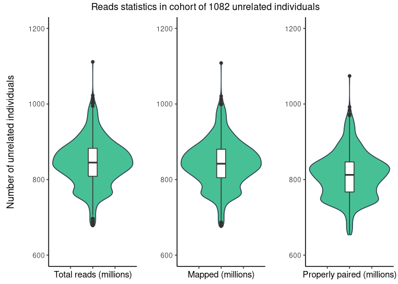
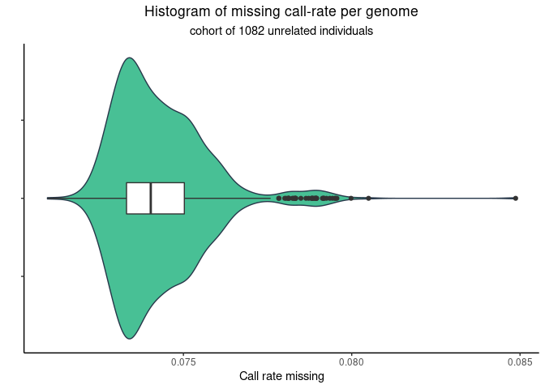
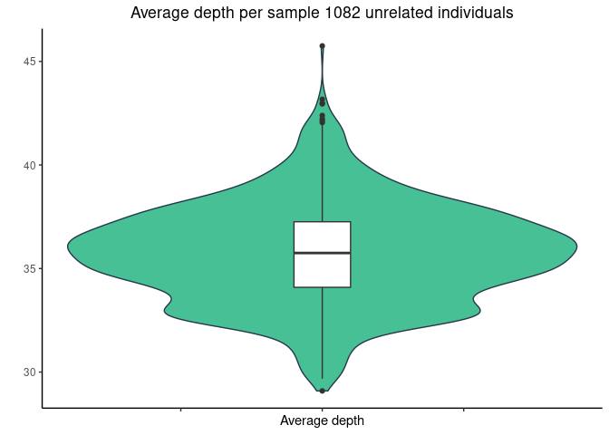
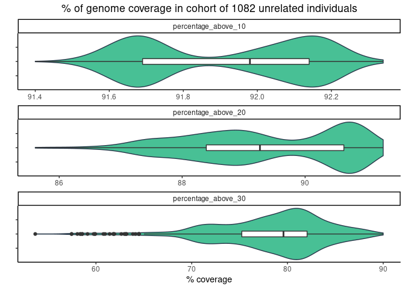
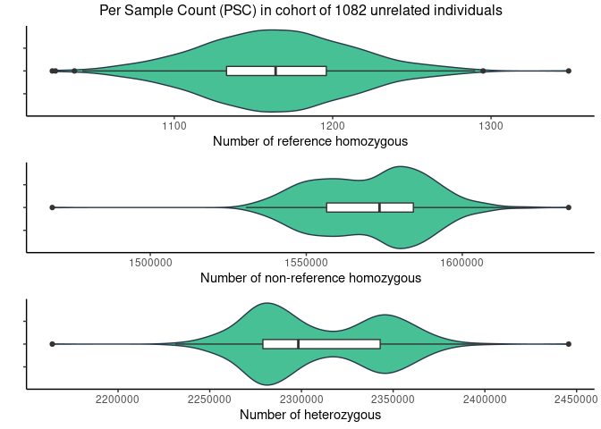
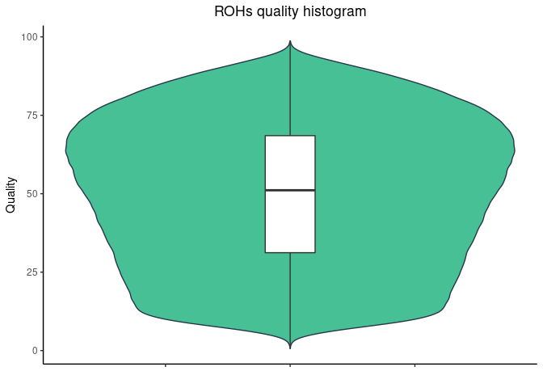
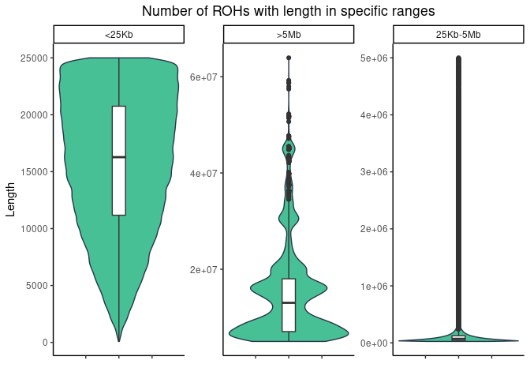
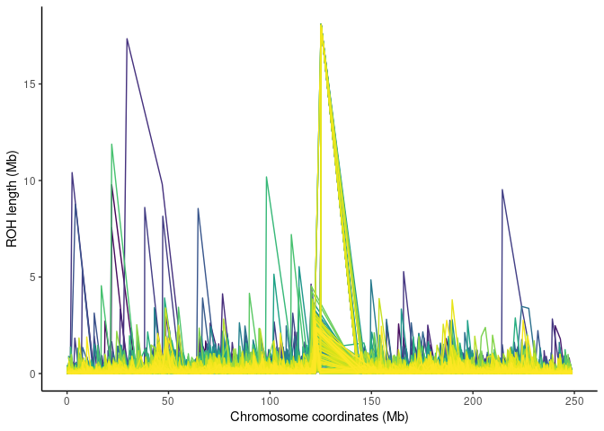

## 1. Sequencing statistics (in millions)


|stat                   |    min| median|   mean|     max|
|:----------------------|------:|------:|------:|-------:|
|flagstat_total         | 678.45| 844.96| 845.01| 1111.49|
|mapped_passed          | 676.71| 841.98| 842.18| 1108.49|
|properly.paired_passed | 653.95| 812.50| 811.85| 1074.30|


<!-- -->


Total reads outliers 


|sample       | flagstat_total|
|:------------|--------------:|
|180_20770_20 |       689.2717|
|262_22542_20 |      1001.3480|
|COV237X052A  |       994.6147|
|COV238Y053B  |      1012.2932|
|COV239X053B  |      1001.0540|
|COV247X054B  |      1001.4843|
|COV258X060B  |      1111.4918|
|COV288X073A  |      1016.6088|
|COV306Y080B  |      1003.9415|
|COV313Y083A  |      1003.2027|
|COV315Y083A  |      1022.7702|
|COV428X126B  |      1004.9815|
|COV623X206B  |       695.0610|
|COV645Y214A  |       680.1506|
|COV647Y215B  |       688.7022|
|COV648X215A  |       695.3860|
|COV649Y215A  |       679.1973|
|COV650Y216B  |       685.0972|
|COV651X216A  |       693.9583|
|COV652X216A  |       678.4532|
|COV653Y217A  |       688.2522|
|COV654X217A  |       681.4599|
|COV655X217B  |       686.0841|
|COV658X219A  |       696.3860|
|COV659Y219B  |       688.1526|
|COV661X220A  |       693.8154|
|COV663X221B  |       697.1672|


<!-- -->

Call rate missing outliers 


|sample         |  F_MISS|
|:--------------|-------:|
|COV747Y253B    | 0.07783|
|323-PORCOVKOM  | 0.07784|
|327_PORCOV_KOM | 0.07801|
|328_PORCOV_KOM | 0.07805|
|35_19267_20    | 0.07811|
|147_PorCOV_KOM | 0.07812|
|24_PorCOV      | 0.07812|
|309-PORCOVKOM  | 0.07814|
|COV744Y252A    | 0.07824|
|22_PorCOV_KOM  | 0.07827|
|COV733X247A    | 0.07831|
|231_PorCOV_KOM | 0.07832|
|COV738Y250A    | 0.07833|
|340-PORCOVKOM  | 0.07834|
|2041_COVID     | 0.07849|
|COV731X246A    | 0.07864|
|COV742Y252B    | 0.07872|
|COV704X237B    | 0.07880|
|304-PORCOVKOM  | 0.07882|
|231_COV99_20   | 0.07883|
|342-PORCOVKOM  | 0.07884|
|COV739X250B    | 0.07888|
|19_PorCOV_KOM  | 0.07891|
|20_PorCOV_KOM  | 0.07893|
|324-PORCOVKOM  | 0.07894|
|308_PORCOV_KOM | 0.07895|
|COV706Y237A    | 0.07896|
|COV732Y247B    | 0.07913|
|COV741X251A    | 0.07915|
|306-PORCOVKOM  | 0.07917|
|COV745Y253A    | 0.07918|
|180_20770_20   | 0.07925|
|COV737X249B    | 0.07935|
|COV730X246B    | 0.07943|
|COV743X252A    | 0.07950|
|COV746X253B    | 0.07952|
|322-PORCOVKOM  | 0.07956|
|341-PORCOVKOM  | 0.07998|
|COV740Y251B    | 0.08050|
|COV215X042A    | 0.08487|


## 2. Depth statistics


|stat                |   min| median|  mean|   max|
|:-------------------|-----:|------:|-----:|-----:|
|average_depth       | 29.09|  35.75| 35.72| 45.75|
|percentage_above_10 | 91.40|  91.98| 91.92| 92.34|
|percentage_above_20 | 85.61|  89.27| 89.37| 91.27|
|percentage_above_30 | 53.66|  79.59| 78.41| 90.00|

Average depth outliers 


|sample       | average_depth|
|:------------|-------------:|
|180_20770_20 |         29.09|
|COV208X039A  |         42.05|
|COV299X077A  |         42.14|
|COV306Y080B  |         42.23|
|COV313Y083A  |         42.39|
|COV238Y053B  |         42.95|
|COV315Y083A  |         42.99|
|COV288X073A  |         43.17|
|COV258X060B  |         45.75|

<!-- -->


<!-- -->

## 3. Per sample count (PSC)


|stat           |       min|    median|       mean|       max|
|:--------------|---------:|---------:|----------:|---------:|
|average_depth  |      30.5|      37.6|      37.64|      47.9|
|nHets          | 2164166.0| 2298296.5| 2308941.86| 2445661.0|
|nIndels        |  797694.0|  810671.0|  810529.96|  823059.0|
|nMissing       |  140389.0|  151153.5|  151124.03|  162078.0|
|nNonRefHom     | 1468590.0| 1573465.0| 1570905.33| 1634096.0|
|nRefHom        |    1023.0|    1164.0|    1164.31|    1349.0|
|nSingletons    | 4596353.0| 4686810.5| 4690486.03| 4766110.0|
|nTransitions   | 2532633.0| 2584326.0| 2586966.12| 2630499.0|
|nTransversions | 1265629.0| 1291660.0| 1292881.07| 1316387.0|

<!-- -->

PSC outliers


|sample       | nRefHom|
|:------------|-------:|
|365_23988_20 |    1023|
|COV641Y213A  |    1025|
|COV031K      |    1037|
|COV045K      |    1295|
|COV258X060B  |    1349|


|sample       | nNonRefHom|
|:------------|----------:|
|COV215X042A  |    1468590|
|389_24332_20 |    1634096|


|sample       |   nHets|
|:------------|-------:|
|389_24332_20 | 2164166|
|COV215X042A  | 2445661|

### Outlier samples reccuring in other statistics:


|sample       |F_MISS  |average_depth |flagstat_total |nRefHom     |nNonRefHom  |nHets       |
|:------------|:-------|:-------------|:--------------|:-----------|:-----------|:-----------|
|180_20770_20 |0.07925 |29.09         |689.271743     |not_outlier |not_outlier |not_outlier |
|COV215X042A  |0.08487 |not_outlier   |not_outlier    |not_outlier |1468590     |2445661     |


## 3. AF
to do:
Summary: rare, medium, common variants, impacts

AF curves


## 4. ROHs

Summary


|stat              |  min|  median|      mean|        max|
|:-----------------|----:|-------:|---------:|----------:|
|Length            | 83.0| 54628.0| 124447.48| 63912719.0|
|Number_of_markers |  2.0|   100.0|    166.01|    45797.0|
|Quality           |  0.6|    51.1|     49.86|       98.7|


<!-- -->


<!-- -->

ROH span across chromosome 1


```
## Loading required package: viridisLite
```

<!-- -->


to do: ROH fst

