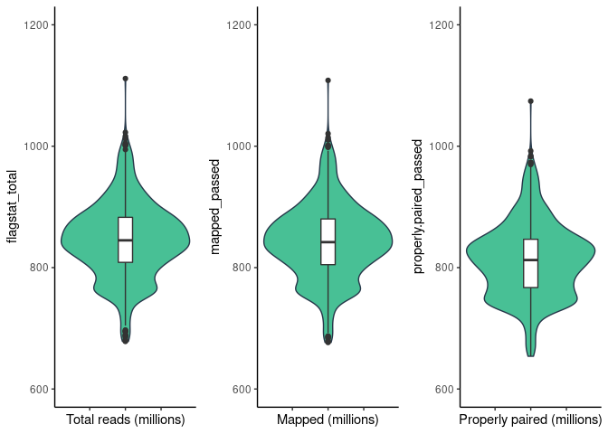
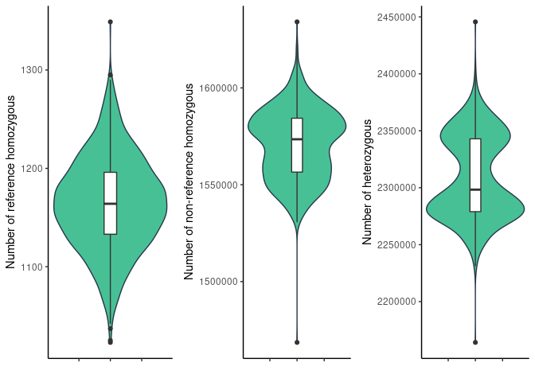
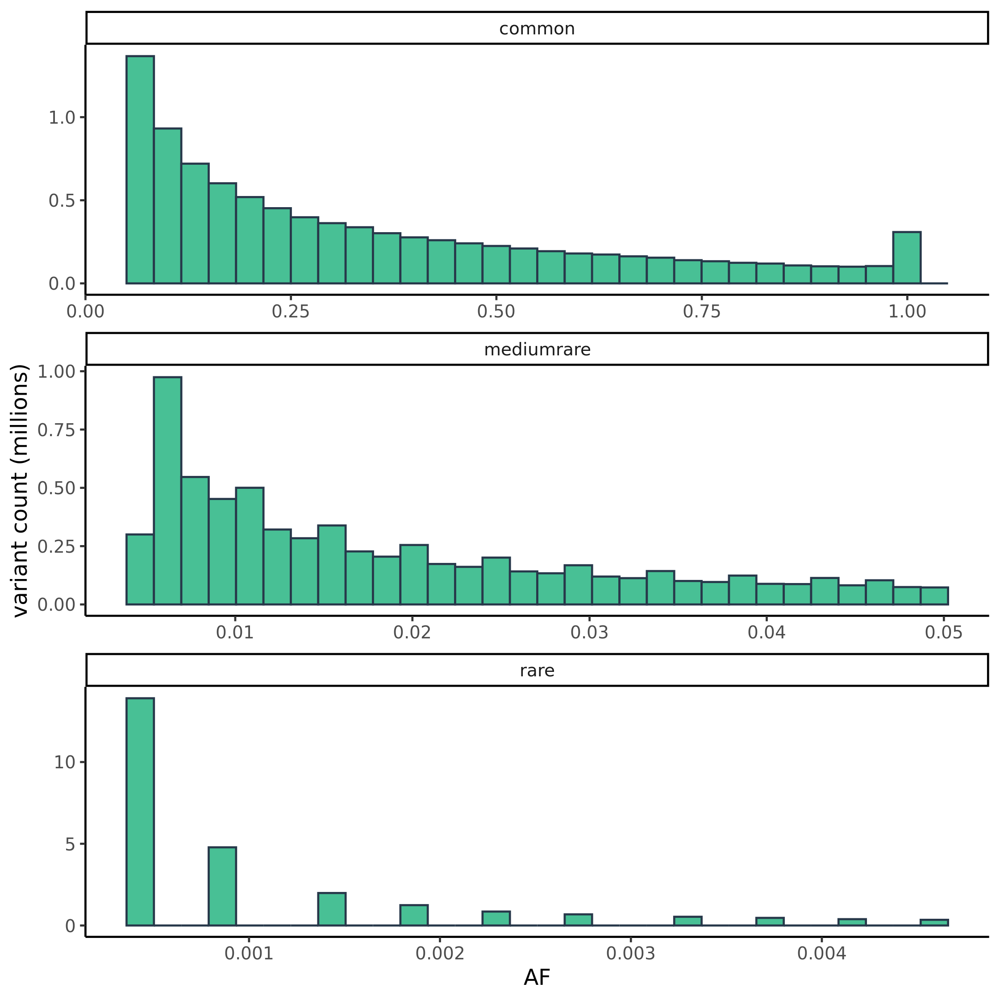
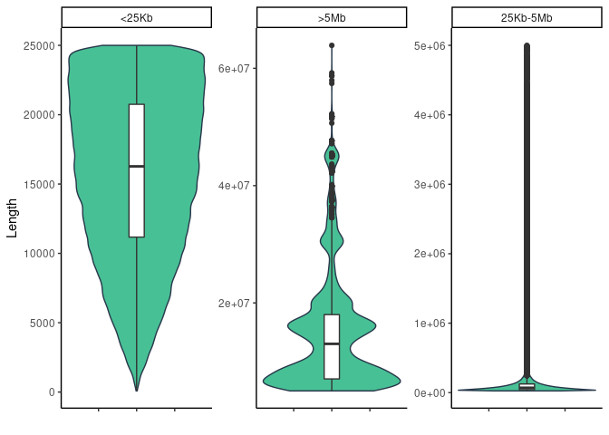
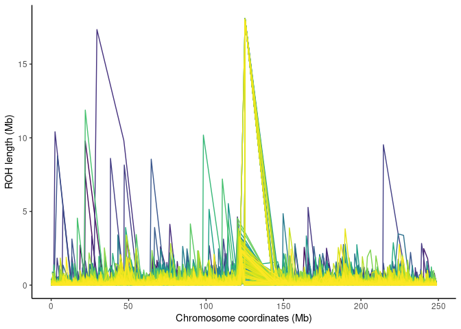

naszegenomy\_raport
================

## 1. Sequencing statistics (in millions)

| stat                    |    min | median |   mean |     max |
|:------------------------|-------:|-------:|-------:|--------:|
| flagstat\_total         | 678.45 | 844.96 | 845.01 | 1111.49 |
| mapped\_passed          | 676.71 | 841.98 | 842.18 | 1108.49 |
| properly.paired\_passed | 653.95 | 812.50 | 811.85 | 1074.30 |

<!-- --> Total reads
outliers

| Sample         | flagstat\_total |
|:---------------|----------------:|
| 180\_20770\_20 |        689.2717 |
| 262\_22542\_20 |       1001.3480 |
| COV237X052A    |        994.6147 |
| COV238Y053B    |       1012.2932 |
| COV239X053B    |       1001.0540 |
| COV247X054B    |       1001.4843 |
| COV258X060B    |       1111.4918 |
| COV288X073A    |       1016.6088 |
| COV306Y080B    |       1003.9415 |
| COV313Y083A    |       1003.2027 |
| COV315Y083A    |       1022.7702 |
| COV428X126B    |       1004.9815 |
| COV623X206B    |        695.0610 |
| COV645Y214A    |        680.1506 |
| COV647Y215B    |        688.7022 |
| COV648X215A    |        695.3860 |
| COV649Y215A    |        679.1973 |
| COV650Y216B    |        685.0972 |
| COV651X216A    |        693.9583 |
| COV652X216A    |        678.4532 |
| COV653Y217A    |        688.2522 |
| COV654X217A    |        681.4599 |
| COV655X217B    |        686.0841 |
| COV658X219A    |        696.3860 |
| COV659Y219B    |        688.1526 |
| COV661X220A    |        693.8154 |
| COV663X221B    |        697.1672 |

## 2. Depth statistics

| stat                  |   min | median |  mean |   max |
|:----------------------|------:|-------:|------:|------:|
| average\_depth        | 29.09 |  35.75 | 35.72 | 45.75 |
| percentage\_above\_10 | 91.40 |  91.98 | 91.92 | 92.34 |
| percentage\_above\_20 | 85.61 |  89.27 | 89.37 | 91.27 |
| percentage\_above\_30 | 53.66 |  79.59 | 78.41 | 90.00 |

Average depth outliers

| sample         | average\_depth |
|:---------------|---------------:|
| 180\_20770\_20 |          29.09 |
| COV208X039A    |          42.05 |
| COV238Y053B    |          42.95 |
| COV258X060B    |          45.75 |
| COV288X073A    |          43.17 |
| COV299X077A    |          42.14 |
| COV306Y080B    |          42.23 |
| COV313Y083A    |          42.39 |
| COV315Y083A    |          42.99 |

<!-- -->

<!-- -->

## 3. Per sample count (PSC)

| stat           |       min |    median |       mean |       max |
|:---------------|----------:|----------:|-----------:|----------:|
| average\_depth |      30.5 |      37.6 |      37.64 |      47.9 |
| nHets          | 2164166.0 | 2298296.5 | 2308941.86 | 2445661.0 |
| nIndels        |  797694.0 |  810671.0 |  810529.96 |  823059.0 |
| nMissing       |  140389.0 |  151153.5 |  151124.03 |  162078.0 |
| nNonRefHom     | 1468590.0 | 1573465.0 | 1570905.33 | 1634096.0 |
| nRefHom        |    1023.0 |    1164.0 |    1164.31 |    1349.0 |
| nSingletons    | 4596353.0 | 4686810.5 | 4690486.03 | 4766110.0 |
| nTransitions   | 2532633.0 | 2584326.0 | 2586966.12 | 2630499.0 |
| nTransversions | 1265629.0 | 1291660.0 | 1292881.07 | 1316387.0 |

<!-- -->

PSC outliers

| sample         | nRefHom |
|:---------------|--------:|
| 365\_23988\_20 |    1023 |
| COV031K        |    1037 |
| COV045K        |    1295 |
| COV258X060B    |    1349 |
| COV641Y213A    |    1025 |

| sample         | nNonRefHom |
|:---------------|-----------:|
| 389\_24332\_20 |    1634096 |
| COV215X042A    |    1468590 |

| sample         |   nHets |
|:---------------|--------:|
| 389\_24332\_20 | 2164166 |
| COV215X042A    | 2445661 |

## 3. AF

to do: Summary: rare, medium, common variants, impacts

AF curves

## 4. ROHs

Summary

| stat                |  min |  median |      mean |        max |
|:--------------------|-----:|--------:|----------:|-----------:|
| Length              | 83.0 | 54628.0 | 124447.48 | 63912719.0 |
| Number\_of\_markers |  2.0 |   100.0 |    166.01 |    45797.0 |
| Quality             |  0.6 |    51.1 |     49.86 |       98.7 |

ROHs quality histogram

<!-- -->

Number of ROHs with length in specific ranges

<!-- -->

ROH span across chromosome 1

    ## Loading required package: viridisLite

<!-- -->

to do: ROH fst
