## Libraries and options


```R
library(data.table)
library(glue)
library(dplyr)
library(plotly)
library(ggplot2)
library(grid)
library(gridExtra)
options(scipen=999)
```

    
    Attaching package: ‘dplyr’
    
    The following object is masked from ‘package:glue’:
    
        collapse
    
    The following objects are masked from ‘package:data.table’:
    
        between, first, last
    
    The following objects are masked from ‘package:stats’:
    
        filter, lag
    
    The following objects are masked from ‘package:base’:
    
        intersect, setdiff, setequal, union
    
    Loading required package: ggplot2
    
    Attaching package: ‘plotly’
    
    The following object is masked from ‘package:ggplot2’:
    
        last_plot
    
    The following object is masked from ‘package:stats’:
    
        filter
    
    The following object is masked from ‘package:graphics’:
    
        layout
    
    
    Attaching package: ‘gridExtra’
    
    The following object is masked from ‘package:dplyr’:
    
        combine
    


## Load and prepare data


```R
# Read input VCF
tgp_vcf <- fread("/home/matdawidziuk/tgp_pl/multisample_20210519.dv.bcfnorm.filtered.nogt.vcf.gz", skip="#CHROM", sep="\t")
```


```R
# Check dim
dim(tgp_vcf)
head(tgp_vcf)
```


```R
# Read TGP vep annotated file
tgp_vep <- fread("/data/NGS/annotations/test_design/pl_genomes/run_1/output/multisample_20210519.dv.bcfnorm.filtered.nogt.header.format.dummygt_VEP.tsv", sep="\t")
```


```R
# Check dim
dim(tgp_vep)
head(tgp_vep)
```


```R
#  Split INFO
tgp_vcf[, c("AF", "AQ", "AN", "AC") := tstrsplit(INFO, ";", fixed=TRUE)]
```


```R
# Clean new columns, remove AQ (duplicates QUAL)
tgp_vcf[, AF := gsub("[^0-9.-]", "", AF)][, AN := gsub("[^0-9.-]", "", AN)][, AC := gsub("[^0-9.-]", "", AC)][, AQ := NULL]
```


```R
head(tgp_vcf)
```


```R
# Create key - further used to merge with VCF file
tgp_vep[, key2 := gsub(">", "_", gsub(":", "_", key))]
setkey(tgp_vep, key2)
setkey(tgp_vcf, ID)
```


```R
# Copy selected columns from VCF to TSV
selected_columns <- c("REF", "ALT", "QUAL", "AF", "AN", "AC")
tgp_vep[tgp_vcf, (selected_columns) := mget(paste0('i.', selected_columns))]
head(tgp_vep)
```


```R
#save(tgp_vep, file="~/tgp_vep_2021_06_26.RData")
```


```R
dim(tgp_vep)
```


<ol class=list-inline>
	<li>37318044</li>
	<li>154</li>
</ol>


```R
# Read AR genes from OMIM
omim_recessive <- fread("/srv/data/TGP-notebooks/recessive_genes.bed", sep="\t", col.names=c("chr", "start", "end", "symbol"))
omim_recessive <- unique(omim_recessive, by = "symbol")
```


```R
tgp_recessive <- tgp_vep[which((Symbol %in% omim_recessive$symbol) & AC!=0)]
```


```R
tgp_vep_nonsyn_rare <- tgp_recessive[which( gnomAD_AF < 0.01 & AF < 0.01 & Impact %in% c("MODERATE", "HIGH"))]
```


```R
#save(tgp_vep_nonsyn_rare,file="~/tgp_vep_nonsyn_rare_2021_06_27.RData" )
#save(tgp_recessive,file="~/tgp_recessive_2021_06_27.RData" )
```


```R

```


```R
gnomad_vep <- fread("/data/NGS/annotations/test_design/pl_genomes/run_1/output/gnomad_genome_v3.0_gt_subset-gatk-haplotype.vcf.gz.annotated.tsv", skip="#Uploaded_variation")
```


```R
gnomad_vep[, gnomAD_AF := as.numeric(gnomad_vep$gnomad_genome.vcf.gz_AF)]
gnomad_vep[, gnomAD_AF_NFE := as.numeric(gnomad_vep$gnomad_genome.vcf.gz_AF_nfe)]
gnomad_vep[, gnomAD_AF:=ifelse(is.na(gnomAD_AF),0,gnomAD_AF)]
gnomad_vep[, gnomAD_AF_NFE:=ifelse(is.na(gnomAD_AF_NFE),0,gnomAD_AF_NFE)]
```

    Warning message in eval(jsub, SDenv, parent.frame()):
    “NAs introduced by coercion”


```R
gnomad_nonsyn_rare <- gnomad_vep[which( gnomAD_AF < 0.01 & IMPACT %in% c("MODERATE", "HIGH"))]
```


```R
idx_duplicated <- which(duplicated(gnomad_nonsyn_rare$key))
gnomad_nonsyn_rare <- gnomad_nonsyn_rare[-idx_duplicated,]
dim(gnomad_nonsyn_rare)
#save(gnomad_nonsyn_rare,file="~/gnomad_nonsyn_rare_2021_06_27.RData" )
```


```R
load("~/tgp_vep_nonsyn_rare_2021_06_27.RData")
load("~/gnomad_nonsyn_rare_2021_06_27.RData" )
```

## Download PanelApp data


```R

#install.packages("rvest")
library(rvest)
panels <- read_html("https://panelapp.genomicsengland.co.uk/panels/")
panels2 <- panels %>%html_nodes("h4")
allPanelsList <- (lapply(panels2[-length(panels2)], function(panel){
    panelURL <- paste0("https://panelapp.genomicsengland.co.uk",panel%>% html_nodes("a") %>%  html_attr("href") ,"download/01234/")
    print(panelURL)
    fread(panelURL)
}))
allPanelsDT <- rbindlist(allPanelsList)
idx <- grep ("Expert Review Green", allPanelsDT$"Sources(; separated)" )
allPanelsDT2 <- allPanelsDT[idx,]
allPanelsDT3 <- allPanelsDT2[grep("BIALLELIC", allPanelsDT2$Model_Of_Inheritance),]
```

    [1] "https://panelapp.genomicsengland.co.uk/panels/399/download/01234/"
    [1] "https://panelapp.genomicsengland.co.uk/panels/933/download/01234/"
    [1] "https://panelapp.genomicsengland.co.uk/panels/929/download/01234/"
    [1] "https://panelapp.genomicsengland.co.uk/panels/930/download/01234/"
    [1] "https://panelapp.genomicsengland.co.uk/panels/934/download/01234/"
    [1] "https://panelapp.genomicsengland.co.uk/panels/931/download/01234/"
    [1] "https://panelapp.genomicsengland.co.uk/panels/932/download/01234/"
    [1] "https://panelapp.genomicsengland.co.uk/panels/774/download/01234/"
    [1] "https://panelapp.genomicsengland.co.uk/panels/540/download/01234/"
    [1] "https://panelapp.genomicsengland.co.uk/panels/245/download/01234/"
    [1] "https://panelapp.genomicsengland.co.uk/panels/391/download/01234/"
    [1] "https://panelapp.genomicsengland.co.uk/panels/511/download/01234/"
    [1] "https://panelapp.genomicsengland.co.uk/panels/269/download/01234/"
    [1] "https://panelapp.genomicsengland.co.uk/panels/502/download/01234/"
    [1] "https://panelapp.genomicsengland.co.uk/panels/263/download/01234/"
    [1] "https://panelapp.genomicsengland.co.uk/panels/510/download/01234/"
    [1] "https://panelapp.genomicsengland.co.uk/panels/34/download/01234/"
    [1] "https://panelapp.genomicsengland.co.uk/panels/134/download/01234/"
    [1] "https://panelapp.genomicsengland.co.uk/panels/258/download/01234/"
    [1] "https://panelapp.genomicsengland.co.uk/panels/477/download/01234/"
    [1] "https://panelapp.genomicsengland.co.uk/panels/139/download/01234/"
    [1] "https://panelapp.genomicsengland.co.uk/panels/260/download/01234/"
    [1] "https://panelapp.genomicsengland.co.uk/panels/657/download/01234/"
    [1] "https://panelapp.genomicsengland.co.uk/panels/282/download/01234/"
    [1] "https://panelapp.genomicsengland.co.uk/panels/557/download/01234/"
    [1] "https://panelapp.genomicsengland.co.uk/panels/543/download/01234/"
    [1] "https://panelapp.genomicsengland.co.uk/panels/38/download/01234/"
    [1] "https://panelapp.genomicsengland.co.uk/panels/208/download/01234/"
    [1] "https://panelapp.genomicsengland.co.uk/panels/545/download/01234/"
    [1] "https://panelapp.genomicsengland.co.uk/panels/166/download/01234/"
    [1] "https://panelapp.genomicsengland.co.uk/panels/90/download/01234/"
    [1] "https://panelapp.genomicsengland.co.uk/panels/55/download/01234/"
    [1] "https://panelapp.genomicsengland.co.uk/panels/13/download/01234/"
    [1] "https://panelapp.genomicsengland.co.uk/panels/234/download/01234/"
    [1] "https://panelapp.genomicsengland.co.uk/panels/842/download/01234/"
    [1] "https://panelapp.genomicsengland.co.uk/panels/843/download/01234/"
    [1] "https://panelapp.genomicsengland.co.uk/panels/749/download/01234/"
    [1] "https://panelapp.genomicsengland.co.uk/panels/230/download/01234/"
    [1] "https://panelapp.genomicsengland.co.uk/panels/214/download/01234/"
    [1] "https://panelapp.genomicsengland.co.uk/panels/286/download/01234/"
    [1] "https://panelapp.genomicsengland.co.uk/panels/109/download/01234/"
    [1] "https://panelapp.genomicsengland.co.uk/panels/491/download/01234/"
    [1] "https://panelapp.genomicsengland.co.uk/panels/147/download/01234/"
    [1] "https://panelapp.genomicsengland.co.uk/panels/745/download/01234/"
    [1] "https://panelapp.genomicsengland.co.uk/panels/847/download/01234/"
    [1] "https://panelapp.genomicsengland.co.uk/panels/259/download/01234/"
    [1] "https://panelapp.genomicsengland.co.uk/panels/221/download/01234/"
    [1] "https://panelapp.genomicsengland.co.uk/panels/544/download/01234/"
    [1] "https://panelapp.genomicsengland.co.uk/panels/30/download/01234/"
    [1] "https://panelapp.genomicsengland.co.uk/panels/197/download/01234/"
    [1] "https://panelapp.genomicsengland.co.uk/panels/81/download/01234/"
    [1] "https://panelapp.genomicsengland.co.uk/panels/210/download/01234/"
    [1] "https://panelapp.genomicsengland.co.uk/panels/64/download/01234/"
    [1] "https://panelapp.genomicsengland.co.uk/panels/244/download/01234/"
    [1] "https://panelapp.genomicsengland.co.uk/panels/517/download/01234/"
    [1] "https://panelapp.genomicsengland.co.uk/panels/507/download/01234/"
    [1] "https://panelapp.genomicsengland.co.uk/panels/508/download/01234/"
    [1] "https://panelapp.genomicsengland.co.uk/panels/145/download/01234/"
    [1] "https://panelapp.genomicsengland.co.uk/panels/25/download/01234/"
    [1] "https://panelapp.genomicsengland.co.uk/panels/512/download/01234/"
    [1] "https://panelapp.genomicsengland.co.uk/panels/308/download/01234/"
    [1] "https://panelapp.genomicsengland.co.uk/panels/31/download/01234/"
    [1] "https://panelapp.genomicsengland.co.uk/panels/207/download/01234/"
    [1] "https://panelapp.genomicsengland.co.uk/panels/232/download/01234/"
    [1] "https://panelapp.genomicsengland.co.uk/panels/225/download/01234/"
    [1] "https://panelapp.genomicsengland.co.uk/panels/250/download/01234/"
    [1] "https://panelapp.genomicsengland.co.uk/panels/658/download/01234/"
    [1] "https://panelapp.genomicsengland.co.uk/panels/111/download/01234/"
    [1] "https://panelapp.genomicsengland.co.uk/panels/168/download/01234/"
    [1] "https://panelapp.genomicsengland.co.uk/panels/5/download/01234/"
    [1] "https://panelapp.genomicsengland.co.uk/panels/560/download/01234/"
    [1] "https://panelapp.genomicsengland.co.uk/panels/283/download/01234/"
    [1] "https://panelapp.genomicsengland.co.uk/panels/487/download/01234/"
    [1] "https://panelapp.genomicsengland.co.uk/panels/519/download/01234/"
    [1] "https://panelapp.genomicsengland.co.uk/panels/159/download/01234/"
    [1] "https://panelapp.genomicsengland.co.uk/panels/484/download/01234/"
    [1] "https://panelapp.genomicsengland.co.uk/panels/251/download/01234/"
    [1] "https://panelapp.genomicsengland.co.uk/panels/293/download/01234/"
    [1] "https://panelapp.genomicsengland.co.uk/panels/26/download/01234/"
    [1] "https://panelapp.genomicsengland.co.uk/panels/652/download/01234/"
    [1] "https://panelapp.genomicsengland.co.uk/panels/47/download/01234/"
    [1] "https://panelapp.genomicsengland.co.uk/panels/9/download/01234/"
    [1] "https://panelapp.genomicsengland.co.uk/panels/235/download/01234/"
    [1] "https://panelapp.genomicsengland.co.uk/panels/209/download/01234/"
    [1] "https://panelapp.genomicsengland.co.uk/panels/265/download/01234/"
    [1] "https://panelapp.genomicsengland.co.uk/panels/192/download/01234/"
    [1] "https://panelapp.genomicsengland.co.uk/panels/553/download/01234/"
    [1] "https://panelapp.genomicsengland.co.uk/panels/136/download/01234/"
    [1] "https://panelapp.genomicsengland.co.uk/panels/53/download/01234/"
    [1] "https://panelapp.genomicsengland.co.uk/panels/648/download/01234/"
    [1] "https://panelapp.genomicsengland.co.uk/panels/271/download/01234/"
    [1] "https://panelapp.genomicsengland.co.uk/panels/562/download/01234/"
    [1] "https://panelapp.genomicsengland.co.uk/panels/119/download/01234/"
    [1] "https://panelapp.genomicsengland.co.uk/panels/554/download/01234/"
    [1] "https://panelapp.genomicsengland.co.uk/panels/91/download/01234/"
    [1] "https://panelapp.genomicsengland.co.uk/panels/314/download/01234/"
    [1] "https://panelapp.genomicsengland.co.uk/panels/158/download/01234/"
    [1] "https://panelapp.genomicsengland.co.uk/panels/50/download/01234/"
    [1] "https://panelapp.genomicsengland.co.uk/panels/305/download/01234/"
    [1] "https://panelapp.genomicsengland.co.uk/panels/152/download/01234/"
    [1] "https://panelapp.genomicsengland.co.uk/panels/110/download/01234/"
    [1] "https://panelapp.genomicsengland.co.uk/panels/7/download/01234/"
    [1] "https://panelapp.genomicsengland.co.uk/panels/23/download/01234/"
    [1] "https://panelapp.genomicsengland.co.uk/panels/63/download/01234/"
    [1] "https://panelapp.genomicsengland.co.uk/panels/6/download/01234/"
    [1] "https://panelapp.genomicsengland.co.uk/panels/772/download/01234/"
    [1] "https://panelapp.genomicsengland.co.uk/panels/480/download/01234/"
    [1] "https://panelapp.genomicsengland.co.uk/panels/312/download/01234/"
    [1] "https://panelapp.genomicsengland.co.uk/panels/522/download/01234/"
    [1] "https://panelapp.genomicsengland.co.uk/panels/394/download/01234/"
    [1] "https://panelapp.genomicsengland.co.uk/panels/11/download/01234/"
    [1] "https://panelapp.genomicsengland.co.uk/panels/212/download/01234/"
    [1] "https://panelapp.genomicsengland.co.uk/panels/318/download/01234/"
    [1] "https://panelapp.genomicsengland.co.uk/panels/200/download/01234/"
    [1] "https://panelapp.genomicsengland.co.uk/panels/290/download/01234/"
    [1] "https://panelapp.genomicsengland.co.uk/panels/552/download/01234/"
    [1] "https://panelapp.genomicsengland.co.uk/panels/167/download/01234/"
    [1] "https://panelapp.genomicsengland.co.uk/panels/478/download/01234/"
    [1] "https://panelapp.genomicsengland.co.uk/panels/144/download/01234/"
    [1] "https://panelapp.genomicsengland.co.uk/panels/33/download/01234/"
    [1] "https://panelapp.genomicsengland.co.uk/panels/61/download/01234/"
    [1] "https://panelapp.genomicsengland.co.uk/panels/132/download/01234/"
    [1] "https://panelapp.genomicsengland.co.uk/panels/412/download/01234/"
    [1] "https://panelapp.genomicsengland.co.uk/panels/402/download/01234/"
    [1] "https://panelapp.genomicsengland.co.uk/panels/201/download/01234/"
    [1] "https://panelapp.genomicsengland.co.uk/panels/227/download/01234/"
    [1] "https://panelapp.genomicsengland.co.uk/panels/254/download/01234/"
    [1] "https://panelapp.genomicsengland.co.uk/panels/249/download/01234/"
    [1] "https://panelapp.genomicsengland.co.uk/panels/528/download/01234/"
    [1] "https://panelapp.genomicsengland.co.uk/panels/720/download/01234/"
    [1] "https://panelapp.genomicsengland.co.uk/panels/473/download/01234/"
    [1] "https://panelapp.genomicsengland.co.uk/panels/59/download/01234/"
    [1] "https://panelapp.genomicsengland.co.uk/panels/407/download/01234/"
    [1] "https://panelapp.genomicsengland.co.uk/panels/99/download/01234/"
    [1] "https://panelapp.genomicsengland.co.uk/panels/115/download/01234/"
    [1] "https://panelapp.genomicsengland.co.uk/panels/126/download/01234/"
    [1] "https://panelapp.genomicsengland.co.uk/panels/20/download/01234/"
    [1] "https://panelapp.genomicsengland.co.uk/panels/466/download/01234/"
    [1] "https://panelapp.genomicsengland.co.uk/panels/488/download/01234/"
    [1] "https://panelapp.genomicsengland.co.uk/panels/157/download/01234/"
    [1] "https://panelapp.genomicsengland.co.uk/panels/123/download/01234/"
    [1] "https://panelapp.genomicsengland.co.uk/panels/85/download/01234/"
    [1] "https://panelapp.genomicsengland.co.uk/panels/846/download/01234/"
    [1] "https://panelapp.genomicsengland.co.uk/panels/165/download/01234/"
    [1] "https://panelapp.genomicsengland.co.uk/panels/567/download/01234/"
    [1] "https://panelapp.genomicsengland.co.uk/panels/568/download/01234/"
    [1] "https://panelapp.genomicsengland.co.uk/panels/78/download/01234/"
    [1] "https://panelapp.genomicsengland.co.uk/panels/310/download/01234/"
    [1] "https://panelapp.genomicsengland.co.uk/panels/179/download/01234/"
    [1] "https://panelapp.genomicsengland.co.uk/panels/267/download/01234/"
    [1] "https://panelapp.genomicsengland.co.uk/panels/236/download/01234/"
    [1] "https://panelapp.genomicsengland.co.uk/panels/49/download/01234/"
    [1] "https://panelapp.genomicsengland.co.uk/panels/481/download/01234/"
    [1] "https://panelapp.genomicsengland.co.uk/panels/92/download/01234/"
    [1] "https://panelapp.genomicsengland.co.uk/panels/650/download/01234/"
    [1] "https://panelapp.genomicsengland.co.uk/panels/482/download/01234/"
    [1] "https://panelapp.genomicsengland.co.uk/panels/490/download/01234/"
    [1] "https://panelapp.genomicsengland.co.uk/panels/555/download/01234/"
    [1] "https://panelapp.genomicsengland.co.uk/panels/277/download/01234/"
    [1] "https://panelapp.genomicsengland.co.uk/panels/467/download/01234/"
    [1] "https://panelapp.genomicsengland.co.uk/panels/176/download/01234/"
    [1] "https://panelapp.genomicsengland.co.uk/panels/246/download/01234/"
    [1] "https://panelapp.genomicsengland.co.uk/panels/175/download/01234/"
    [1] "https://panelapp.genomicsengland.co.uk/panels/503/download/01234/"
    [1] "https://panelapp.genomicsengland.co.uk/panels/171/download/01234/"
    [1] "https://panelapp.genomicsengland.co.uk/panels/143/download/01234/"
    [1] "https://panelapp.genomicsengland.co.uk/panels/524/download/01234/"
    [1] "https://panelapp.genomicsengland.co.uk/panels/97/download/01234/"
    [1] "https://panelapp.genomicsengland.co.uk/panels/649/download/01234/"
    [1] "https://panelapp.genomicsengland.co.uk/panels/504/download/01234/"
    [1] "https://panelapp.genomicsengland.co.uk/panels/525/download/01234/"
    [1] "https://panelapp.genomicsengland.co.uk/panels/523/download/01234/"
    [1] "https://panelapp.genomicsengland.co.uk/panels/521/download/01234/"
    [1] "https://panelapp.genomicsengland.co.uk/panels/42/download/01234/"
    [1] "https://panelapp.genomicsengland.co.uk/panels/174/download/01234/"
    [1] "https://panelapp.genomicsengland.co.uk/panels/285/download/01234/"
    [1] "https://panelapp.genomicsengland.co.uk/panels/514/download/01234/"
    [1] "https://panelapp.genomicsengland.co.uk/panels/315/download/01234/"
    [1] "https://panelapp.genomicsengland.co.uk/panels/515/download/01234/"
    [1] "https://panelapp.genomicsengland.co.uk/panels/131/download/01234/"
    [1] "https://panelapp.genomicsengland.co.uk/panels/239/download/01234/"
    [1] "https://panelapp.genomicsengland.co.uk/panels/173/download/01234/"
    [1] "https://panelapp.genomicsengland.co.uk/panels/248/download/01234/"
    [1] "https://panelapp.genomicsengland.co.uk/panels/213/download/01234/"
    [1] "https://panelapp.genomicsengland.co.uk/panels/549/download/01234/"
    [1] "https://panelapp.genomicsengland.co.uk/panels/530/download/01234/"
    [1] "https://panelapp.genomicsengland.co.uk/panels/238/download/01234/"
    [1] "https://panelapp.genomicsengland.co.uk/panels/384/download/01234/"
    [1] "https://panelapp.genomicsengland.co.uk/panels/185/download/01234/"
    [1] "https://panelapp.genomicsengland.co.uk/panels/546/download/01234/"
    [1] "https://panelapp.genomicsengland.co.uk/panels/527/download/01234/"
    [1] "https://panelapp.genomicsengland.co.uk/panels/76/download/01234/"
    [1] "https://panelapp.genomicsengland.co.uk/panels/218/download/01234/"
    [1] "https://panelapp.genomicsengland.co.uk/panels/529/download/01234/"
    [1] "https://panelapp.genomicsengland.co.uk/panels/96/download/01234/"
    [1] "https://panelapp.genomicsengland.co.uk/panels/133/download/01234/"
    [1] "https://panelapp.genomicsengland.co.uk/panels/83/download/01234/"
    [1] "https://panelapp.genomicsengland.co.uk/panels/112/download/01234/"
    [1] "https://panelapp.genomicsengland.co.uk/panels/534/download/01234/"
    [1] "https://panelapp.genomicsengland.co.uk/panels/535/download/01234/"
    [1] "https://panelapp.genomicsengland.co.uk/panels/536/download/01234/"
    [1] "https://panelapp.genomicsengland.co.uk/panels/537/download/01234/"
    [1] "https://panelapp.genomicsengland.co.uk/panels/538/download/01234/"
    [1] "https://panelapp.genomicsengland.co.uk/panels/533/download/01234/"
    [1] "https://panelapp.genomicsengland.co.uk/panels/532/download/01234/"
    [1] "https://panelapp.genomicsengland.co.uk/panels/472/download/01234/"
    [1] "https://panelapp.genomicsengland.co.uk/panels/18/download/01234/"
    [1] "https://panelapp.genomicsengland.co.uk/panels/564/download/01234/"
    [1] "https://panelapp.genomicsengland.co.uk/panels/75/download/01234/"
    [1] "https://panelapp.genomicsengland.co.uk/panels/87/download/01234/"
    [1] "https://panelapp.genomicsengland.co.uk/panels/36/download/01234/"
    [1] "https://panelapp.genomicsengland.co.uk/panels/211/download/01234/"
    [1] "https://panelapp.genomicsengland.co.uk/panels/19/download/01234/"
    [1] "https://panelapp.genomicsengland.co.uk/panels/558/download/01234/"
    [1] "https://panelapp.genomicsengland.co.uk/panels/385/download/01234/"
    [1] "https://panelapp.genomicsengland.co.uk/panels/149/download/01234/"
    [1] "https://panelapp.genomicsengland.co.uk/panels/474/download/01234/"
    [1] "https://panelapp.genomicsengland.co.uk/panels/183/download/01234/"
    [1] "https://panelapp.genomicsengland.co.uk/panels/255/download/01234/"
    [1] "https://panelapp.genomicsengland.co.uk/panels/724/download/01234/"
    [1] "https://panelapp.genomicsengland.co.uk/panels/736/download/01234/"
    [1] "https://panelapp.genomicsengland.co.uk/panels/465/download/01234/"
    [1] "https://panelapp.genomicsengland.co.uk/panels/526/download/01234/"
    [1] "https://panelapp.genomicsengland.co.uk/panels/219/download/01234/"
    [1] "https://panelapp.genomicsengland.co.uk/panels/513/download/01234/"
    [1] "https://panelapp.genomicsengland.co.uk/panels/296/download/01234/"
    [1] "https://panelapp.genomicsengland.co.uk/panels/253/download/01234/"
    [1] "https://panelapp.genomicsengland.co.uk/panels/189/download/01234/"
    [1] "https://panelapp.genomicsengland.co.uk/panels/128/download/01234/"
    [1] "https://panelapp.genomicsengland.co.uk/panels/294/download/01234/"
    [1] "https://panelapp.genomicsengland.co.uk/panels/722/download/01234/"
    [1] "https://panelapp.genomicsengland.co.uk/panels/186/download/01234/"
    [1] "https://panelapp.genomicsengland.co.uk/panels/196/download/01234/"
    [1] "https://panelapp.genomicsengland.co.uk/panels/943/download/01234/"
    [1] "https://panelapp.genomicsengland.co.uk/panels/117/download/01234/"
    [1] "https://panelapp.genomicsengland.co.uk/panels/486/download/01234/"
    [1] "https://panelapp.genomicsengland.co.uk/panels/479/download/01234/"
    [1] "https://panelapp.genomicsengland.co.uk/panels/79/download/01234/"
    [1] "https://panelapp.genomicsengland.co.uk/panels/288/download/01234/"
    [1] "https://panelapp.genomicsengland.co.uk/panels/215/download/01234/"
    [1] "https://panelapp.genomicsengland.co.uk/panels/556/download/01234/"
    [1] "https://panelapp.genomicsengland.co.uk/panels/386/download/01234/"
    [1] "https://panelapp.genomicsengland.co.uk/panels/86/download/01234/"
    [1] "https://panelapp.genomicsengland.co.uk/panels/39/download/01234/"
    [1] "https://panelapp.genomicsengland.co.uk/panels/541/download/01234/"
    [1] "https://panelapp.genomicsengland.co.uk/panels/24/download/01234/"
    [1] "https://panelapp.genomicsengland.co.uk/panels/60/download/01234/"
    [1] "https://panelapp.genomicsengland.co.uk/panels/114/download/01234/"
    [1] "https://panelapp.genomicsengland.co.uk/panels/94/download/01234/"
    [1] "https://panelapp.genomicsengland.co.uk/panels/559/download/01234/"
    [1] "https://panelapp.genomicsengland.co.uk/panels/483/download/01234/"
    [1] "https://panelapp.genomicsengland.co.uk/panels/311/download/01234/"
    [1] "https://panelapp.genomicsengland.co.uk/panels/105/download/01234/"
    [1] "https://panelapp.genomicsengland.co.uk/panels/653/download/01234/"
    [1] "https://panelapp.genomicsengland.co.uk/panels/539/download/01234/"
    [1] "https://panelapp.genomicsengland.co.uk/panels/178/download/01234/"
    [1] "https://panelapp.genomicsengland.co.uk/panels/398/download/01234/"
    [1] "https://panelapp.genomicsengland.co.uk/panels/65/download/01234/"
    [1] "https://panelapp.genomicsengland.co.uk/panels/155/download/01234/"
    [1] "https://panelapp.genomicsengland.co.uk/panels/566/download/01234/"
    [1] "https://panelapp.genomicsengland.co.uk/panels/506/download/01234/"
    [1] "https://panelapp.genomicsengland.co.uk/panels/17/download/01234/"
    [1] "https://panelapp.genomicsengland.co.uk/panels/106/download/01234/"
    [1] "https://panelapp.genomicsengland.co.uk/panels/193/download/01234/"
    [1] "https://panelapp.genomicsengland.co.uk/panels/531/download/01234/"
    [1] "https://panelapp.genomicsengland.co.uk/panels/247/download/01234/"
    [1] "https://panelapp.genomicsengland.co.uk/panels/518/download/01234/"
    [1] "https://panelapp.genomicsengland.co.uk/panels/565/download/01234/"
    [1] "https://panelapp.genomicsengland.co.uk/panels/150/download/01234/"
    [1] "https://panelapp.genomicsengland.co.uk/panels/728/download/01234/"
    [1] "https://panelapp.genomicsengland.co.uk/panels/48/download/01234/"
    [1] "https://panelapp.genomicsengland.co.uk/panels/8/download/01234/"
    [1] "https://panelapp.genomicsengland.co.uk/panels/154/download/01234/"
    [1] "https://panelapp.genomicsengland.co.uk/panels/725/download/01234/"
    [1] "https://panelapp.genomicsengland.co.uk/panels/902/download/01234/"
    [1] "https://panelapp.genomicsengland.co.uk/panels/903/download/01234/"
    [1] "https://panelapp.genomicsengland.co.uk/panels/292/download/01234/"
    [1] "https://panelapp.genomicsengland.co.uk/panels/550/download/01234/"
    [1] "https://panelapp.genomicsengland.co.uk/panels/307/download/01234/"
    [1] "https://panelapp.genomicsengland.co.uk/panels/600/download/01234/"
    [1] "https://panelapp.genomicsengland.co.uk/panels/66/download/01234/"
    [1] "https://panelapp.genomicsengland.co.uk/panels/217/download/01234/"
    [1] "https://panelapp.genomicsengland.co.uk/panels/734/download/01234/"
    [1] "https://panelapp.genomicsengland.co.uk/panels/98/download/01234/"
    [1] "https://panelapp.genomicsengland.co.uk/panels/130/download/01234/"
    [1] "https://panelapp.genomicsengland.co.uk/panels/262/download/01234/"
    [1] "https://panelapp.genomicsengland.co.uk/panels/228/download/01234/"
    [1] "https://panelapp.genomicsengland.co.uk/panels/162/download/01234/"
    [1] "https://panelapp.genomicsengland.co.uk/panels/62/download/01234/"
    [1] "https://panelapp.genomicsengland.co.uk/panels/921/download/01234/"
    [1] "https://panelapp.genomicsengland.co.uk/panels/224/download/01234/"
    [1] "https://panelapp.genomicsengland.co.uk/panels/199/download/01234/"
    [1] "https://panelapp.genomicsengland.co.uk/panels/726/download/01234/"
    [1] "https://panelapp.genomicsengland.co.uk/panels/309/download/01234/"
    [1] "https://panelapp.genomicsengland.co.uk/panels/229/download/01234/"
    [1] "https://panelapp.genomicsengland.co.uk/panels/542/download/01234/"
    [1] "https://panelapp.genomicsengland.co.uk/panels/3/download/01234/"
    [1] "https://panelapp.genomicsengland.co.uk/panels/180/download/01234/"
    [1] "https://panelapp.genomicsengland.co.uk/panels/509/download/01234/"
    [1] "https://panelapp.genomicsengland.co.uk/panels/841/download/01234/"
    [1] "https://panelapp.genomicsengland.co.uk/panels/45/download/01234/"
    [1] "https://panelapp.genomicsengland.co.uk/panels/551/download/01234/"
    [1] "https://panelapp.genomicsengland.co.uk/panels/82/download/01234/"
    [1] "https://panelapp.genomicsengland.co.uk/panels/700/download/01234/"
    [1] "https://panelapp.genomicsengland.co.uk/panels/1/download/01234/"
    [1] "https://panelapp.genomicsengland.co.uk/panels/122/download/01234/"
    [1] "https://panelapp.genomicsengland.co.uk/panels/945/download/01234/"
    [1] "https://panelapp.genomicsengland.co.uk/panels/516/download/01234/"
    [1] "https://panelapp.genomicsengland.co.uk/panels/421/download/01234/"
    [1] "https://panelapp.genomicsengland.co.uk/panels/548/download/01234/"
    [1] "https://panelapp.genomicsengland.co.uk/panels/243/download/01234/"
    [1] "https://panelapp.genomicsengland.co.uk/panels/195/download/01234/"
    [1] "https://panelapp.genomicsengland.co.uk/panels/302/download/01234/"
    [1] "https://panelapp.genomicsengland.co.uk/panels/216/download/01234/"
    [1] "https://panelapp.genomicsengland.co.uk/panels/156/download/01234/"
    [1] "https://panelapp.genomicsengland.co.uk/panels/678/download/01234/"
    [1] "https://panelapp.genomicsengland.co.uk/panels/273/download/01234/"
    [1] "https://panelapp.genomicsengland.co.uk/panels/101/download/01234/"
    [1] "https://panelapp.genomicsengland.co.uk/panels/563/download/01234/"
    [1] "https://panelapp.genomicsengland.co.uk/panels/222/download/01234/"
    [1] "https://panelapp.genomicsengland.co.uk/panels/928/download/01234/"
    [1] "https://panelapp.genomicsengland.co.uk/panels/579/download/01234/"
    [1] "https://panelapp.genomicsengland.co.uk/panels/476/download/01234/"
    [1] "https://panelapp.genomicsengland.co.uk/panels/496/download/01234/"
    [1] "https://panelapp.genomicsengland.co.uk/panels/77/download/01234/"


```R
gnomad_nonsyn_rare[,key:=paste0(Location, ":", REF_ALLELE, ">", Allele)]
```

## Calculate cumulative frequencies


```R
gnomad_nonsyn_rare[, CADD_phred:=as.numeric(CADD_phred)]
gnomad_nonsyn_rare[, CADD_phred:=ifelse(is.na(CADD_phred),0,CADD_phred)]

```


```R
calculateCumFreq <- function(tgp_clinvar, gnomad_clinvar){
    
    tgp_clinvar[, c("cum_AF", "nr_vars"):=list(sum(as.numeric(AF)), .N), by=Symbol]
    tgp_clinvar[, cum_AF2 := cum_AF^2]
    tgp_clinvar_unique <- tgp_clinvar[-which(duplicated(tgp_clinvar[,"Symbol",with=F])),]
    tgp_clinvar_unique <- tgp_clinvar_unique[order(cum_AF2, decreasing =TRUE), c("Symbol", "cum_AF", "cum_AF2", "nr_vars"),with=F]


    gnomad_clinvar[, c("cum_gnomAD_AF","gnomAD_nr_vars") := list(sum(as.numeric(gnomAD_AF)), .N), by=SYMBOL]
    gnomad_clinvar[, cum_gnomAD_AF2 := cum_gnomAD_AF^2]
    gnomad_clinvar[, cum_gnomAD_AF_NFE := sum(as.numeric(gnomAD_AF_NFE)), by=SYMBOL]
    gnomad_clinvar[, cum_gnomAD_AF2_NFE := cum_gnomAD_AF_NFE^2]
    gnomad_clinvar_unique <- gnomad_clinvar[-which(duplicated(gnomad_clinvar[,"SYMBOL",with=F])),]
    gnomad_clinvar_unique <- gnomad_clinvar_unique[order(cum_gnomAD_AF2, decreasing =TRUE), c("SYMBOL", "cum_gnomAD_AF", "cum_gnomAD_AF2", "cum_gnomAD_AF_NFE", "cum_gnomAD_AF2_NFE","gnomAD_nr_vars"),with=F]
    list(tgp_clinvar_unique,gnomad_clinvar_unique )
}


tgp_clinvar <-  tgp_vep_nonsyn_rare[which(CLNSIG %in% c("Pathogenic", "Pathogenic/Likely_pathogenic", "Likely_pathogenic"))]
gnomad_clinvar  <- gnomad_nonsyn_rare[which(clinvar.vcf.gz_CLNSIG %in% c("Pathogenic", "Pathogenic/Likely_pathogenic", "Likely_pathogenic"))]
rr <- calculateCumFreq (tgp_clinvar, gnomad_clinvar)
tgp_clinvar_unique <- rr[[1]]
gnomad_clinvar_unique <- rr[[2]]                      

tgp_cadd <-  tgp_vep_nonsyn_rare[which(CADD_phred > 20)]
gnomad_cadd  <- gnomad_nonsyn_rare[which(CADD_phred > 20)]
rr1 <- calculateCumFreq (tgp_cadd, gnomad_cadd)
tgp_cadd_unique <- rr1[[1]]
gnomad_cadd_unique <- rr1[[2]]                      

```


```R
dim(tgp_clinvar_unique)
dim(gnomad_clinvar_unique)
```


<ol class=list-inline>
	<li>466</li>
	<li>3</li>
</ol>


<ol class=list-inline>
	<li>1919</li>
	<li>5</li>
</ol>


```R
tgp_clinvar_unique$cum_AC <- round(tgp_clinvar_unique$cum_AF*max(as.numeric(tgp_vep_nonsyn_rare$AN)))
tgp_clinvar_unique$cum_AN <- round(max(as.numeric(tgp_vep_nonsyn_rare$AN))*tgp_clinvar_unique$cum_AC)

tgp_clinvar_unique$cum_gnomad_AF2 <- gnomad_clinvar_unique$cum_gnomAD_AF2[match(tgp_clinvar_unique$Symbol,gnomad_clinvar_unique$SYMBOL )]
tgp_clinvar_unique$cum_gnomad_AF2_NFE <- gnomad_clinvar_unique$cum_gnomAD_AF2_NFE[match(tgp_clinvar_unique$Symbol,gnomad_clinvar_unique$SYMBOL )]
tgp_clinvar_unique$cum_gnomad_AF <- gnomad_clinvar_unique$cum_gnomAD_AF[match(tgp_clinvar_unique$Symbol,gnomad_clinvar_unique$SYMBOL )]
tgp_clinvar_unique$cum_gnomad_AF_NFE <- gnomad_clinvar_unique$cum_gnomAD_AF_NFE[match(tgp_clinvar_unique$Symbol,gnomad_clinvar_unique$SYMBOL )]
tgp_clinvar_unique$gnomad_nr_vars <- gnomad_clinvar_unique$gnomAD_nr_vars[match(tgp_clinvar_unique$Symbol,gnomad_clinvar_unique$SYMBOL )]

nfe_cnt <- 32299
tgp_clinvar_unique$cum_gnomad_AC_NFE <- round(tgp_clinvar_unique$cum_gnomad_AF_NFE*nfe_cnt)
tgp_clinvar_unique$cum_gnomad_AN_NFE <- round(nfe_cnt*tgp_clinvar_unique$cum_gnomad_AC_NFE)
#tgp_clinvar_unique$cum_gnomad_AN_NFE[which(!is.finite(tgp_clinvar_unique$cum_gnomad_AN_NFE))] <- 0 

tgp_clinvar_unique$cum_AF_fold_change <- log2(tgp_clinvar_unique$cum_AF/tgp_clinvar_unique$cum_gnomad_AF_NFE)

tgp_cadd_unique$cum_gnomad_AF2 <- gnomad_cadd_unique$cum_gnomAD_AF2[match(tgp_cadd_unique$Symbol,gnomad_cadd_unique$SYMBOL )]
tgp_cadd_unique$cum_gnomad_AF2_NFE <- gnomad_cadd_unique$cum_gnomAD_AF2_NFE[match(tgp_cadd_unique$Symbol,gnomad_cadd_unique$SYMBOL )]

```


```R
dim(tgp_clinvar_unique)
```


<ol class=list-inline>
	<li>466</li>
	<li>13</li>
</ol>


```R
suppressWarnings(pvals <- sapply(1:nrow(tgp_clinvar_unique), function(i){
        #print(i)
        row <- tgp_clinvar_unique[i,]
        if(!is.finite(row$cum_gnomad_AC_NFE)){return (NA)}
        M <- as.table(rbind(c(row$cum_AC, row$cum_AN), c(row$cum_gnomad_AC_NFE, row$cum_gnomad_AN_NFE)))
        dimnames(M) <- list(pop = c("PL", "NFE"),  value = c("AC", "AN"))
      (Xsq <- chisq.test(M))  # Prints test summary
    Xsq$p.value
}))
```


```R
tgp_clinvar_unique$pvals <- pvals*nrow(tgp_clinvar_unique) #  Bonferonni correction
```


```R
tcu <- tgp_clinvar_unique[which(abs(tgp_clinvar_unique$cum_AF_fold_change) >=1  & tgp_clinvar_unique$pvals < 0.01  & tgp_clinvar_unique$nr_vars >=3),]
```


```R
tcu[order(tcu$pvals, decreasing=F),]
```


<table>
<thead><tr><th scope=col>Symbol</th><th scope=col>cum_AF</th><th scope=col>cum_AF2</th><th scope=col>nr_vars</th><th scope=col>cum_AC</th><th scope=col>cum_AN</th><th scope=col>cum_gnomad_AF2</th><th scope=col>cum_gnomad_AF2_NFE</th><th scope=col>cum_gnomad_AF</th><th scope=col>cum_gnomad_AF_NFE</th><th scope=col>gnomad_nr_vars</th><th scope=col>cum_gnomad_AC_NFE</th><th scope=col>cum_gnomad_AN_NFE</th><th scope=col>pvals</th><th scope=col>cum_AF_fold_change</th></tr></thead>
<tbody>
	<tr><td>SLC26A2                             </td><td>0.005832456                         </td><td>0.000034017543                      </td><td>4                                   </td><td>11                                  </td><td>20746                               </td><td>0.00000433941460                    </td><td>0.00000638038046                    </td><td>0.0020831262                        </td><td>0.0025259415                        </td><td>20                                  </td><td> 82                                 </td><td>2648518                             </td><td>0.0000000000000000000000000003776394</td><td> 1.207282                           </td></tr>
	<tr><td>VWF                                 </td><td>0.003181899                         </td><td>0.000010124481                      </td><td>3                                   </td><td> 6                                  </td><td>11316                               </td><td>0.00002947052767                    </td><td>0.00005922751865                    </td><td>0.0054286764                        </td><td>0.0076959417                        </td><td>38                                  </td><td>249                                 </td><td>8042451                             </td><td>0.0000000000000039246965031128552821</td><td>-1.274210                           </td></tr>
	<tr><td>CNGB3                               </td><td>0.003712690                         </td><td>0.000013784067                      </td><td>3                                   </td><td> 7                                  </td><td>13202                               </td><td>0.00000028243152                    </td><td>0.00000067556317                    </td><td>0.0005314429                        </td><td>0.0008219265                        </td><td>30                                  </td><td> 27                                 </td><td> 872073                             </td><td>0.0000000000000107195810928723123098</td><td> 2.175384                           </td></tr>
	<tr><td>PIGV                                </td><td>0.004241786                         </td><td>0.000017992748                      </td><td>3                                   </td><td> 8                                  </td><td>15088                               </td><td>0.00000005630112                    </td><td>0.00000021585846                    </td><td>0.0002372786                        </td><td>0.0004646057                        </td><td> 6                                  </td><td> 15                                 </td><td> 484485                             </td><td>0.0000000000000530946188397879028492</td><td> 3.190593                           </td></tr>
	<tr><td>BCHE                                </td><td>0.002651116                         </td><td>0.000007028416                      </td><td>3                                   </td><td> 5                                  </td><td> 9430                               </td><td>0.00001469898382                    </td><td>0.00003819948632                    </td><td>0.0038339254                        </td><td>0.0061805733                        </td><td>21                                  </td><td>200                                 </td><td>6459800                             </td><td>0.0000000000069151794630602445389159</td><td>-1.221141                           </td></tr>
	<tr><td>ABCB11                              </td><td>0.003711566                         </td><td>0.000013775722                      </td><td>4                                   </td><td> 7                                  </td><td>13202                               </td><td>0.00000025306682                    </td><td>0.00000016228579                    </td><td>0.0005030575                        </td><td>0.0004028471                        </td><td>21                                  </td><td> 13                                 </td><td> 419887                             </td><td>0.0000000000086958757193686604692798</td><td> 3.203724                           </td></tr>
	<tr><td>XPA                                 </td><td>0.003711563                         </td><td>0.000013775700                      </td><td>3                                   </td><td> 7                                  </td><td>13202                               </td><td>0.00000030485489                    </td><td>0.00000013820208                    </td><td>0.0005521367                        </td><td>0.0003717554                        </td><td>13                                  </td><td> 12                                 </td><td> 387588                             </td><td>0.0000000000205029787338678576278587</td><td> 3.319601                           </td></tr>
	<tr><td>ADSL                                </td><td>0.002122016                         </td><td>0.000004502952                      </td><td>3                                   </td><td> 4                                  </td><td> 7544                               </td><td>0.00000025256047                    </td><td>0.00000075204035                    </td><td>0.0005025539                        </td><td>0.0008672026                        </td><td>12                                  </td><td> 28                                 </td><td> 904372                             </td><td>0.0000001279640467842105004566522581</td><td> 1.290995                           </td></tr>
	<tr><td>PCDH15                              </td><td>0.002120892                         </td><td>0.000004498183                      </td><td>4                                   </td><td> 4                                  </td><td> 7544                               </td><td>0.00000028178403                    </td><td>0.00000020186672                    </td><td>0.0005308333                        </td><td>0.0004492958                        </td><td>34                                  </td><td> 15                                 </td><td> 484485                             </td><td>0.0000009814363263735765682198135262</td><td> 2.238934                           </td></tr>
	<tr><td>FANCD2                              </td><td>0.002121455                         </td><td>0.000004500571                      </td><td>4                                   </td><td> 4                                  </td><td> 7544                               </td><td>0.00000008193707                    </td><td>0.00000014991432                    </td><td>0.0002862465                        </td><td>0.0003871877                        </td><td> 9                                  </td><td> 13                                 </td><td> 419887                             </td><td>0.0000017722003551604721565581245998</td><td> 2.453949                           </td></tr>
	<tr><td>POLG                                </td><td>0.001590669                         </td><td>0.000002530228                      </td><td>3                                   </td><td> 3                                  </td><td> 5658                               </td><td>0.00000659298454                    </td><td>0.00001671139652                    </td><td>0.0025676808                        </td><td>0.0040879575                        </td><td>45                                  </td><td>132                                 </td><td>4263468                             </td><td>0.0000187850873478197939443843506035</td><td>-1.361747                           </td></tr>
	<tr><td>DDX11                               </td><td>0.001590669                         </td><td>0.000002530228                      </td><td>3                                   </td><td> 3                                  </td><td> 5658                               </td><td>0.00000021938336                    </td><td>0.00000014995056                    </td><td>0.0004683838                        </td><td>0.0003872345                        </td><td> 7                                  </td><td> 13                                 </td><td> 419887                             </td><td>0.0002799206003960469694123724959667</td><td> 2.038354                           </td></tr>
	<tr><td>GPR179                              </td><td>0.001590669                         </td><td>0.000002530228                      </td><td>3                                   </td><td> 3                                  </td><td> 5658                               </td><td>0.00000002148184                    </td><td>0.00000006141019                    </td><td>0.0001465668                        </td><td>0.0002478108                        </td><td> 7                                  </td><td>  8                                 </td><td> 258392                             </td><td>0.0011352149597895649403567208679533</td><td> 2.682323                           </td></tr>
</tbody>
</table>


### Cum frequency differences
* Difference of cumulative frequencies between Polish and GnomAD (first column) and Polish and NFE  (second columns)
* Cumulative frequencies have been calculated for pathogenic and likely pathogenic clinvar variants (first row) and for predicted deleterious (CADD >20) variants (second row)


```R
ggplot(tcu, aes(cum_AF, cum_gnomad_AF)) +
    geom_point() +
     geom_text(aes(label = Symbol),hjust = 0, nudge_x = 0.0001)+ 
    geom_abline() 
```


    
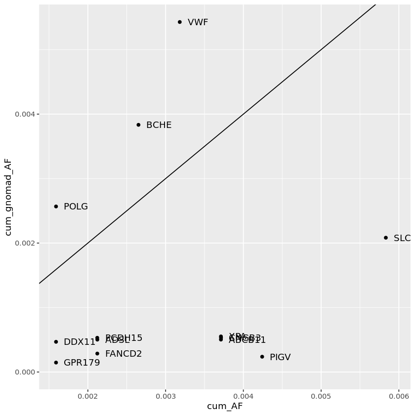
    


```R
p1 <- ggplot(tcu, aes(cum_AF, cum_gnomad_AF)) +
    geom_point() +
     geom_text(aes(label = Symbol),hjust = 0, nudge_x = 0.00001)+ 
    geom_abline()#+
      #xlim(0, 0.0003) 
p2 <- ggplot(tcu, aes(cum_AF, cum_gnomad_AF_NFE)) +
    geom_point() +
    geom_text(aes(label = Symbol),hjust = 0, nudge_x = 0.00001) + 
    geom_abline()#+
    #xlim(0, 0.0003) 

p3 <- ggplot(tgp_cadd_unique, aes(cum_AF2, cum_gnomad_AF2)) +
    geom_point() +
     geom_text(aes(label = Symbol),hjust = 0, nudge_x = 0.0001)+ 
    geom_abline()+ xlim(0, 0.01) + ylim(0, 0.01) 

p4 <- ggplot(tgp_cadd_unique, aes(cum_AF2, cum_gnomad_AF2_NFE)) +
    geom_point() +
    geom_text(aes(label = Symbol),hjust = 0, nudge_x = 0.0001) + 
    geom_abline()+ xlim(0, 0.01) + ylim(0, 0.01) 

    
grid.arrange(p1, p2,p3,p4, nrow = 2)
```

    Warning message:
    “Removed 11 rows containing missing values (geom_point).”Warning message:
    “Removed 11 rows containing missing values (geom_text).”Warning message:
    “Removed 5 rows containing missing values (geom_point).”Warning message:
    “Removed 5 rows containing missing values (geom_text).”


    

    


```R
allPanelsDT3$clinvar_cum_AF2 <- tgp_clinvar_unique$cum_AF2[match(allPanelsDT3$"Gene Symbol",tgp_clinvar_unique$Symbol )]
allPanelsDT3$clinvar_cum_gnomad_AF2 <- tgp_clinvar_unique$cum_gnomad_AF2[match(allPanelsDT3$"Gene Symbol",tgp_clinvar_unique$Symbol )]
allPanelsDT3$clinvar_cum_gnomad_AF2_NFE <- tgp_clinvar_unique$cum_gnomad_AF2_NFE[match(allPanelsDT3$"Gene Symbol",tgp_clinvar_unique$Symbol )]

allPanelsDT3$cadd_cum_AF2 <- tgp_cadd_unique$cum_AF2[match(allPanelsDT3$"Gene Symbol",tgp_cadd_unique$Symbol )]
allPanelsDT3$cadd_cum_gnomad_AF2 <- tgp_cadd_unique$cum_gnomad_AF2[match(allPanelsDT3$"Gene Symbol",tgp_cadd_unique$Symbol )]
allPanelsDT3$cadd_cum_gnomad_AF2_NFE <- tgp_cadd_unique$cum_gnomad_AF2_NFE[match(allPanelsDT3$"Gene Symbol",tgp_cadd_unique$Symbol )]

```


```R
allPanelsDT3[,clinvar_cum_AF2_sum:=sum(clinvar_cum_AF2, na.rm=T), by=Level4]
allPanelsDT3[,clinvar_cum_gnomad_AF2_sum:=sum(clinvar_cum_gnomad_AF2, na.rm=T), by=Level4]
allPanelsDT3[,clinvar_cum_gnomad_AF2_NFE_sum:=sum(clinvar_cum_gnomad_AF2_NFE, na.rm=T), by=Level4]

allPanelsDT3[,cadd_cum_AF2_sum:=sum(cadd_cum_AF2, na.rm=T), by=Level4]
allPanelsDT3[,cadd_cum_gnomad_AF2_sum:=sum(cadd_cum_gnomad_AF2, na.rm=T), by=Level4]
allPanelsDT3[,cadd_cum_gnomad_AF2_NFE_sum:=sum(cadd_cum_gnomad_AF2_NFE, na.rm=T), by=Level4]
allPanelsDT3_unique <- allPanelsDT3[-which(duplicated(Level4)),]
allPanelsDT3_unique$Symbol <- allPanelsDT3_unique$"Gene Symbol"
```


```R
p1 <- ggplot(allPanelsDT3_unique, aes(clinvar_cum_AF2_sum, clinvar_cum_gnomad_AF2_sum)) +
    geom_point() +
     geom_text(aes(label = Level4),hjust = 0, nudge_x = 0.00001)+ 
    geom_abline()
      #xlim(0, 0.0003) 
p2 <- ggplot(allPanelsDT3_unique, aes(clinvar_cum_AF2_sum, clinvar_cum_gnomad_AF2_NFE_sum)) +
    geom_point() +
    geom_text(aes(label = Level4),hjust = 0, nudge_x = 0.00001) + 
    geom_abline()
    #xlim(0, 0.0003) 

p3 <- ggplot(allPanelsDT3_unique, aes(cadd_cum_AF2_sum, cadd_cum_gnomad_AF2_sum)) +
    geom_point() +
     geom_text(aes(label = Level4),hjust = 0, nudge_x = 0.0001)+ 
    geom_abline()+ xlim(0, 0.01) + ylim(0, 0.01) 

p4 <- ggplot(allPanelsDT3_unique, aes(cadd_cum_AF2_sum, cadd_cum_gnomad_AF2_NFE_sum)) +
    geom_point() +
    geom_text(aes(label = Level4),hjust = 0, nudge_x = 0.0001) + 
    geom_abline()+ xlim(0, 0.01) + ylim(0, 0.01) 

    
grid.arrange(p1, p2,p3,p4, nrow = 2)
```

    Warning message:
    “Removed 90 rows containing missing values (geom_point).”Warning message:
    “Removed 90 rows containing missing values (geom_text).”Warning message:
    “Removed 47 rows containing missing values (geom_point).”Warning message:
    “Removed 47 rows containing missing values (geom_text).”


    
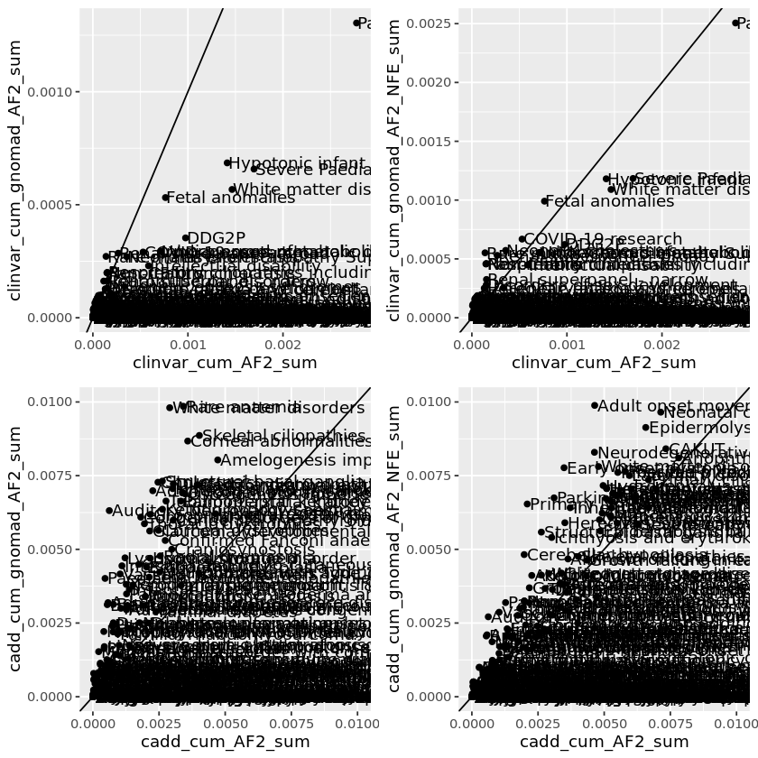
    


### Estimated disease prelevance in gene panels (from geneApp)


```R
idx_list <- split(1:nrow(allPanelsDT3_unique), 1:10)

allPanelsDT3_unique <- allPanelsDT3_unique[order(clinvar_cum_gnomad_AF2_sum, decreasing=T)]
lapply(1:25, function(i){
    start <- ((i-1)*10+1)
    idx <- c(start:min(nrow(allPanelsDT3_unique),start+10))
    
melt_panel_clinvar <- melt(allPanelsDT3_unique[idx],  measure.vars = c("clinvar_cum_AF2_sum", "clinvar_cum_gnomad_AF2_sum", "clinvar_cum_gnomad_AF2_NFE_sum"), value.name = c("frequency"))
#melt_panel_cadd <- melt(allPanelsDT3_unique[idx],  measure.vars = c("cadd_cum_AF2_sum", "cadd_cum_gnomad_AF2_sum", "cadd_cum_gnomad_AF2_NFE_sum"), value.name = c("frequency"))

#library(repr)
#options(repr.plot.width=10, repr.plot.height=15)

p1 <- ggplot(data=melt_panel_clinvar, aes(x=Level4, y=frequency, fill=variable)) +
    geom_bar(stat="identity", position=position_dodge()) +
    theme(axis.text.x = element_text(angle = 45, hjust=1))

p1
})

#p2 <-     ggplot(data=melt_panel_cadd, aes(x=Level4, y=frequency, fill=variable)) +
#geom_bar(stat="identity", position=position_dodge()) +
#theme(axis.text.x = element_text(angle = 45, hjust=1))


```

    Warning message in split.default(1:nrow(allPanelsDT3_unique), 1:10):
    “data length is not a multiple of split variable”


    

    


    

    


    

    


    

    


    
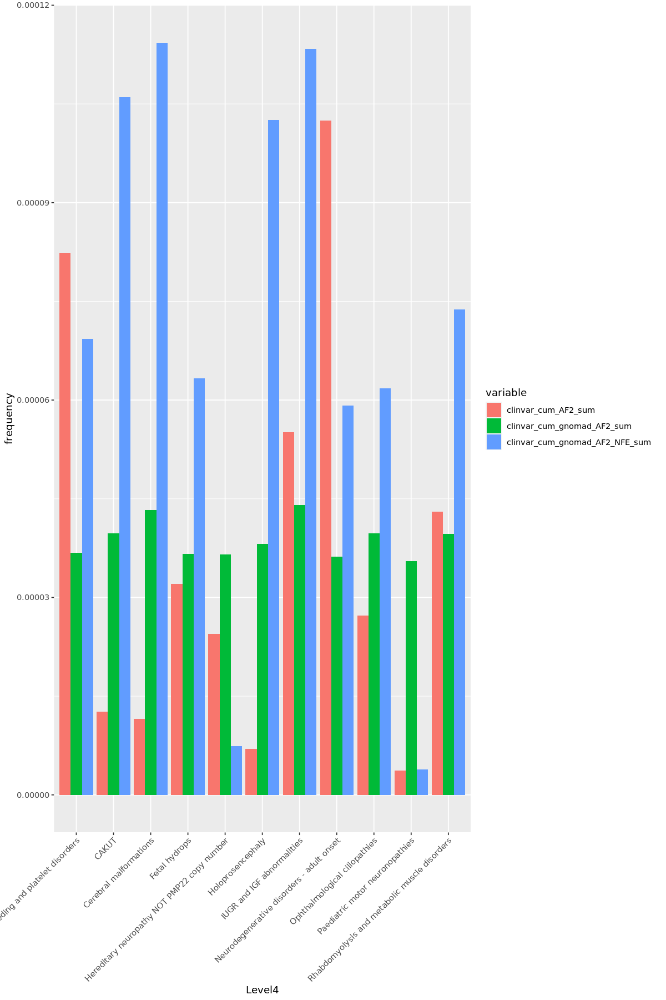
    


    
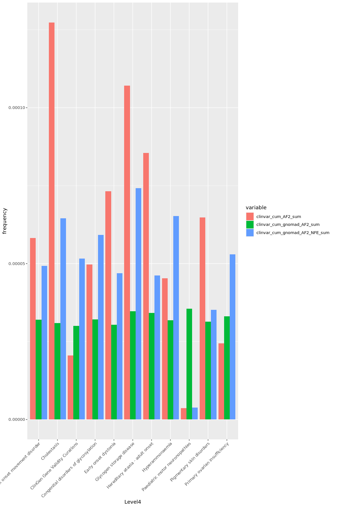
    


    

    


    
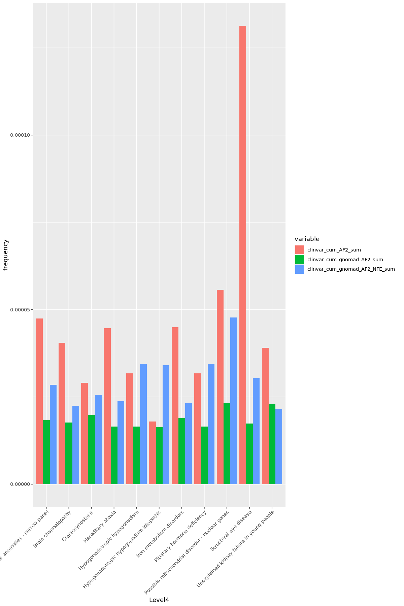
    


    

    


    

    


    

    


    

    


    
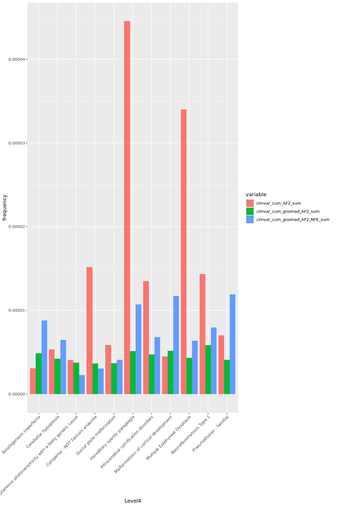
    


    
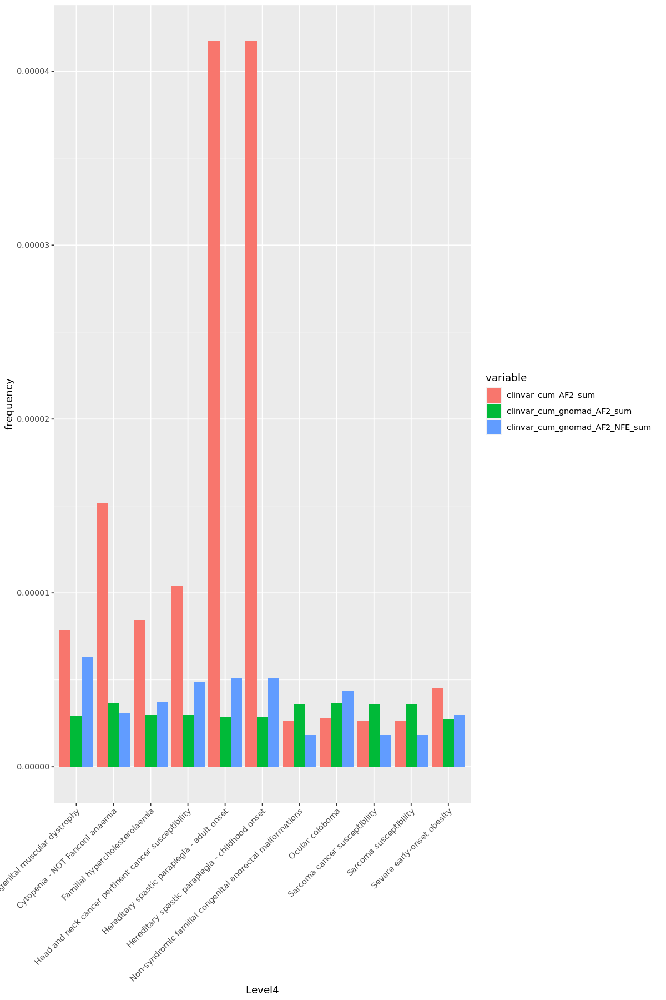
    


    

    


    
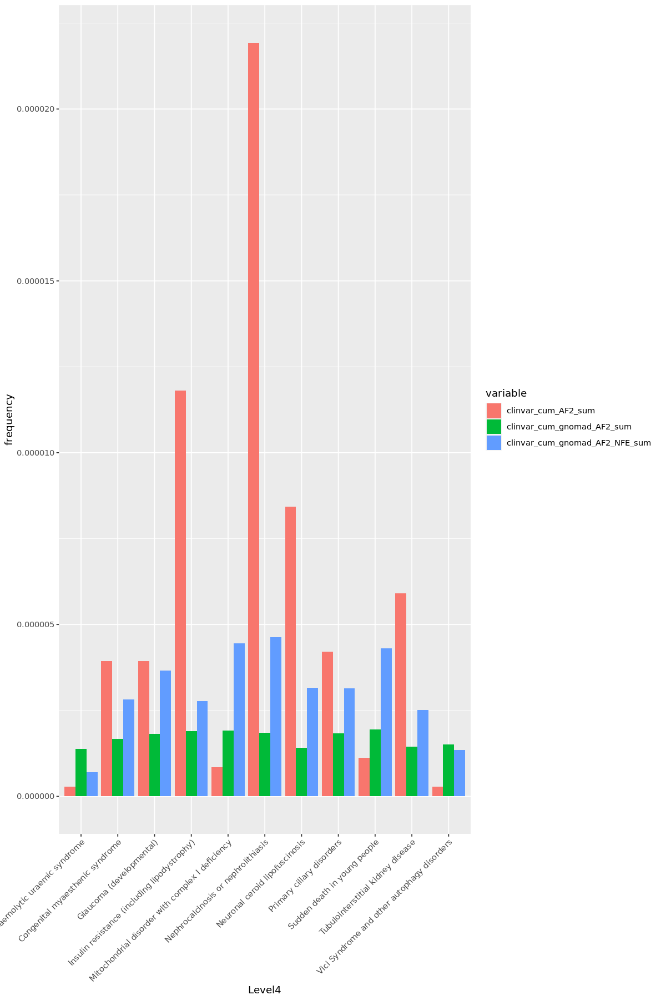
    


    

    


    

    


    

    


    

    


    

    


    

    


    

    


    [[1]]
    
    [[2]]
    
    [[3]]
    
    [[4]]
    
    [[5]]
    
    [[6]]
    
    [[7]]
    
    [[8]]
    
    [[9]]
    
    [[10]]
    
    [[11]]
    
    [[12]]
    
    [[13]]
    
    [[14]]
    
    [[15]]
    
    [[16]]
    
    [[17]]
    
    [[18]]
    
    [[19]]
    
    [[20]]
    
    [[21]]
    
    [[22]]
    
    [[23]]
    
    [[24]]
    
    [[25]]


    

    


    

    


```R
idx_list <- split(1:nrow(allPanelsDT3_unique), 1:10)

allPanelsDT3_unique <- allPanelsDT3_unique[order(cadd_cum_gnomad_AF2_sum, decreasing=T)]
lapply(1:25, function(i){
    start <- ((i-1)*10+1)
    idx <- c(start:min(nrow(allPanelsDT3_unique),start+10))
    
#melt_panel_clinvar <- melt(allPanelsDT3_unique[idx],  measure.vars = c("clinvar_cum_AF2_sum", "clinvar_cum_gnomad_AF2_sum", "clinvar_cum_gnomad_AF2_NFE_sum"), value.name = c("frequency"))
melt_panel_cadd <- melt(allPanelsDT3_unique[idx],  measure.vars = c("cadd_cum_AF2_sum", "cadd_cum_gnomad_AF2_sum", "cadd_cum_gnomad_AF2_NFE_sum"), value.name = c("frequency"))

#library(repr)
#options(repr.plot.width=10, repr.plot.height=15)

p1 <- ggplot(data=melt_panel_cadd, aes(x=Level4, y=frequency, fill=variable)) +
    geom_bar(stat="identity", position=position_dodge()) +
    theme(axis.text.x = element_text(angle = 45, hjust=1))

p1
})


```

    Warning message in split.default(1:nrow(allPanelsDT3_unique), 1:10):
    “data length is not a multiple of split variable”


    

    


    

    


    

    


    

    


    

    


    
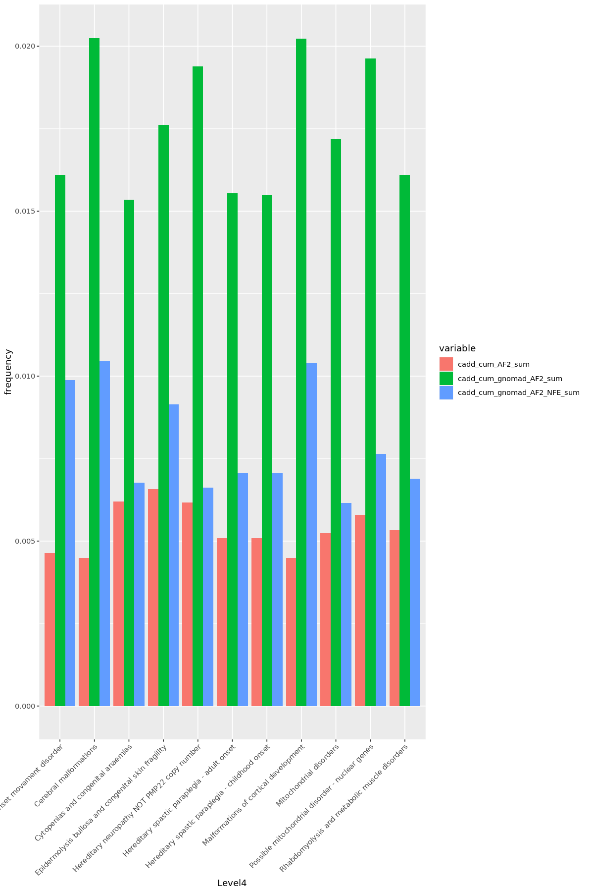
    


    
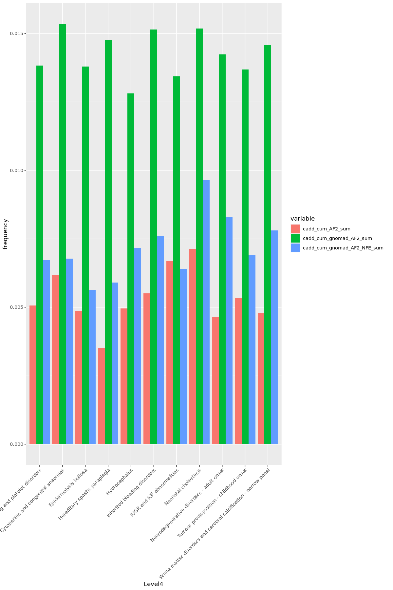
    


    

    


    
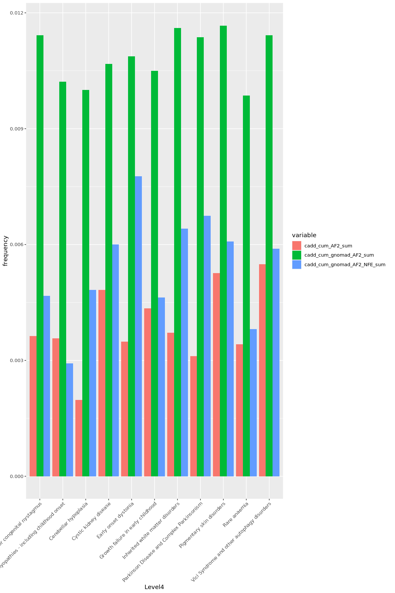
    


    

    


    

    


    

    


    

    


    

    


    
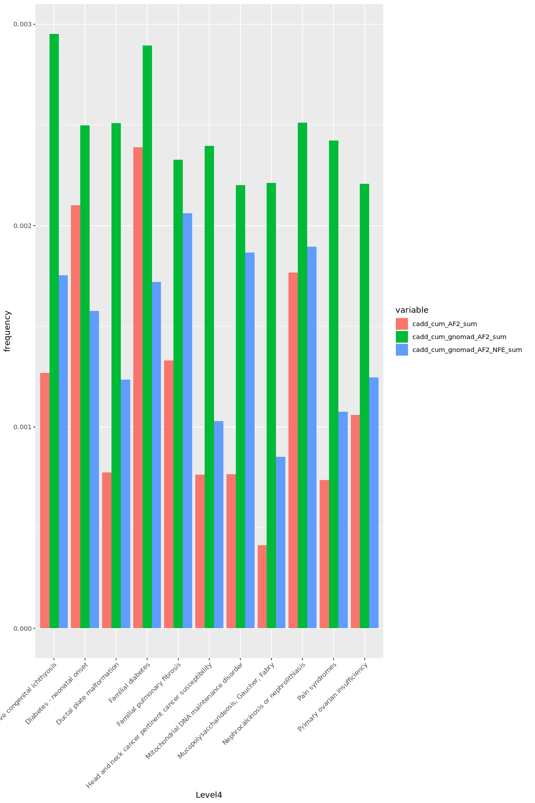
    


    
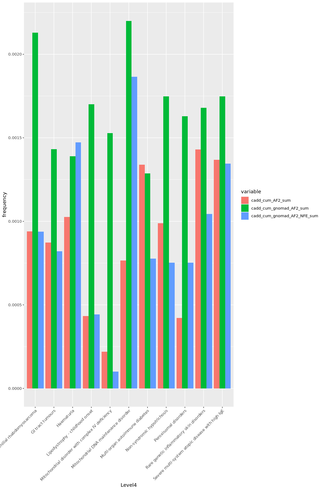
    


    
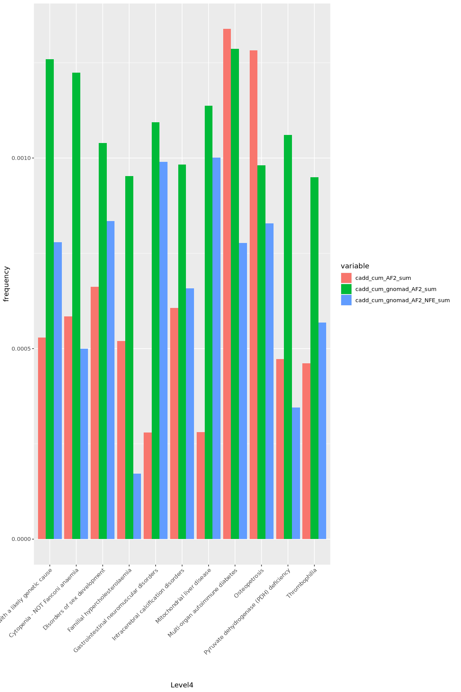
    


    
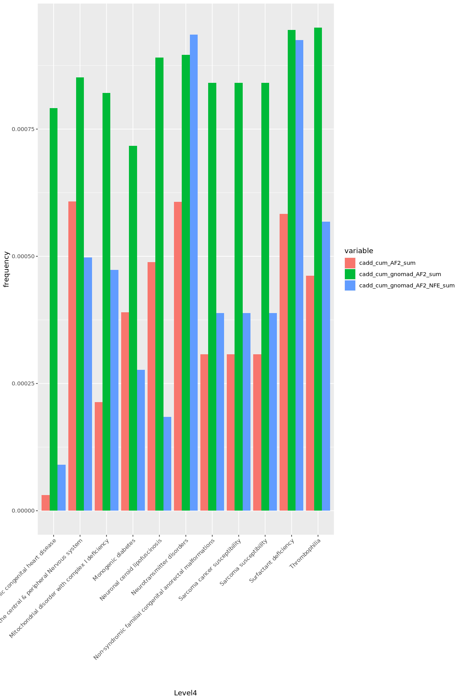
    


    
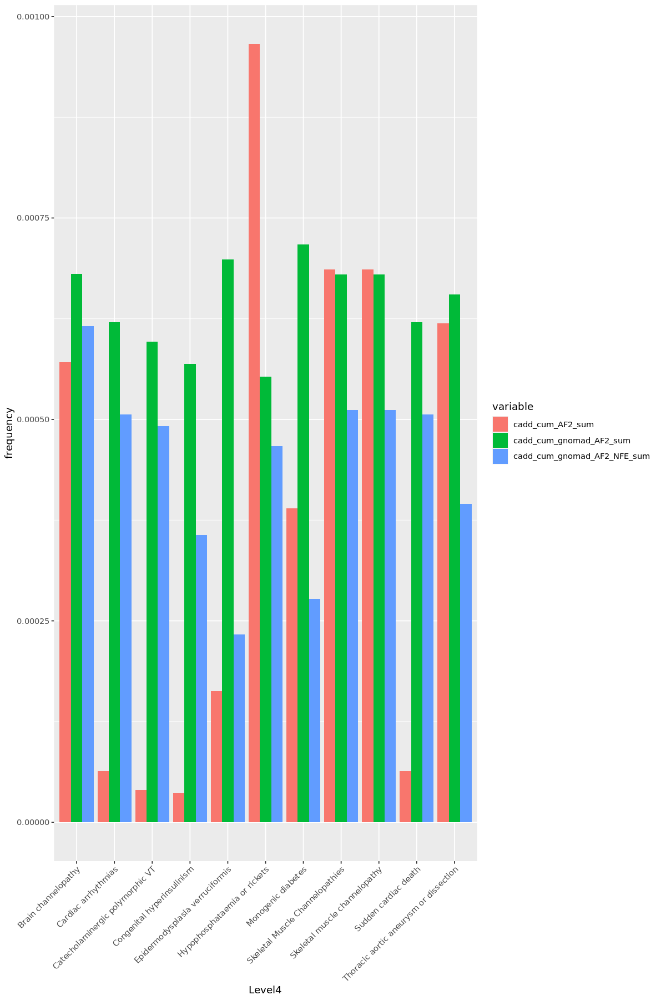
    


    

    


    
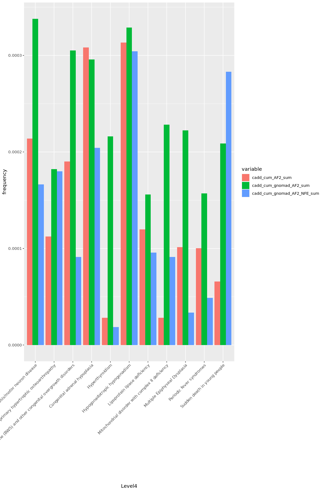
    


    

    


    

    


    [[1]]
    
    [[2]]
    
    [[3]]
    
    [[4]]
    
    [[5]]
    
    [[6]]
    
    [[7]]
    
    [[8]]
    
    [[9]]
    
    [[10]]
    
    [[11]]
    
    [[12]]
    
    [[13]]
    
    [[14]]
    
    [[15]]
    
    [[16]]
    
    [[17]]
    
    [[18]]
    
    [[19]]
    
    [[20]]
    
    [[21]]
    
    [[22]]
    
    [[23]]
    
    [[24]]
    
    [[25]]


    

    


    

    


# OLD analysis:


```R
# Conseuqneces summary
csq_table <- as.data.table(table(tgp_vep$Consequence))
head(csq_table)
```


    Error in table(tgp_vep$Consequence): object 'tgp_vep' not found
    Traceback:


    1. as.data.table(table(tgp_vep$Consequence))

    2. table(tgp_vep$Consequence)


```R
# Select "main" consequence per each row 
csq_table$csq_first <- sapply(strsplit(csq_table$V1, ","), `[`, 1)
csq_first <- as.data.table(csq_table %>% mutate(csq_first = toupper(csq_first)) %>% 
    group_by(csq_first) %>% summarise(N = sum(N)))
dim(csq_first)
head(csq_first)
```


<ol class=list-inline>
	<li>24</li>
	<li>2</li>
</ol>


<table>
<thead><tr><th scope=col>csq_first</th><th scope=col>N</th></tr></thead>
<tbody>
	<tr><td>3_PRIME_UTR_VARIANT              </td><td> 341486                          </td></tr>
	<tr><td>5_PRIME_UTR_VARIANT              </td><td>  57721                          </td></tr>
	<tr><td>CODING_SEQUENCE_VARIANT          </td><td>      9                          </td></tr>
	<tr><td>DOWNSTREAM_GENE_VARIANT          </td><td>2131350                          </td></tr>
	<tr><td>FRAMESHIFT_VARIANT               </td><td>   4416                          </td></tr>
	<tr><td>INCOMPLETE_TERMINAL_CODON_VARIANT</td><td>      4                          </td></tr>
</tbody>
</table>


```R
# Plot consequences
p1 <- ggplot(csq_first, aes(reorder(csq_first, -N), N)) + 
    geom_col() +
    scale_x_discrete(guide = guide_axis(angle = 90)) +
    scale_y_log10() +
    labs(x = "Consequence", y = "Frequency (log10)")
p2 <- ggplot(csq_first, aes(reorder(csq_first, -N), N)) + 
    geom_col() +
    scale_x_discrete(guide = guide_axis(angle = 90)) +
    labs(x = "Consequence", y = "Frequency")
    #theme(plot.title = "Liczba wariantów dla poszczególnych głownych konsekwencji", axis.title.x = element_blank(), axis.title.y = element_blank())


grid.arrange(p2, p1, nrow = 1, top = textGrob("Total no. of variants obs. by VEP consequence",gp=gpar(fontsize=20)))
```


    

    


```R

```


```R
# Recessive clinvar pathogenic/likely pathogenic variants
clinvar_recessive <- tgp_vep[which(Symbol %in% omim_recessive$symbol & CLNSIG %in% c("Pathogenic", "Pathogenic/Likely_pathogenic", "Likely_pathogenic)"))]
```


```R
dim(tgp_vep[which(AC==0)])
```


<ol class=list-inline>
	<li>429163</li>
	<li>154</li>
</ol>


```R
# 10 variants with AC=0
dim(clinvar_recessive)
dim(clinvar_recessive[which(AC>0)])
head(clinvar_recessive[which(AC==0)])
```


```R
table(clinvar_recessive[,Consequence])
```


    
                                            5_prime_UTR_variant 
                                                              3 
                                        downstream_gene_variant 
                                                             12 
                                             frameshift_variant 
                                                            118 
                       frameshift_variant,splice_region_variant 
                                                              3 
                                               inframe_deletion 
                                                              6 
                                              inframe_insertion 
                                                              1 
                                                 intron_variant 
                                                             18 
                                               missense_variant 
                                                            251 
                         missense_variant,splice_region_variant 
                                                              8 
                                        splice_acceptor_variant 
                                                             19 
                                           splice_donor_variant 
                                                             40 
    splice_donor_variant,coding_sequence_variant,intron_variant 
                                                              2 
                           splice_region_variant,intron_variant 
                                                             17 
                       splice_region_variant,synonymous_variant 
                                                              3 
                                                     start_lost 
                                                              6 
                                                    stop_gained 
                                                            121 
                                 stop_gained,frameshift_variant 
                                                              2 
                              stop_gained,splice_region_variant 
                                                              2 
                                                      stop_lost 
                                                              2 
                                             synonymous_variant 
                                                              3 
                                          upstream_gene_variant 
                                                             11 


```R
clinvar_recessive[which(Consequence == "upstream_gene_variant"),ClinVar_url]
```


<ol class=list-inline>
	<li>'https://www.ncbi.nlm.nih.gov/clinvar/variation/12076/'</li>
	<li>'https://www.ncbi.nlm.nih.gov/clinvar/variation/265135/'</li>
	<li>'https://www.ncbi.nlm.nih.gov/clinvar/variation/626999/'</li>
	<li>'https://www.ncbi.nlm.nih.gov/clinvar/variation/116/'</li>
	<li>'https://www.ncbi.nlm.nih.gov/clinvar/variation/188834/'</li>
	<li>'https://www.ncbi.nlm.nih.gov/clinvar/variation/573257/'</li>
	<li>'https://www.ncbi.nlm.nih.gov/clinvar/variation/162203/'</li>
	<li>'https://www.ncbi.nlm.nih.gov/clinvar/variation/223044/'</li>
	<li>'https://www.ncbi.nlm.nih.gov/clinvar/variation/16663/'</li>
	<li>'https://www.ncbi.nlm.nih.gov/clinvar/variation/223019/'</li>
	<li>'https://www.ncbi.nlm.nih.gov/clinvar/variation/31077/'</li>
</ol>


```R
dim(clinvar_recessive[which(AF > gnomAD_AF_NFE), c("key","gnomAD_AF","gnomAD_AF_NFE", "AF")])
head(clinvar_recessive[which(AF > gnomAD_AF_NFE), c("key","gnomAD_AF","gnomAD_AF_NFE", "AF")])
```


```R
clinvar_gene_table <- as.data.table(sort(table(clinvar_recessive$Symbol), decreasing = TRUE))
```


```R
# Genes with the highest number of Clinvar pathogenic varianst
clinvar_gene_table_2 <- clinvar_gene_table[which(N > 2)]
ggplot(clinvar_gene_table[which(N > 2)], aes(reorder(V1, -N), N)) + 
    geom_col() +
    scale_x_discrete(guide = guide_axis(angle = 60)) +
    labs(title = "Genes with most P/LP ClinVar variants in TGP cohort", x = "Symbol", y = "Count")
```


    

    


```R
clinvar_recessive$AF <- as.numeric(clinvar_recessive$AF)
```


```R
melt_clinvar <- melt(clinvar_recessive, id.vars = c("key2"), measure.vars = c("gnomAD_AF", "gnomAD_AF_NFE", "AF"), variable.name = c("database"), value.name = c("frequency"))
```


```R
dim(melt_clinvar)
#head(melt_clinvar)
```


<ol class=list-inline>
	<li>1944</li>
	<li>3</li>
</ol>


```R
ggplot(melt_clinvar, aes(database,frequency, fill=frequency)) +
    geom_boxplot() +
    geom_line(aes(group=key2)) +
    geom_point(aes(fill=frequency,group=database),size=2,shape=21, position = position_dodge(0.2)) +
    theme(legend.position = "none") +
    scale_y_log10() +
    labs(title = "ClinVar P/LP variant freq. across gnomAD database and TGP cohort", x = "Population", y = "Frequency (log10)")
```

    Warning message:
    “Transformation introduced infinite values in continuous y-axis”Warning message:
    “Transformation introduced infinite values in continuous y-axis”Warning message:
    “Transformation introduced infinite values in continuous y-axis”Warning message:
    “Removed 211 rows containing non-finite values (stat_boxplot).”


    

    


```R
clinvar_recessive_overrep_TGP <- clinvar_recessive[which(AF > gnomAD_AF_NFE & AF > gnomAD_AF), c("key2","gnomAD_AF","gnomAD_AF_NFE", "AF")]
#head(clinvar_recessive_overrep_TGP)
melt_clinvar_overrep_TGP <- melt(clinvar_recessive_overrep_TGP, id.vars = c("key2"), measure.vars = c("gnomAD_AF", "gnomAD_AF_NFE", "AF"), variable.name = c("database"), value.name = c("frequency"))
#head(melt_clinvar_overrep_TGP)
```


```R
clinvar_recessive_diff <- clinvar_recessive[, diff_AF := gnomAD_AF - AF][, diff_AF_NFE := gnomAD_AF_NFE - AF]
```


```R
#head(clinvar_recessive_diff[which(diff_AF < 0 & diff_AF_NFE < 0), c("key","gnomAD_AF","gnomAD_AF_NFE", "AF", "diff_AF", "diff_AF_NFE")])
dim(clinvar_recessive_diff[which(diff_AF < 0 & diff_AF_NFE < 0)])
```


<ol class=list-inline>
	<li>551</li>
	<li>156</li>
</ol>


```R
#ggplot(clinvar_recessive_overrep_TGP, aes(database, frequency, fill = frequency)) +
#    geom_boxplot() +
#    geom_line(aes(group = key2)) +
#    geom_point(aes(fill = frequency, group = database), size = 2, shape = 21, position = position_dodge(0.2)) +
#    theme(legend.position = "none") +
#    scale_y_log10() +
#    labs(title = "ClinVar P/LP variant freq. across gnomAD database and TGP cohort", x = "Population", y = "Frequency (log10)")

#ggplot(clinvar_recessive_overrep_TGP, aes(x=database, y=frequency)) +
#    geom_boxplot() +
#    geom_jitter(colour="lightblue", height = 0) +
#    scale_y_log10() +
#    labs(title = "ClinVar P/LP variant freq. across gnomAD database and TGP cohort", x = "Population", y = "Frequency (log10)")
```


```R
ggplot(melt_clinvar, aes(x=database, y=frequency)) +
    geom_boxplot() +
    geom_jitter(colour="lightblue", height = 0) +
    scale_y_log10() +
    labs(title = "ClinVar P/LP variant freq. across gnomAD database and TGP cohort", x = "Population", y = "Frequency (log10)")
```

    Warning message:
    “Transformation introduced infinite values in continuous y-axis”Warning message:
    “Transformation introduced infinite values in continuous y-axis”Warning message:
    “Removed 211 rows containing non-finite values (stat_boxplot).”Warning message:
    “Removed 211 rows containing missing values (geom_point).”


    
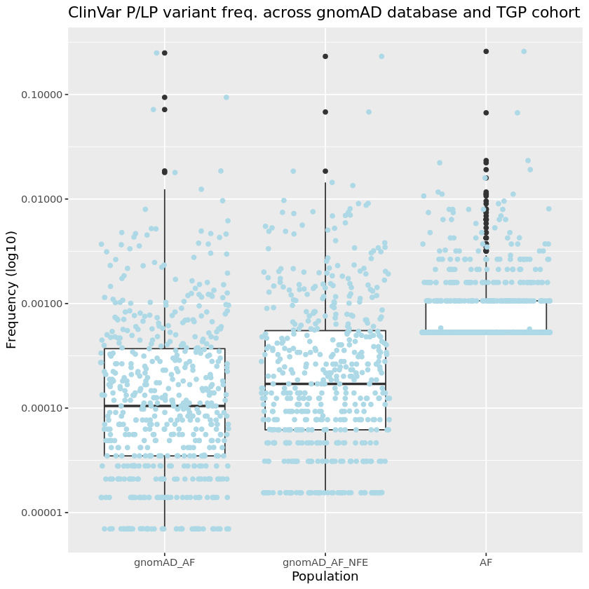
    


```R
ggplot(melt_clinvar, aes(x=database, y=frequency)) +
    geom_violin() +
    geom_count(alpha=0.5) +
    scale_y_log10() +
    labs(title = "ClinVar P/LP variant freq. across gnomAD database and TGP cohort", x = "Population", y = "Frequency (log10)")
```

    Warning message:
    “Transformation introduced infinite values in continuous y-axis”Warning message:
    “Transformation introduced infinite values in continuous y-axis”Warning message:
    “Removed 211 rows containing non-finite values (stat_ydensity).”Warning message:
    “Removed 211 rows containing non-finite values (stat_sum).”


    

    


```R

```


```R
tgp_vep_gene_table <- as.data.table(sort(table(tgp_vep_nonsyn_rare$Symbol), decreasing = TRUE))
ggplot(tgp_vep_gene_table[2:31], aes(reorder(V1, -N), N)) + 
    geom_col() +
    scale_x_discrete(guide = guide_axis(angle = 45)) +
    labs(title = "Total no. of variants per gene in TGP cohort", x = "Symbol", y = "Count")
```


    

    


```R
tgp_vep_gene_table_singleton <- as.data.table(sort(table(tgp_vep_nonsyn_rare[which(AF < 0.01 & AC == 1)]$Symbol), decreasing = TRUE))
```


```R
ggplot(tgp_vep_gene_table_singleton[2:31], aes(reorder(V1, -N), N)) + 
    geom_col() +
    scale_x_discrete(guide = guide_axis(angle = 45)) +
    labs(title = "Total no. of singleton variants per gene in TGP cohort", x = "Symbol", y = "Count")
```


    
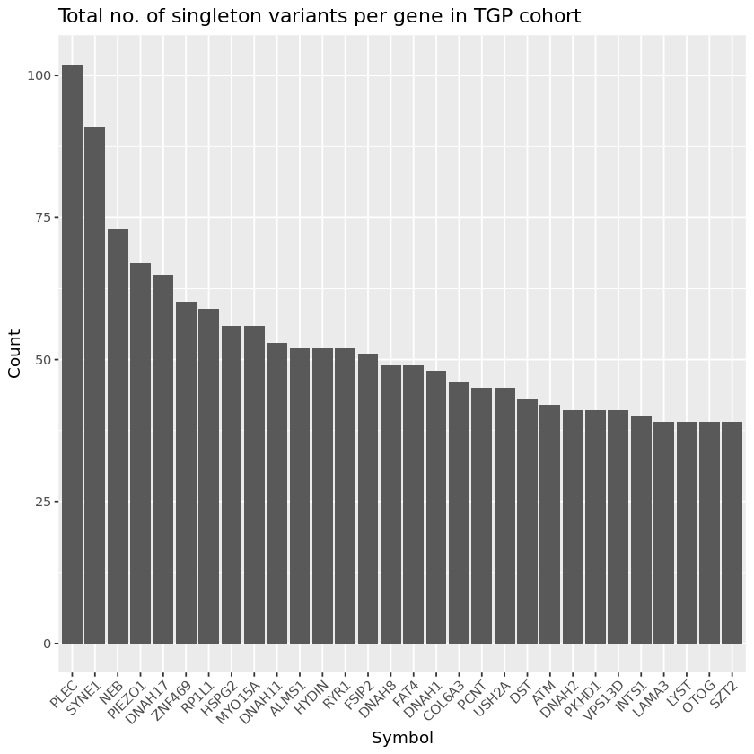
    

