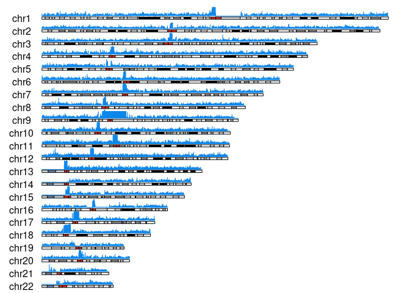

Runs of homozygosity on 943 individuals
================

| stat                |  min |  median |      mean |        max |
|:--------------------|-----:|--------:|----------:|-----------:|
| Length              | 83.0 | 54619.0 | 124596.53 | 63912719.0 |
| Number\_of\_markers |  2.0 |   100.0 |    166.18 |    45797.0 |
| Quality             |  0.6 |    51.1 |     49.86 |       98.7 |

ROHs quality histogram

<!-- -->

## Results

### All results below are ROHs filter for autosomes with Quality &gt; 25%

1.  Average sum of ROHs per genome

<!-- -->

|     | mean\_SROH\_Mb |
|:----|:---------------|
|     | Min. :266.0    |
|     | 1st Qu.:394.6  |
|     | Median :403.9  |
|     | Mean :403.0    |
|     | 3rd Qu.:412.1  |
|     | Max. :521.2    |

| Range    | mean\_length |
|:---------|-------------:|
| 25kb-1Mb |    0.1106537 |
| &gt;1Mb  |    2.5019576 |
| NA       |    0.0161917 |

2.  Sum of ROHs per chromosome and individual

<!-- -->

    ## `summarise()` has grouped output by 'sample_id', 'Chromosome'. You can override using the `.groups` argument.

<!-- -->

    ## `summarise()` has grouped output by 'sample_id'. You can override using the `.groups` argument.

    ## Adding missing grouping variables: `sample_id`

|     | sample\_id       | mean\_SROH\_Mb |
|:----|:-----------------|:---------------|
|     | Length:20746     | Min. : 2.184   |
|     | Class :character | 1st Qu.:11.107 |
|     | Mode :character  | Median :18.209 |
|     | NA               | Mean :18.319   |
|     | NA               | 3rd Qu.:25.023 |
|     | NA               | Max. :67.368   |

3.  Sum of ROH length per range

<!-- -->

    ## `summarise()` has grouped output by 'Range'. You can override using the `.groups` argument.

<!-- -->

|     | &gt;1Mb         |
|:----|:----------------|
|     | Min. : 5.821    |
|     | 1st Qu.: 28.883 |
|     | Median : 33.917 |
|     | Mean : 33.234   |
|     | 3rd Qu.: 38.002 |
|     | Max. :131.589   |

4.  Relationship between number of ROHs and total length of genome
    covered by them

<!-- -->

5.  ROH genome coverage

<!-- -->

<!-- -->

6.  % of ROhs per category in sample

<!-- -->

    ## Warning: Removed 1 rows containing missing values (geom_bar).

<!-- -->

7.  ROH length sum

<!-- -->

    ## Warning: Removed 1 rows containing missing values (geom_bar).

<!-- -->

<!-- 7. Number of ROHs per sample -->
<!-- ```{r roh_count_per_sample, echo=FALSE}  -->
<!-- suppressMessages( -->
<!-- roh_avg <- roh %>% group_by(sample_id, Range) %>% -->
<!--   summarise(avg_length=mean(Length), n=n()) %>% -->
<!--   arrange(Range,n) -->
<!-- ) -->
<!-- roh_avg %>% -->
<!--   ggplot(aes(x=1:nrow(roh_avg),y=n)) + -->
<!--   geom_point(col='#48C095',alpha=0.5) + -->
<!--   facet_wrap(~Range, nrow = 3,scales = 'free') +  -->
<!--   ylab('Number of ROHs') + -->
<!--   xlab('Individual') + -->
<!--   theme_classic() + -->
<!--   theme(axis.text.x = element_blank()) -->
<!-- ``` -->
<!-- 8. Average ROHs per sample -->
<!-- ```{r average_roh_per_sample, echo=FALSE}  -->
<!-- roh_avg <- roh %>% group_by(sample_id, Range) %>% -->
<!--   summarise(avg_length=mean(Length), n=n()) %>% -->
<!--   arrange(Range,avg_length) -->
<!-- roh_avg %>% -->
<!--   ggplot(aes(x=1:nrow(roh_avg),y=avg_length)) + -->
<!--   geom_point(col='#48C095',alpha=0.5) + -->
<!--   facet_wrap(~Range, nrow = 3,scales = 'free') +  -->
<!--   ylab('Mean ROH length') + -->
<!--   xlab('Individual') + -->
<!--   theme_classic() + -->
<!--   theme(axis.text.x = element_blank()) -->
<!-- ``` -->

8.  Cummulative sum

<!-- -->

    ## `summarise()` has grouped output by 'sample_id'. You can override using the `.groups` argument.

<!-- -->

9.  Cosanguinity in population

<!-- -->
