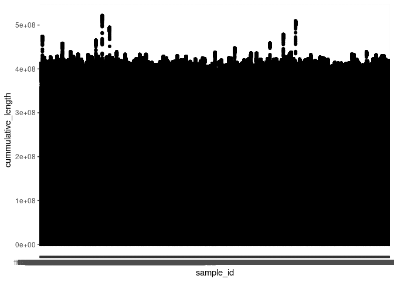

Runs of homozygosity
================

| stat                |  min |  median |      mean |        max |
|:--------------------|-----:|--------:|----------:|-----------:|
| Length              | 83.0 | 54628.0 | 124447.48 | 63912719.0 |
| Number\_of\_markers |  2.0 |   100.0 |    166.01 |    45797.0 |
| Quality             |  0.6 |    51.1 |     49.86 |       98.7 |

<!-- -->

<!-- ```{r roh, echo=FALSE} --> <!-- test1 <- roh$Length > 5e+06 -->
<!-- test2 <- roh$Length < 25000 -->

<!-- roh <- roh %>% -->
<!--     mutate(group = case_when(test1 ~ ">5Mb", -->
<!--                              (test2) ~ "<25Kb" , -->
<!--                              !test1 & !test2 ~ "25Kb-5Mb" -->
<!--     )) -->

<!-- roh  %>% filter(Length > 25e+03  &  Quality > 90) %>% -->
<!--   ggplot(aes(Length)) + -->
<!--     geom_histogram(fill='48C095', col='27384A') + -->
<!--      theme_classic() + -->
<!--   ggtitle('Number of ROHs with length in specific ranges') + -->
<!--   theme(plot.title = element_text(hjust = 0.5)) -->

<!-- ``` -->

<!-- -->

<!-- -->
