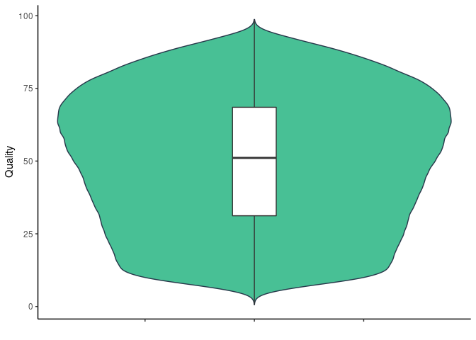
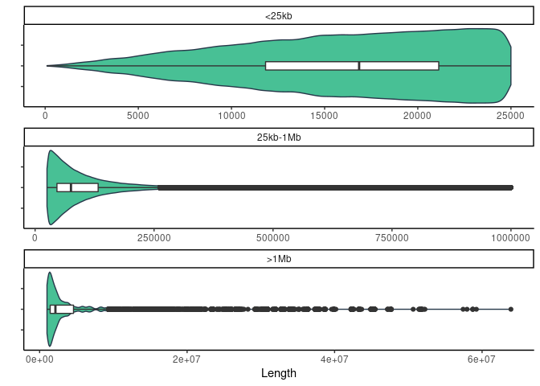
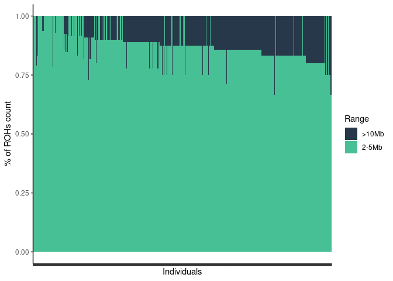
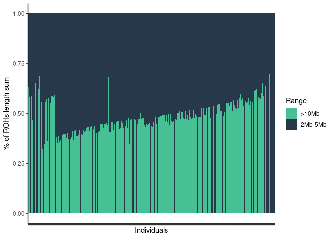
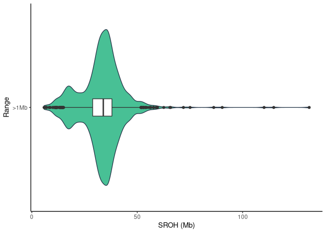
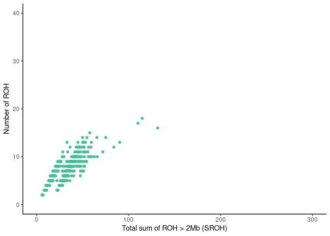
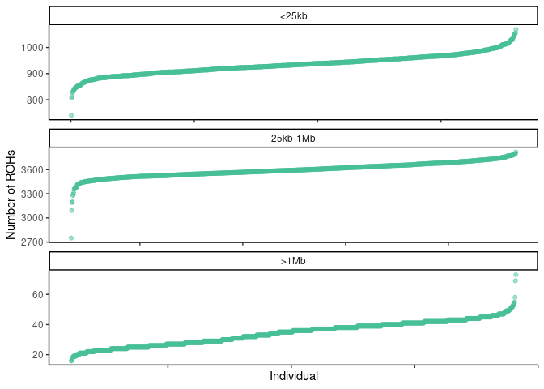
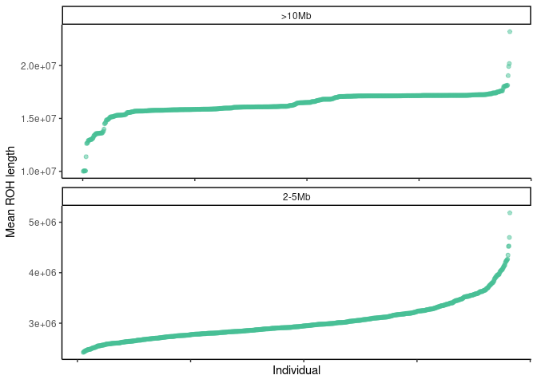
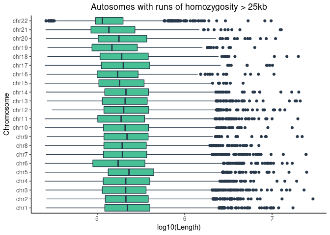

Runs of homozygosity on 1082 individuals
================

| stat                |  min |  median |      mean |        max |
|:--------------------|-----:|--------:|----------:|-----------:|
| Length              | 83.0 | 54628.0 | 124447.48 | 63912719.0 |
| Number\_of\_markers |  2.0 |   100.0 |    166.01 |    45797.0 |
| Quality             |  0.6 |    51.1 |     49.86 |       98.7 |

ROHs quality histogram

<!-- -->

## Results

### All results below are ROHs filter for autosomes with Quality &gt; 25% andNumber of markers &gt;= 50

Number of ROHs with length in specific ranges

<!-- -->

% of ROhs per category in sample

    ## `summarise()` has grouped output by 'Range'. You can override using the `.groups` argument.

<!-- -->

ROH length sum

    ## `summarise()` has grouped output by 'Range'. You can override using the `.groups` argument.

<!-- -->

Sum of ROH length per range

    ## `summarise()` has grouped output by 'Range'. You can override using the `.groups` argument.

<!-- -->

Relationship between number of ROHs and total length of genome covered
by them

<!-- -->

Number of ROHs per sample

    ## `summarise()` has grouped output by 'sample_id'. You can override using the `.groups` argument.

<!-- -->

Average ROHs per sample

    ## `summarise()` has grouped output by 'sample_id'. You can override using the `.groups` argument.

<!-- -->

Cosanguinity in population

<!-- -->
