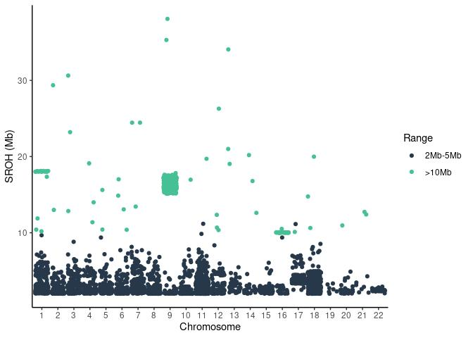

Runs of homozygosity on 943 individuals
================

| stat                |   min |  median |      mean |        max |
|:--------------------|------:|--------:|----------:|-----------:|
| Length              | 609.0 | 73043.0 | 159868.28 | 63912719.0 |
| Number\_of\_markers |  51.0 |   133.0 |    211.22 |    45797.0 |
| Quality             |  25.1 |    60.5 |     59.46 |       98.7 |

ROHs quality histogram

## Results

1.  Cummulative sum

<!-- -->

    ## `summarise()` has grouped output by 'sample_id'. You can override using the `.groups` argument.
    ## `summarise()` has grouped output by 'sample_id'. You can override using the `.groups` argument.

    ## `summarise()` has grouped output by 'Range'. You can override using the `.groups` argument.

<!-- -->

2.  Median SROH

<!-- -->

    ## `summarise()` has grouped output by 'Range'. You can override using the `.groups` argument.
    ## `summarise()` has grouped output by 'Range'. You can override using the `.groups` argument.

<!-- -->

2.  Coverage heatmap

<!-- -->

### All results below are ROHs filter for autosomes with Quality &gt; 25%, Number of markers &gt; 50 and ROH length &gt; 2 Mb

3.  Average sum of ROHs per genome

<!-- -->

|     | mean\_SROH\_Mb  |
|:----|:----------------|
|     | Min. : 5.821    |
|     | 1st Qu.: 28.883 |
|     | Median : 33.855 |
|     | Mean : 33.207   |
|     | 3rd Qu.: 37.978 |
|     | Max. :131.589   |

| Range    | mean\_length |
|:---------|-------------:|
| 2Mb-5Mb  |     2.892791 |
| &gt;10Mb |    16.239240 |

4.  Sum of ROHs per chromosome and individual

<!-- -->

    ## `summarise()` has grouped output by 'sample_id', 'Chromosome'. You can override using the `.groups` argument.

<!-- -->

    ## `summarise()` has grouped output by 'sample_id'. You can override using the `.groups` argument.

    ## Adding missing grouping variables: `sample_id`

|     | sample\_id       | mean\_SROH\_Mb |
|:----|:-----------------|:---------------|
|     | Length:6575      | Min. : 2.000   |
|     | Class :character | 1st Qu.: 2.358 |
|     | Mode :character  | Median : 2.972 |
|     | NA               | Mean : 4.763   |
|     | NA               | 3rd Qu.: 3.900 |
|     | NA               | Max. :38.193   |

5.  Sum of ROH length per range

<!-- -->

    ## `summarise()` has grouped output by 'Range'. You can override using the `.groups` argument.

<!-- -->

|     | 2Mb-5Mb        | &gt;10Mb       |
|:----|:---------------|:---------------|
|     | Min. : 5.815   | Min. : 10.00   |
|     | 1st Qu.:15.537 | 1st Qu.: 15.89 |
|     | Median :18.727 | Median : 16.76 |
|     | Mean :19.026   | Mean : 17.77   |
|     | 3rd Qu.:21.975 | 3rd Qu.: 17.17 |
|     | Max. :42.199   | Max. :104.20   |

6.  Relationship between number of ROHs and total length of genome
    covered by them

<!-- -->

<!-- 6. ROH genome coverage  -->
<!-- ```{r genome_coverage, echo=FALSE} -->
<!-- chr <- 'chr1' -->
<!-- coverage <- roh %>% filter(Chromosome %in% chr) %>% -->
<!--   arrange(Chromosome,Start) -->
<!-- # coverage$Chromosome <- paste(coverage$Chromosome,sep='') -->
<!-- # coverage$x_from <- paste(coverage$Chromosome,coverage$Start,sep='') -->
<!-- # coverage$x_end <- paste(coverage$Chromosome,coverage$End,sep='') -->
<!-- coverage %>% ggplot() + -->
<!--   geom_segment(aes(x = Start, y = sample_id, xend = End,  -->
<!--                                  yend = sample_id), col='#48C095') + -->
<!--   theme_classic() + -->
<!--   theme(axis.text.x = element_blank(),axis.text.y = element_blank()) + -->
<!--   xlab('Position on chromosome 1') + -->
<!--   ylab('Individual') -->
<!-- ``` -->

7.  % of ROhs per category in sample

<!-- -->

8.  ROH length sum

<!-- -->

<!-- 7. Number of ROHs per sample -->
<!-- ```{r roh_count_per_sample, echo=FALSE}  -->
<!-- suppressMessages( -->
<!-- roh_avg <- roh %>% group_by(sample_id, Range) %>% -->
<!--   summarise(avg_length=mean(Length), n=n()) %>% -->
<!--   arrange(Range,n) -->
<!-- ) -->
<!-- roh_avg %>% -->
<!--   ggplot(aes(x=1:nrow(roh_avg),y=n)) + -->
<!--   geom_point(col='#48C095',alpha=0.5) + -->
<!--   facet_wrap(~Range, nrow = 3,scales = 'free') +  -->
<!--   ylab('Number of ROHs') + -->
<!--   xlab('Individual') + -->
<!--   theme_classic() + -->
<!--   theme(axis.text.x = element_blank()) -->
<!-- ``` -->
<!-- 8. Average ROHs per sample -->
<!-- ```{r average_roh_per_sample, echo=FALSE}  -->
<!-- roh_avg <- roh %>% group_by(sample_id, Range) %>% -->
<!--   summarise(avg_length=mean(Length), n=n()) %>% -->
<!--   arrange(Range,avg_length) -->
<!-- roh_avg %>% -->
<!--   ggplot(aes(x=1:nrow(roh_avg),y=avg_length)) + -->
<!--   geom_point(col='#48C095',alpha=0.5) + -->
<!--   facet_wrap(~Range, nrow = 3,scales = 'free') +  -->
<!--   ylab('Mean ROH length') + -->
<!--   xlab('Individual') + -->
<!--   theme_classic() + -->
<!--   theme(axis.text.x = element_blank()) -->
<!-- ``` -->
<!--
9. Cosanguinity in population
-->
