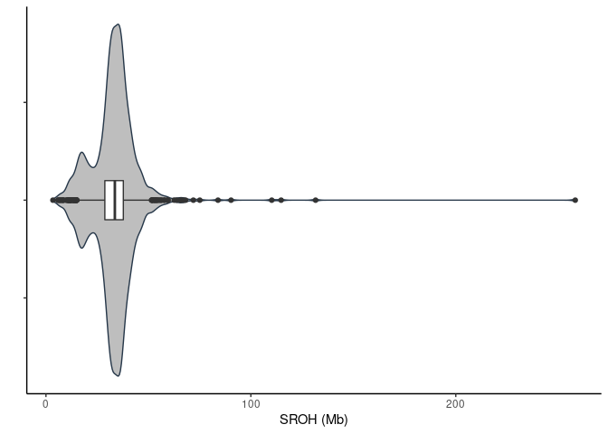
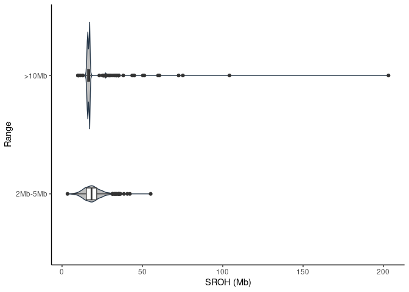

Runs of homozygosity on 1082 individuals
================

| stat                |  min |  median |      mean |        max |
|:--------------------|-----:|--------:|----------:|-----------:|
| Length              | 83.0 | 54628.0 | 124447.48 | 63912719.0 |
| Number\_of\_markers |  2.0 |   100.0 |    166.01 |    45797.0 |
| Quality             |  0.6 |    51.1 |     49.86 |       98.7 |

ROHs quality histogram

<!-- -->

## Results

### All results below are ROHs filter for autosomes with Quality &gt; 25% and Number of markers &gt;= 50

1.  Average sum of ROHs

<!-- -->

|     | mean\_SROH\_Mb  |
|:----|:----------------|
|     | Min. : 5.821    |
|     | 1st Qu.: 29.297 |
|     | Median : 34.491 |
|     | Mean : 34.332   |
|     | 3rd Qu.: 39.067 |
|     | Max. :144.543   |

2.  Sum of ROH length per range

<!-- -->

    ## `summarise()` has grouped output by 'Range'. You can override using the `.groups` argument.

<!-- -->

|     | &gt;10Mb       | 2-5Mb          |
|:----|:---------------|:---------------|
|     | Min. : 10.00   | Min. : 5.815   |
|     | 1st Qu.: 15.89 | 1st Qu.:15.387 |
|     | Median : 16.72 | Median :18.615 |
|     | Mean : 17.78   | Mean :18.859   |
|     | 3rd Qu.: 17.17 | 3rd Qu.:21.595 |
|     | Max. :104.20   | Max. :42.199   |

3.  Relationship between number of ROHs and total length of genome
    covered by them

<!-- -->

4.  % of ROhs per category in sample

<!-- -->

5.  ROH length sum

<!-- -->

6.  Number of ROHs per sample

<!-- -->

7.  Average ROHs per sample

<!-- -->

    ## `summarise()` has grouped output by 'sample_id'. You can override using the `.groups` argument.

<!-- -->

8.  Cosanguinity in population

<!-- -->
