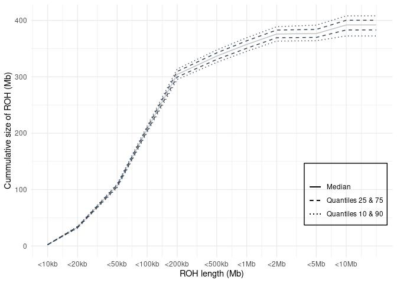
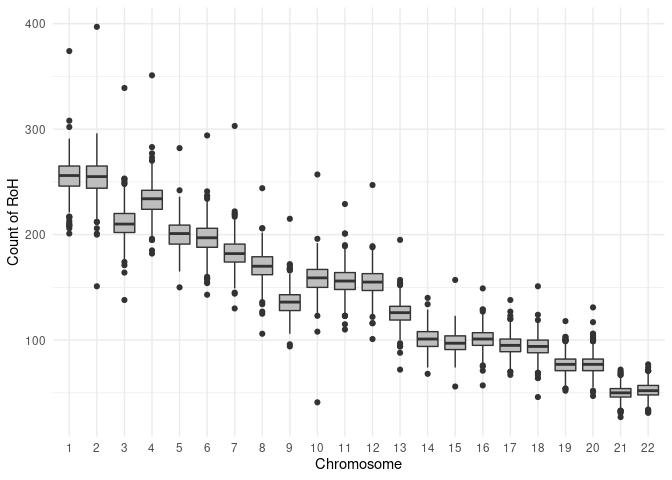
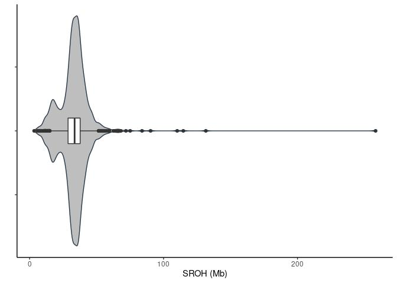

Runs of homozygosity on 943 individuals
================

## Runs of homozygozity (ROH)

#### ROHs quality histogram

``` r
# Quality filtering: Quality>25 & markers > 50
roh <- roh %>% 
  filter(Quality > 25 & Number_of_markers >50)
```

#### ROH stats after quality filtering

| stat                |   min |  median |      mean |        max |
|:--------------------|------:|--------:|----------:|-----------:|
| Length              | 609.0 | 72459.0 | 123018.00 | 29363916.0 |
| Number\_of\_markers |  51.0 |   132.0 |    193.66 |    33173.0 |
| Quality             |  25.1 |    60.4 |     59.40 |       98.7 |

Average ROH size per genome (additionally filtered: &gt;100kb)

| stat      |       average |
|:----------|--------------:|
| count     |       1124.41 |
| maxLen    |   14239847.30 |
| meanLen   |     252746.68 |
| medianLen |     164071.12 |
| minLen    |     100073.33 |
| sumLen    | 284174602\.38 |

## Results

1.  Cummulative sum

<!-- -->

    ## `summarise()` has grouped output by 'sample_id'. You can override using the `.groups` argument.
    ## `summarise()` has grouped output by 'sample_id'. You can override using the `.groups` argument.

    ## `summarise()` has grouped output by 'Range'. You can override using the `.groups` argument.

<!-- -->

Fig. Relation between size of runs of homozygozity and cumulative length
of RoHs in an average individual.

    ## `summarise()` has grouped output by 'sample_id'. You can override using the `.groups` argument.

<!-- -->

Fig. Distribution of mean length of runs of homozygozity per chromosome

<!-- -->

Fig. Distribution of counts of runs of homozygozity per chromosome

2.  Median SROH

<!-- -->

    ## `summarise()` has grouped output by 'Range'. You can override using the `.groups` argument.
    ## `summarise()` has grouped output by 'Range'. You can override using the `.groups` argument.

<!-- -->

2.  Coverage heatmap

<!-- -->

    ## Loading required package: regioneR

<!-- -->

Fig. Chromosomal location of run of homozygozity hotspots - regions
frequently covered by runs of homozygozity in this cohort.

### All results below are ROHs filter for autosomes with Quality &gt; 25%, Number of markers &gt; 50 and ROH length &gt; 2 Mb

3.  Average sum of ROHs per genome

<!-- -->

|     | mean\_SROH\_Mb  |
|:----|:----------------|
|     | Min. : 5.821    |
|     | 1st Qu.: 28.883 |
|     | Median : 33.855 |
|     | Mean : 33.207   |
|     | 3rd Qu.: 37.978 |
|     | Max. :131.589   |

| Range    | mean\_length |
|:---------|-------------:|
| 2Mb-5Mb  |     2.892791 |
| &gt;10Mb |    16.239240 |

5.  Sum of ROH length per range

<!-- -->

    ## `summarise()` has grouped output by 'Range'. You can override using the `.groups` argument.

<!-- -->

|     | 2Mb-5Mb        | &gt;10Mb       |
|:----|:---------------|:---------------|
|     | Min. : 5.815   | Min. : 10.00   |
|     | 1st Qu.:15.537 | 1st Qu.: 15.89 |
|     | Median :18.727 | Median : 16.76 |
|     | Mean :19.026   | Mean : 17.77   |
|     | 3rd Qu.:21.975 | 3rd Qu.: 17.17 |
|     | Max. :42.199   | Max. :104.20   |

6.  Relationship between number of ROHs and total length of genome
    covered by them

<!-- -->

<!-- 6. ROH genome coverage  -->
<!-- ```{r genome_coverage, echo=FALSE} -->
<!-- chr <- 'chr1' -->
<!-- coverage <- roh %>% filter(Chromosome %in% chr) %>% -->
<!--   arrange(Chromosome,Start) -->
<!-- # coverage$Chromosome <- paste(coverage$Chromosome,sep='') -->
<!-- # coverage$x_from <- paste(coverage$Chromosome,coverage$Start,sep='') -->
<!-- # coverage$x_end <- paste(coverage$Chromosome,coverage$End,sep='') -->
<!-- coverage %>% ggplot() + -->
<!--   geom_segment(aes(x = Start, y = sample_id, xend = End,  -->
<!--                                  yend = sample_id), col='#48C095') + -->
<!--   theme_classic() + -->
<!--   theme(axis.text.x = element_blank(),axis.text.y = element_blank()) + -->
<!--   xlab('Position on chromosome 1') + -->
<!--   ylab('Individual') -->
<!-- ``` -->

7.  % of ROhs per category in sample

<!-- -->

8.  ROH length sum

<!-- -->

<!-- 7. Number of ROHs per sample -->
<!-- ```{r roh_count_per_sample, echo=FALSE}  -->
<!-- suppressMessages( -->
<!-- roh_avg <- roh %>% group_by(sample_id, Range) %>% -->
<!--   summarise(avg_length=mean(Length), n=n()) %>% -->
<!--   arrange(Range,n) -->
<!-- ) -->
<!-- roh_avg %>% -->
<!--   ggplot(aes(x=1:nrow(roh_avg),y=n)) + -->
<!--   geom_point(col='#48C095',alpha=0.5) + -->
<!--   facet_wrap(~Range, nrow = 3,scales = 'free') +  -->
<!--   ylab('Number of ROHs') + -->
<!--   xlab('Individual') + -->
<!--   theme_classic() + -->
<!--   theme(axis.text.x = element_blank()) -->
<!-- ``` -->
<!-- 8. Average ROHs per sample -->
<!-- ```{r average_roh_per_sample, echo=FALSE}  -->
<!-- roh_avg <- roh %>% group_by(sample_id, Range) %>% -->
<!--   summarise(avg_length=mean(Length), n=n()) %>% -->
<!--   arrange(Range,avg_length) -->
<!-- roh_avg %>% -->
<!--   ggplot(aes(x=1:nrow(roh_avg),y=avg_length)) + -->
<!--   geom_point(col='#48C095',alpha=0.5) + -->
<!--   facet_wrap(~Range, nrow = 3,scales = 'free') +  -->
<!--   ylab('Mean ROH length') + -->
<!--   xlab('Individual') + -->
<!--   theme_classic() + -->
<!--   theme(axis.text.x = element_blank()) -->
<!-- ``` -->
<!--
9. Cosanguinity in population
-->
