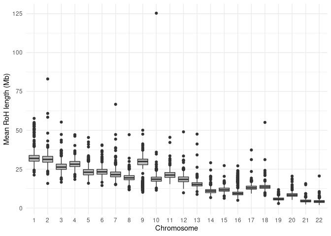

## 1. Read QC

#### 1.1 Depth statistics

**Supplementary Table 1.1: Coverage statistics for all 1082 samples analysed in the project.**
| stat                  |   min | median |  mean |   max |
|:----------------------|------:|-------:|------:|------:|
| average\_depth        | 29.09 |  35.75 | 35.72 | 45.75 |
| percentage\_above\_10 | 91.40 |  91.98 | 91.92 | 92.34 |
| percentage\_above\_20 | 85.61 |  89.27 | 89.37 | 91.27 |
| percentage\_above\_30 | 53.66 |  79.59 | 78.41 | 90.00 |

**Supplementary Figure 1.1: Distribution of mean coverage in the cohort.**
 

## 2. Variants

### 2.1 Small variants

**Supplementary Table 2.1.1. SNV counts per individual.**
| Variant    | min\_count | mean\_count | max\_count |
|:-----------|-----------:|------------:|-----------:|
| Indels     |     751,498 |      768,905 |     781,426 |
| Singletons |        436 |       16,473 |      82,329 |
| SNP        |    3,637,424 |     3,715,552 |    3,776,871 |

**Supplementary Figure 2.1.1: Distribution of variant consequences across the allele-frequency spectrum**
<!-- -->

### 2.2 Structural variants

**Supplementary Table 2.2.1: Total numbers of structural variants in the dataset. BND-breakend, DEL-deletion, DUP-duplication, INV-inversion**
| svtype | count |
|:-------|------:|
| BND    | 18464 |
| DEL    | 43546 |
| DUP    | 13566 |
| INV    |  1811 |

**Supplementary Table 2.2.2: Numbers of structural variants per individual. BND-breakend, DEL-deletion, DUP-duplication, INV-inversion, het-heterozygous genotype, hom-homozygous genotype.**

| Type   | Genotype |  min |       mean | median |  max |
|:-------|:----|-----:|-----------:|-------:|-----:|
| BND    | het | 2174 | 2534.94380 |   2536 | 2904 |
| BND    | hom |   46 |   77.42100 |     78 |  108 |
| DEL    | het | 5090 | 5999.10604 |   6003 | 6446 |
| DEL    | hom | 1319 | 1689.17815 |   1691 | 1866 |
| DUP    | het | 1855 | 2452.21845 |   2454 | 2687 |
| DUP    | hom |  586 |  763.65748 |    765 |  949 |
| INV    | het |  507 |  586.13150 |    587 |  673 |
| INV    | hom |   20 |   31.47402 |     31 |   43 |

**Supplementary Figure 2.2.3A Distribution of SV lengths (log10 scale) for three SV types:
deletions (DEL), duplications (DUP), and inversion (INV)**
<!-- -->

**Supplementary Figure 2.2.3B Distribution of SV lengths (log10 scale) presented as density for
the three SV types: deletions (DEL), duplications (DUP), and inversion
(INV)**
<!-- -->

**Supplementary Figure 2.2.3C Distribution of SV lengths in the range 0-1000bp, for the three SV
types: deletions (DEL), duplications (DUP), and inversion (INV)**
<!-- -->

### 2.3 Runs of homozygosity

**Supplementary Figure 2.3.1 Distribution of average lengths of RoH per chromosome.**
<!-- -->

**Supplementary Figure 2.3.2 Distribution of counts of runs of homozygosity per chromosome.**
<!-- -->

**Supplementary Figure 2.3.3. Cummulative length of runs of homozygozity in single individuals.**

## 3. Population analysis

An average Fst statistics over each sliding window built from 1,000 neighbouring SNPs is presented on Figure 3.1. This results prove that samples from our cohort are 
the most similar to the European population and the least to the African and East Asian populations.

 
**Figure 3.1. The average Fst statistics calculated for the sliding windows containing 1,000 SNP.**

On the Figure 3.2. we can observe only one huge cluster obtained using Density-Based Spatial Method (935 patients marked on black) and a few outliers (8 patients marked on red). 
The average Fst between cluster and outliers is equal to 0.012. 

**The results are presented on the following plot:**
 
**Figure 3.2. Cluster analysis based on Density-Based Spatial method.**

