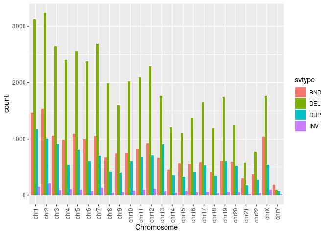

Structural variants. ewline Results for 943 unrelated individuals
================

## Counts of structural variants (SV)

| svtype | count |
|:-------|------:|
| BND    | 18464 |
| DEL    | 43546 |
| DUP    | 13566 |
| INV    |  1811 |

<!-- -->

## Allele frequency of structural variants (SV)

    ## `summarise()` has grouped output by 'svtype'. You can override using the `.groups` argument.
    ## `summarise()` has grouped output by 'svtype'. You can override using the `.groups` argument.

<!-- --> \#\# SV Lengths

<!-- --><!-- -->

### SV sizes

#### Deletions

|     | len             |
|:----|:----------------|
|     | Min. : 9        |
|     | 1st Qu.: 305    |
|     | Median : 776    |
|     | Mean : 387106   |
|     | 3rd Qu.: 3754   |
|     | Max. :231715203 |

#### Duplications

|     | len             |
|:----|:----------------|
|     | Min. : 116      |
|     | 1st Qu.: 1415   |
|     | Median : 10178  |
|     | Mean : 1614682  |
|     | 3rd Qu.: 136079 |
|     | Max. :242323219 |

#### Inversions

|     | len             |
|:----|:----------------|
|     | Min. : 32       |
|     | 1st Qu.: 570    |
|     | Median : 6577   |
|     | Mean : 1355850  |
|     | 3rd Qu.: 676354 |
|     | Max. :153641537 |
