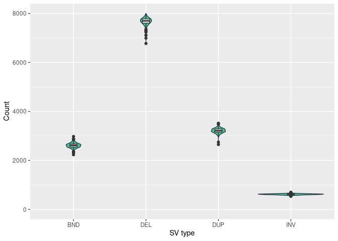
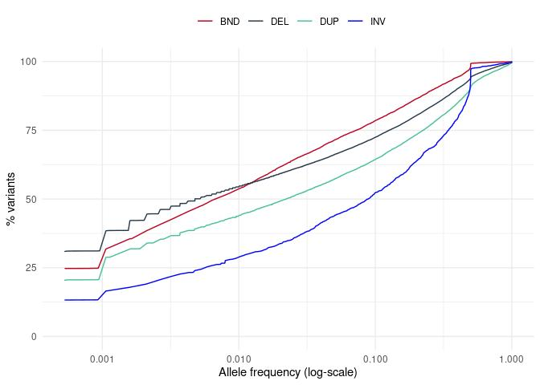

Structural variants. ewline Results for 943 unrelated individuals
================

## Counts of structural variants (SV)

| svtype | count |
|:-------|------:|
| BND    | 18464 |
| DEL    | 43546 |
| DUP    | 13566 |
| INV    |  1811 |

<!-- -->

Fig. Figure presents counts of four SV types (deletions (DEL),
duplications (DUP), inversion (INV), and break-ends (BND)) in autosomal
and sex chromosomes.

    ## `summarise()` has grouped output by 'svtype', 'gt'. You can override using the `.groups` argument.

    ## `summarise()` has grouped output by 'svtype'. You can override using the `.groups` argument.

| svtype | gt  |  min |       mean | median |  max |
|:-------|:----|-----:|-----------:|-------:|-----:|
| BND    | het | 2174 | 2534.94380 |   2536 | 2904 |
| BND    | hom |   46 |   77.42100 |     78 |  108 |
| DEL    | het | 5090 | 5999.10604 |   6003 | 6446 |
| DEL    | hom | 1319 | 1689.17815 |   1691 | 1866 |
| DUP    | het | 1855 | 2452.21845 |   2454 | 2687 |
| DUP    | hom |  586 |  763.65748 |    765 |  949 |
| INV    | het |  507 |  586.13150 |    587 |  673 |
| INV    | hom |   20 |   31.47402 |     31 |   43 |

Table. Numbers of structural variant types per sample, with breakdown
into homozygous and heterozygous

    ## `summarise()` has grouped output by 'sampleid'. You can override using the `.groups` argument.

    ## Warning: Removed 8 rows containing non-finite values (stat_ydensity).

    ## Warning: Removed 8 rows containing non-finite values (stat_boxplot).

<!-- -->

Fig. Distribution of structural variant counts per sample, for the four
SV categories.

## Allele frequency of structural variants (SV)

    ## `summarise()` has grouped output by 'svtype'. You can override using the `.groups` argument.
    ## `summarise()` has grouped output by 'svtype'. You can override using the `.groups` argument.

<!-- -->

Fig. Cumulative fraction of variants presenting with given allele
frequency (on log-scale). Deletions (DEL), duplications (DUP), inversion
(INV), and break-ends (BND).

### Allele frequency per individual

    ## `summarise()` has grouped output by 'svtype', 'sampleid'. You can override using the `.groups` argument.

<!-- -->

## SV Lengths

<!-- --><!-- -->

    ## Warning: Removed 31406 rows containing non-finite values (stat_bin).

    ## Warning: Removed 4 rows containing missing values (geom_bar).

<!-- -->

Fig1. Distribution of SV lengths (log10 scale) for three SV types:
deletions (DEL), duplications (DUP), and inversion (INV)

Fig2. Distribution of SV lengths (log10 scale) presented as density for
the three SV types: deletions (DEL), duplications (DUP), and inversion
(INV)

Fig3. Distribution of SV lengths in the range 0-1000bp, for the three SV
types: deletions (DEL), duplications (DUP), and inversion (INV)

Majority of deletions ware shortar than 1kb (55.5137096 %) and as much
as 84.5910072% were below 10kb

Only 9.413239% of duplications were longer than 1Mb.

### SV sizes

#### Deletions

|     | len             |
|:----|:----------------|
|     | Min. : 9        |
|     | 1st Qu.: 305    |
|     | Median : 776    |
|     | Mean : 387106   |
|     | 3rd Qu.: 3754   |
|     | Max. :231715203 |

#### Duplications

|     | len             |
|:----|:----------------|
|     | Min. : 116      |
|     | 1st Qu.: 1415   |
|     | Median : 10178  |
|     | Mean : 1614682  |
|     | 3rd Qu.: 136079 |
|     | Max. :242323219 |

#### Inversions

|     | len             |
|:----|:----------------|
|     | Min. : 32       |
|     | 1st Qu.: 570    |
|     | Median : 6577   |
|     | Mean : 1355850  |
|     | 3rd Qu.: 676354 |
|     | Max. :153641537 |
