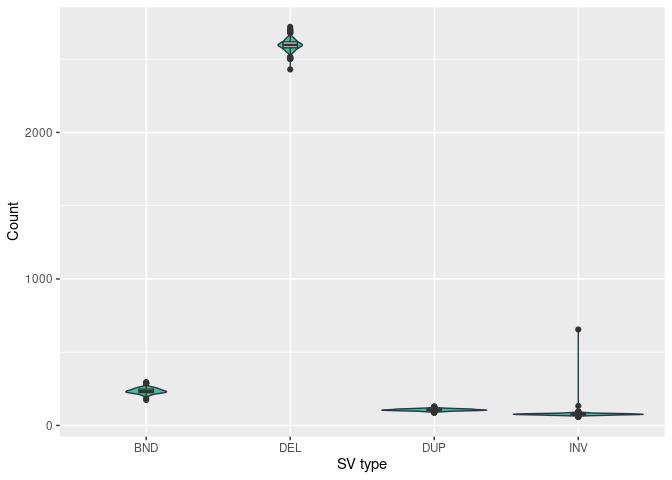
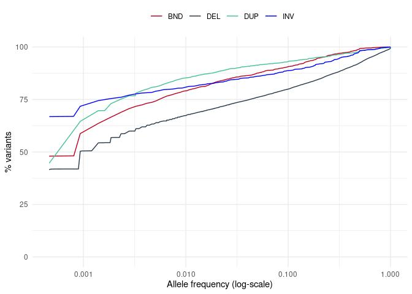

Structural variants. ewline Results for 1076 unrelated individuals
================

    ## 123456789101112131415

## QC

``` r
sv.af.full = sv.af
sv.af.full$PASS = (sv.af.full$MSHQ>=3 | sv.af.full$MSHQ==-1) & 
             (sv.af.full$svtype!='DEL' | sv.af.full$MDHFFC < 0.7) & 
             (sv.af.full$svtype!='DUP' | sv.af.full$MDHFFC > 1.25) &
             (sv.af.full$SR/sv.af.full$AC)>1 
             # & sv.af.full$HWE>0.1
           
sv.af = sv.af.full[sv.af.full$PASS,]
# save sv.af
# write.table(sv.af, row.names = F, quote = F, sep='\t',
#            file = '../input/sv_multisample_210716.smoove.square.unrelated.af_stats_PASS.tsv')

sv.pers.full = sv.pers
sv.pers.full$PASS= (sv.pers.full$MSHQ>=3 | sv.pers.full$MSHQ==-1) & 
                   (sv.pers.full$svtype!='DEL' | sv.pers.full$DHFFC < 0.7) & 
                   (sv.pers.full$svtype!='DUP' | sv.pers.full$DHFFC > 1.25) &
                   (sv.pers.full$SR/sv.pers.full$AC)>1
                   # & (sv.pers.full$HWE>0.1)

sv.pers = sv.pers.full[sv.pers.full$PASS,]
```

## Counts of structural variants (SV)

| svtype | count | count.PASS |  pct.pass |
|:-------|------:|-----------:|----------:|
| BND    | 21547 |       3964 | 0.1839699 |
| DEL    | 45613 |      19808 | 0.4342622 |
| DUP    | 14171 |       2270 | 0.1601863 |
| INV    | 16800 |        998 | 0.0594048 |

<!-- -->

Fig. Figure presents counts of four SV types (deletions (DEL),
duplications (DUP), inversion (INV), and break-ends (BND)) in autosomal
and sex chromosomes.

    ## `summarise()` has grouped output by 'svtype'. You can override using the `.groups` argument.

| svtype |  min |      mean | median |  max |
|:-------|-----:|----------:|-------:|-----:|
| BND    |  174 |  235.5428 |    234 |  296 |
| DEL    | 2430 | 2598.0316 |   2597 | 2721 |
| DUP    |   87 |  106.3113 |    106 |  129 |
| INV    |   57 |   76.9461 |     76 |  655 |

    ## `summarise()` has grouped output by 'svtype', 'GT'. You can override using the `.groups` argument.
    ## `summarise()` has grouped output by 'svtype'. You can override using the `.groups` argument.

| svtype | GT  |  min |       mean | median |  max |
|:-------|:----|-----:|-----------:|-------:|-----:|
| BND    | het |  156 |  216.50558 |  216.0 |  276 |
| BND    | hom |    6 |   19.03717 |   18.0 |   34 |
| DEL    | het | 1340 | 1514.50279 | 1512.5 | 1924 |
| DEL    | hom |  671 | 1083.52881 | 1086.0 | 1200 |
| DUP    | het |   56 |   74.54182 |   74.5 |   95 |
| DUP    | hom |   21 |   31.76952 |   32.0 |   46 |
| INV    | het |   46 |   64.65892 |   64.0 |  642 |
| INV    | hom |    5 |   12.28717 |   12.0 |   21 |

Table. Numbers of structural variant types per sample (A), with
breakdown into homozygous and heterozygous (B)

    ## `summarise()` has grouped output by 'sampleid'. You can override using the `.groups` argument.

<!-- -->

Fig. Distribution of structural variant counts per sample, for the four
SV categories.

## Lengths of structural variants (SV)

    ## `summarise()` has grouped output by 'svtype'. You can override using the `.groups` argument.

| svtype |      min |     mean |   median |       max |
|:-------|---------:|---------:|---------:|----------:|
| DEL    | 2.388770 | 3.234082 | 2.942019 |  52.33160 |
| DUP    | 0.067046 | 7.554059 | 2.172321 |  60.49131 |
| INV    | 0.051012 | 5.842582 | 7.440581 | 125.69712 |

    ## `summarise()` has grouped output by 'svtype', 'GT'. You can override using the `.groups` argument.
    ## `summarise()` has grouped output by 'svtype'. You can override using the `.groups` argument.

| svtype | GT  |     min |       mean |    median |       max |
|:-------|:----|--------:|-----------:|----------:|----------:|
| DEL    | het | 1424732 | 2268168.61 | 1976514.0 |  51361738 |
| DEL    | hom |  708617 |  965913.76 |  950488.5 |   1535070 |
| DUP    | het |   32485 | 6661696.51 | 2058780.5 |  58489600 |
| DUP    | hom |    5697 |  892362.91 |   71374.5 |  31332766 |
| INV    | het |   40523 | 5829857.09 | 7428078.5 | 125690013 |
| INV    | hom |    1158 |   12724.47 |   14453.0 |     42662 |

Table. Total length of structural variant per sample, and per type (A),
with breakdown into homozygous and heterozygous (B)

    ## `summarise()` has grouped output by 'sampleid'. You can override using the `.groups` argument.

<!-- -->

## Allele frequency of structural variants (SV)

    ## `summarise()` has grouped output by 'svtype'. You can override using the `.groups` argument.
    ## `summarise()` has grouped output by 'svtype'. You can override using the `.groups` argument.

<!-- -->

Fig. Cumulative fraction of variants presenting with given allele
frequency (on log-scale). Deletions (DEL), duplications (DUP), inversion
(INV), and break-ends (BND).

### Allele frequency per individual

## SV Lengths

<!-- --><!-- -->

    ## Warning: Removed 7160 rows containing non-finite values (stat_bin).

    ## Warning: Removed 4 rows containing missing values (geom_bar).

<!-- -->

Fig1. Distribution of SV lengths (log10 scale) for three SV types:
deletions (DEL), duplications (DUP), and inversion (INV)

Fig2. Distribution of SV lengths (log10 scale) presented as density for
the three SV types: deletions (DEL), duplications (DUP), and inversion
(INV)

Fig3. Distribution of SV lengths in the range 0-1000bp, for the three SV
types: deletions (DEL), duplications (DUP), and inversion (INV)

Majority of deletions ware shortar than 1kb (62.9997981 %) and as much
as 92.9170032% were below 10kb

Only 0.0403877% of deletions were longer than 1Mb.

Only 0.4845815% of duplications were longer than 1Mb.

As much as 1.2024048% of inversions were longer than 1Mb.

### SV sizes

#### Deletions

|     | svlen         |
|:----|:--------------|
|     | Min. : 18     |
|     | 1st Qu.: 101  |
|     | Median : 325  |
|     | Mean : 5766   |
|     | 3rd Qu.: 2470 |
|     | Max. :5015019 |

#### Duplications

|     | svlen          |
|:----|:---------------|
|     | Min. : 123     |
|     | 1st Qu.: 350   |
|     | Median : 4220  |
|     | Mean : 58772   |
|     | 3rd Qu.: 24808 |
|     | Max. :21853917 |

#### Inversions

|     | svlen           |
|:----|:----------------|
|     | Min. : 36       |
|     | 1st Qu.: 740    |
|     | Median : 1430   |
|     | Mean : 250038   |
|     | 3rd Qu.: 2124   |
|     | Max. :118133946 |
