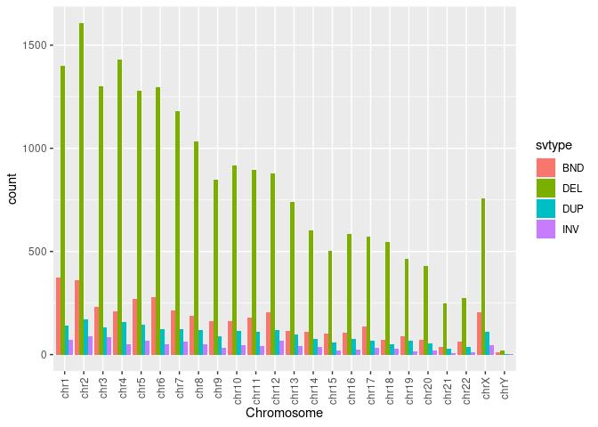
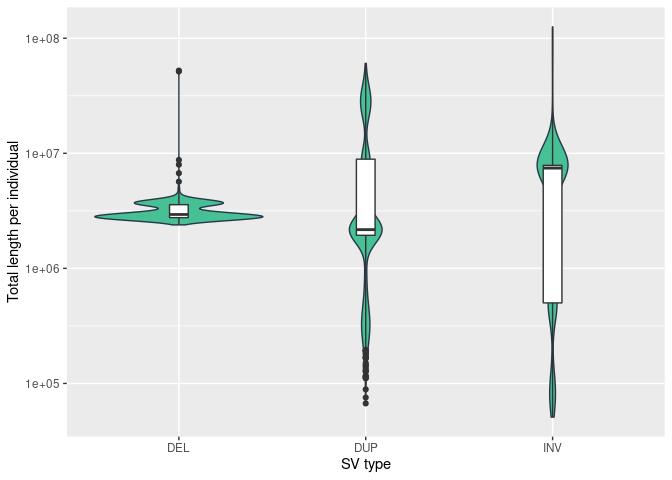

Structural variants. ewline Results for 943 unrelated individuals
================

    ## 12345678910111213

## QC

``` r
sv.af.full = sv.af
sv.af.full$PASS = (sv.af.full$MSHQ>=3 | sv.af.full$MSHQ==-1) & 
             (sv.af.full$svtype!='DEL' | sv.af.full$MDHFFC < 0.7) & 
             (sv.af.full$svtype!='DUP' | sv.af.full$MDHFFC > 1.25) &
             (sv.af.full$SR/sv.af.full$AC)>1 #& sv.af.full$HWE>0.1
           #  (sv.af.full$chrom %in% c('chrX','chrY') | sv.af.full$HWE>0.1)
sv.af = sv.af.full[sv.af.full$PASS,]

sv.pers.full = sv.pers
sv.pers.full$PASS= (sv.pers.full$MSHQ>=3 | sv.pers.full$MSHQ==-1) & 
                    (sv.pers.full$svtype!='DEL' | sv.pers.full$DHFFC < 0.7) & 
                    (sv.pers.full$svtype!='DUP' | sv.pers.full$DHFFC > 1.25) &
                   (sv.pers.full$SR/sv.pers.full$AC)>1 #& (sv.pers.full$HWE>0.1) & 

sv.pers = sv.pers.full[sv.pers.full$PASS,]
```

## Counts of structural variants (SV)

| svtype | count | count.PASS |  pct.pass |
|:-------|------:|-----------:|----------:|
| BND    | 18342 |       3734 | 0.2035765 |
| DEL    | 43203 |      18797 | 0.4350855 |
| DUP    | 13484 |       2128 | 0.1578167 |
| INV    |  1805 |        368 | 0.2038781 |

<!-- -->

Fig. Figure presents counts of four SV types (deletions (DEL),
duplications (DUP), inversion (INV), and break-ends (BND)) in autosomal
and sex chromosomes.

    ## `summarise()` has grouped output by 'svtype'. You can override using the `.groups` argument.

| svtype |  min |       mean | median |  max |
|:-------|-----:|-----------:|-------:|-----:|
| BND    |  182 |  246.15907 |    246 |  302 |
| DEL    | 2431 | 2601.69459 |   2600 | 2724 |
| DUP    |   86 |  106.02651 |    106 |  128 |
| INV    |   56 |   75.99258 |     76 |   91 |

    ## `summarise()` has grouped output by 'svtype', 'GT'. You can override using the `.groups` argument.
    ## `summarise()` has grouped output by 'svtype'. You can override using the `.groups` argument.

| svtype | GT  |  min |       mean | median |  max |
|:-------|:----|-----:|-----------:|-------:|-----:|
| BND    | het |  164 |  226.90138 |    226 |  280 |
| BND    | hom |    6 |   19.25769 |     20 |   34 |
| DEL    | het | 1338 | 1517.17179 |   1515 | 1927 |
| DEL    | hom |  670 | 1084.52280 |   1088 | 1178 |
| DUP    | het |   56 |   74.05832 |     74 |   94 |
| DUP    | hom |   21 |   31.96819 |     32 |   46 |
| INV    | het |   46 |   63.45493 |     63 |   80 |
| INV    | hom |    5 |   12.53765 |     13 |   20 |

Table. Numbers of structural variant types per sample (A), with
breakdown into homozygous and heterozygous (B)

    ## `summarise()` has grouped output by 'sampleid'. You can override using the `.groups` argument.

<!-- -->

Fig. Distribution of structural variant counts per sample, for the four
SV categories.

## Lengths of structural variants (SV)

    ## `summarise()` has grouped output by 'svtype'. You can override using the `.groups` argument.

| svtype |      min |     mean |   median |       max |
|:-------|---------:|---------:|---------:|----------:|
| DEL    | 2.421290 | 3.177118 | 2.937996 |  52.33224 |
| DUP    | 0.066895 | 8.909158 | 2.339648 |  74.41328 |
| INV    | 0.052036 | 5.806720 | 7.438858 | 125.69628 |

    ## `summarise()` has grouped output by 'svtype', 'GT'. You can override using the `.groups` argument.
    ## `summarise()` has grouped output by 'svtype'. You can override using the `.groups` argument.

| svtype | GT  |     min |       mean |  median |       max |
|:-------|:----|--------:|-----------:|--------:|----------:|
| DEL    | het | 1425161 | 2210153.02 | 1967896 |  51362047 |
| DEL    | hom |  708688 |  966965.22 |  951100 |   1534026 |
| DUP    | het |   32180 | 7774446.87 | 2122728 |  72491034 |
| DUP    | hom |    5697 | 1134710.75 |   76210 |  35890413 |
| INV    | het |   40505 | 5793697.26 | 7425727 | 125688127 |
| INV    | hom |    1691 |   13022.97 |   14170 |     42661 |

Table. Total length of structural variant per sample, and per type (A),
with breakdown into homozygous and heterozygous (B)

    ## `summarise()` has grouped output by 'sampleid'. You can override using the `.groups` argument.

<!-- -->

## Allele frequency of structural variants (SV)

    ## `summarise()` has grouped output by 'svtype'. You can override using the `.groups` argument.
    ## `summarise()` has grouped output by 'svtype'. You can override using the `.groups` argument.

<!-- -->

Fig. Cumulative fraction of variants presenting with given allele
frequency (on log-scale). Deletions (DEL), duplications (DUP), inversion
(INV), and break-ends (BND).

### Allele frequency per individual

## SV Lengths

<!-- --><!-- -->

    ## Warning: Removed 6484 rows containing non-finite values (stat_bin).

    ## Warning: Removed 4 rows containing missing values (geom_bar).

<!-- -->

Fig1. Distribution of SV lengths (log10 scale) for three SV types:
deletions (DEL), duplications (DUP), and inversion (INV)

Fig2. Distribution of SV lengths (log10 scale) presented as density for
the three SV types: deletions (DEL), duplications (DUP), and inversion
(INV)

Fig3. Distribution of SV lengths in the range 0-1000bp, for the three SV
types: deletions (DEL), duplications (DUP), and inversion (INV)

Majority of deletions ware shortar than 1kb (63.5899346 %) and as much
as 93.0893228% were below 10kb

Only 0.03724% of deletions were longer than 1Mb.

Only 0.5169173% of duplications were longer than 1Mb.

As much as 2.7173913% of inversions were longer than 1Mb.

### SV sizes

#### Deletions

|     | svlen         |
|:----|:--------------|
|     | Min. : 18     |
|     | 1st Qu.: 101  |
|     | Median : 321  |
|     | Mean : 5424   |
|     | 3rd Qu.: 2407 |
|     | Max. :2614283 |

#### Duplications

|     | svlen          |
|:----|:---------------|
|     | Min. : 123     |
|     | 1st Qu.: 350   |
|     | Median : 4138  |
|     | Mean : 63317   |
|     | 3rd Qu.: 23932 |
|     | Max. :21853917 |

#### Inversions

|     | svlen           |
|:----|:----------------|
|     | Min. : 36       |
|     | 1st Qu.: 268    |
|     | Median : 702    |
|     | Mean : 661473   |
|     | 3rd Qu.: 1666   |
|     | Max. :118133946 |
