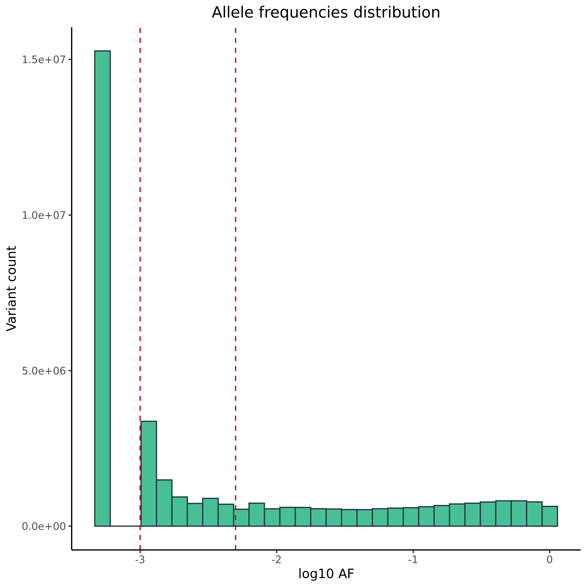
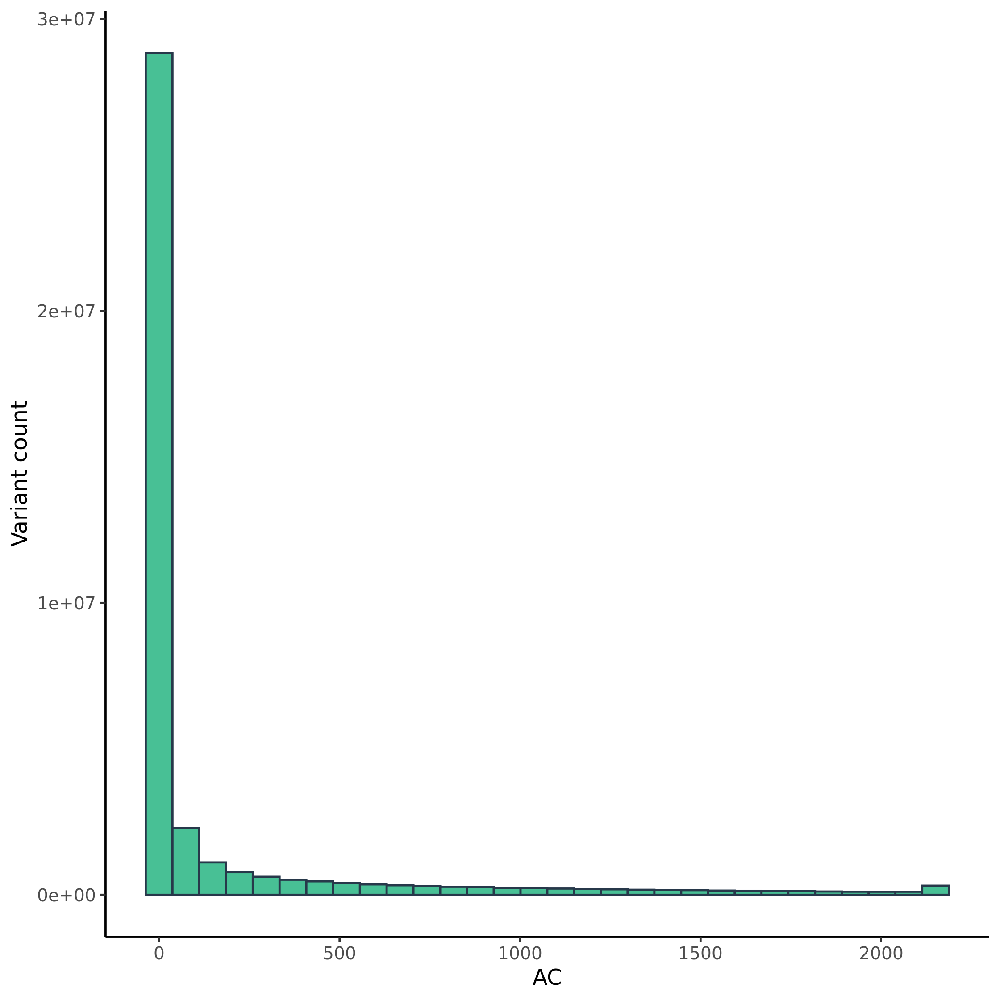
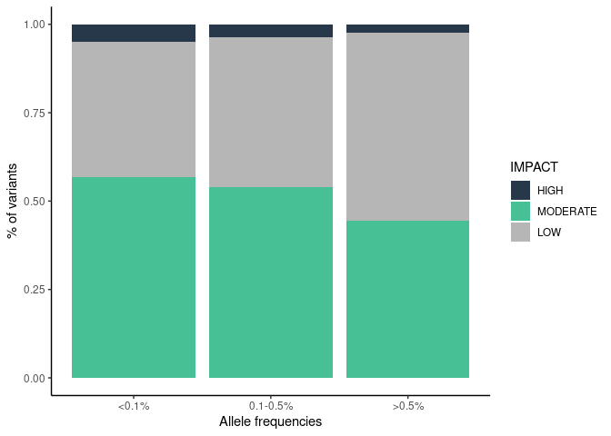
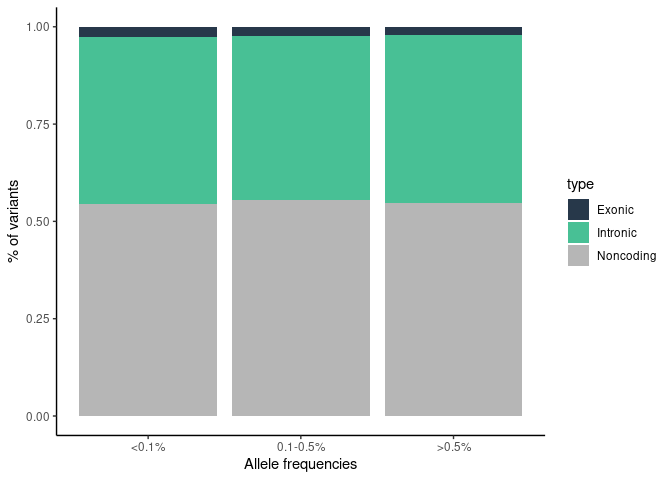

Variants in disease causing genes ewline Results for 943 unrelated
individuals
================

## 1. Allele frequency

## 2. Allele count

## 3. ACMG

<!-- -->

### 4. ClinVar variants

<!-- -->

    ## 
    ##   1   2   3   4 
    ## 700 611  32   2

### 5. Putative variants

<!-- -->

    ## Rows: 10,577
    ## Columns: 12
    ## $ Uploaded_variation <chr> "chr1_935833_C_G", "chr1_939121_C_T", "chr1_939382_…
    ## $ Location           <chr> "chr1:935833", "chr1:939121", "chr1:939382", "chr1:…
    ## $ CLIN_SIG           <chr> "-", "-", "-", "-", "-", "-", "-", "-", "-", "-", "…
    ## $ ClinVar_CLNSIG     <chr> "Uncertain_significance", "Uncertain_significance",…
    ## $ ClinVar_CLNREVSTAT <chr> "_single_submitter", "_single_submitter", "_single_…
    ## $ ClinVar_CLNDN      <chr> "not_provided", "not_provided", "not_provided", "no…
    ## $ SYMBOL             <chr> "SAMD11", "SAMD11", "SAMD11", "SAMD11", "SAMD11", "…
    ## $ Gene               <chr> "ENSG00000187634", "ENSG00000187634", "ENSG00000187…
    ## $ PL_AC              <int> 1, 1, 1, 1, 1, 1, 1, 1, 1, 1, 1, 1, 1, 1, 1, 1, 1, …
    ## $ PL_AF              <dbl> 0.000530223, 0.000530223, 0.000530223, 0.000548246,…
    ## $ gnomADg_AF_NFE     <dbl> 2.66916e-04, 2.67344e-04, 1.20643e-03, 6.83153e-05,…
    ## $ gnomADg_AF         <dbl> 1.29282e-04, 1.94238e-04, 9.40886e-04, 6.96980e-04,…

### 6. % IMPACT variants

<!-- -->

### 7. Variants per functional category

<!-- -->

    ## Rows: 296
    ## Columns: 5
    ## $ group       <ord> <0.1%, <0.1%, <0.1%, <0.1%, <0.1%, <0.1%, <0.1%, <0.1%, <0…
    ## $ type        <fct> Exonic, Exonic, Exonic, Exonic, Exonic, Exonic, Exonic, Ex…
    ## $ IMPACT      <fct> HIGH, HIGH, HIGH, HIGH, HIGH, HIGH, HIGH, HIGH, HIGH, HIGH…
    ## $ Consequence <fct> "frameshift_variant", "frameshift_variant,NMD_transcript_v…
    ## $ n           <int> 3241, 36, 86, 2, 7, 5, 11, 5, 248, 2, 2, 2, 9, 1, 2, 1, 23…

## 8. Number of variants per impact

| VARIANT\_CLASS | AF       | HIGH |   LOW | MODERATE | MODIFIER |
|:---------------|:---------|-----:|------:|---------:|---------:|
| deletion       | &gt;0.5% |  500 |  1090 |      680 |  1697005 |
| indel          | &gt;0.5% |    0 |     2 |        2 |     4929 |
| insertion      | &gt;0.5% |  327 |  1280 |      630 |  1934758 |
| SNV            | &gt;0.5% | 1446 | 45903 |    39096 | 15294308 |
| deletion       | 0.1-0.5% |  813 |   582 |      859 |   885811 |
| indel          | 0.1-0.5% |    0 |     1 |        1 |    10935 |
| insertion      | 0.1-0.5% |  407 |   648 |      573 |  1010671 |
| SNV            | 0.1-0.5% | 1723 | 32131 |    41239 |  9509163 |
| deletion       | &lt;0.1% | 2662 |   978 |     1731 |  1423061 |
| indel          | &lt;0.1% |    1 |     1 |        4 |     8770 |
| insertion      | &lt;0.1% | 1252 |   800 |     1015 |  1102882 |
| SNV            | &lt;0.1% | 5109 | 69962 |   103413 | 19741686 |

## 9. NBS

<!-- -->
