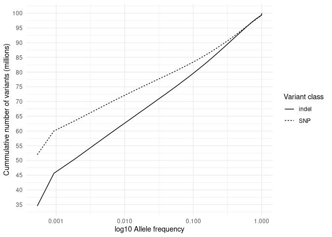
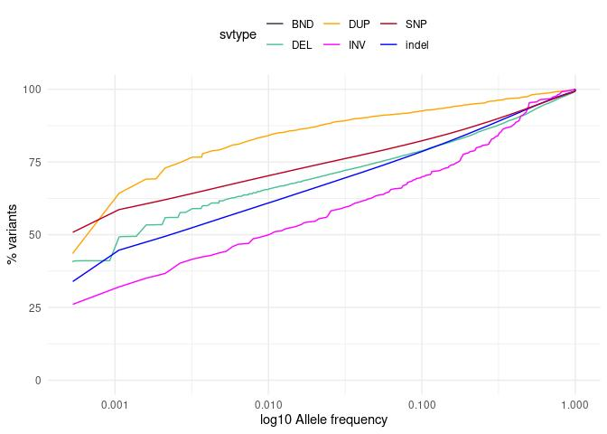
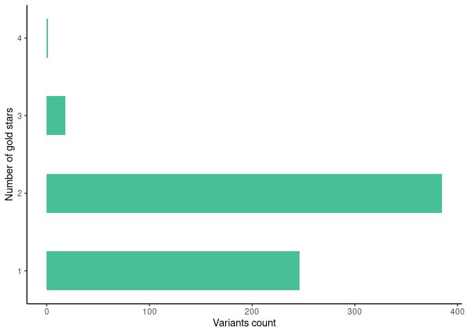
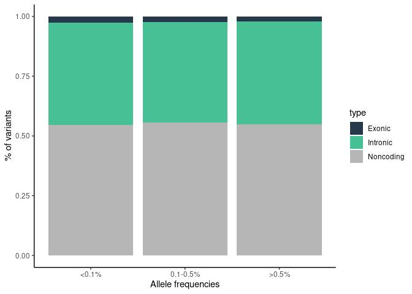
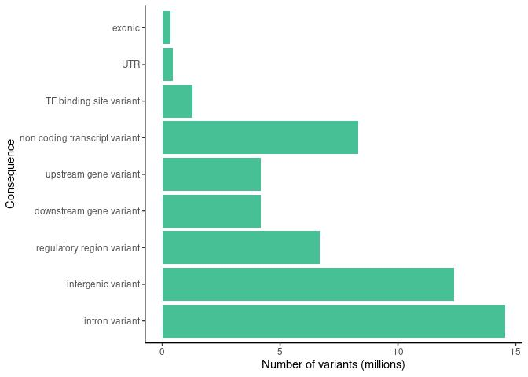
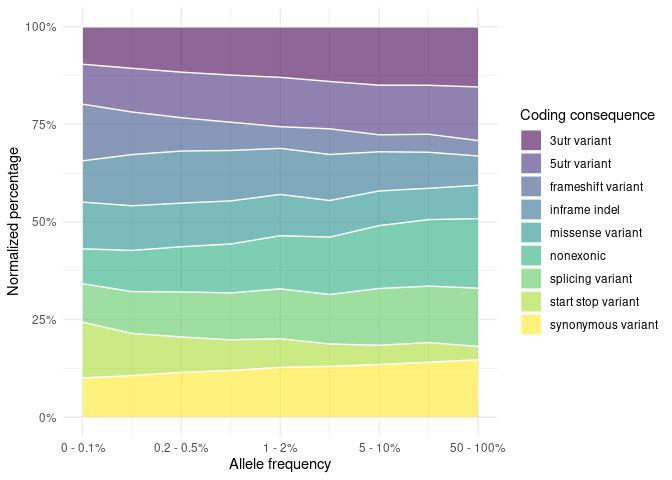
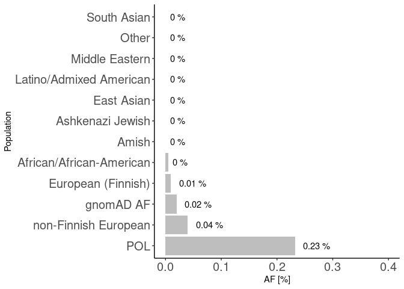
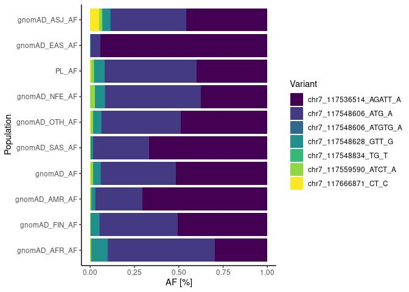

Variants in disease causing genes Results for 943 unrelated individuals
================

### Samples count

| Variant    | min\_count | mean\_count | max\_count |
|:-----------|-----------:|------------:|-----------:|
| Indels     |     751498 |      768905 |     781426 |
| Singletons |        436 |       16473 |      82329 |
| SNP        |    3637424 |     3715552 |    3776871 |

## Cummulative allele frequency

<!-- -->

    ## `summarise()` has grouped output by 'svtype'. You can override using the `.groups` argument.
    ## `summarise()` has grouped output by 'svtype'. You can override using the `.groups` argument.

<!-- -->

## ACMG

<!-- -->

### ClinVar variants

<!-- -->

| stars |   n |
|------:|----:|
|     1 | 141 |
|     2 | 108 |
|     3 |   9 |
|    NA |  68 |

variants with Clinvar stars

### Putative variants

### % IMPACT variants

<!-- -->

## Number of variants per impact

| VARIANT\_CLASS | AF       | HIGH |   LOW | MODERATE | MODIFIER |
|:---------------|:---------|-----:|------:|---------:|---------:|
| deletion       | &gt;0.5% |  500 |  1090 |      680 |  1697005 |
| indel          | &gt;0.5% |    0 |     2 |        2 |     4929 |
| insertion      | &gt;0.5% |  327 |  1280 |      630 |  1934758 |
| SNV            | &gt;0.5% | 1446 | 45903 |    39096 | 15294308 |
| deletion       | 0.1-0.5% |  813 |   582 |      859 |   885811 |
| indel          | 0.1-0.5% |    0 |     1 |        1 |    10935 |
| insertion      | 0.1-0.5% |  407 |   648 |      573 |  1010671 |
| SNV            | 0.1-0.5% | 1723 | 32131 |    41239 |  9509163 |
| deletion       | &lt;0.1% | 2600 |   946 |     1684 |  1383954 |
| indel          | &lt;0.1% |    1 |     1 |        4 |     7822 |
| insertion      | &lt;0.1% | 1219 |   773 |      983 |  1062161 |
| SNV            | &lt;0.1% | 4967 | 68293 |   100838 | 19225909 |

### Variants per coding consequence

    ## `summarise()` has grouped output by 'Coding_var_category'. You can override using the `.groups` argument.

    ## `summarise()` has grouped output by 'Konsekwencje'. You can override using the `.groups` argument.

<!-- --><!-- -->

### Variants per non-coding consequence

    ## `summarise()` has grouped output by 'noncoding.var_category'. You can override using the `.groups` argument.

<!-- -->

## NBS: chr8\_89971213\_ATTTGT\_A

<!-- -->

## Cystic fybrosis: chr7\_117559590\_ATCT\_A

<!-- -->

## CFTR deletions

<!-- -->

| Uploaded\_variation       |    PL\_AF | gnomAD\_AF | gnomAD\_AFR\_AF | gnomAD\_AMR\_AF | gnomAD\_ASJ\_AF | gnomAD\_EAS\_AF | gnomAD\_FIN\_AF | gnomAD\_NFE\_AF | gnomAD\_OTH\_AF | gnomAD\_SAS\_AF |
|:--------------------------|----------:|-----------:|----------------:|----------------:|----------------:|----------------:|----------------:|----------------:|----------------:|----------------:|
| chr7\_117536514\_AGATT\_A | 0.1935310 |  0.2696000 |       0.2159000 |        0.384300 |        0.170500 |       0.4153000 |        0.300100 |       0.1875000 |        0.245500 |       0.3452000 |
| chr7\_117548606\_ATG\_A   | 0.2500000 |  0.2222000 |       0.4383000 |        0.144200 |        0.159400 |       0.0236600 |        0.260300 |       0.2703000 |        0.222900 |       0.1627000 |
| chr7\_117548606\_ATGTG\_A | 0.0005519 |  0.0013450 |       0.0056910 |        0.001099 |        0.000312 |       0.0000694 |        0.001146 |       0.0014410 |        0.001383 |       0.0003595 |
| chr7\_117548628\_GTT\_G   | 0.0282818 |  0.0223100 |       0.0669800 |        0.011230 |        0.017300 |       0.0014670 |        0.028040 |       0.0283400 |        0.022420 |       0.0063610 |
| chr7\_117548834\_TG\_T    | 0.0005308 |  0.0000085 |       0.0000000 |        0.000000 |        0.000000 |       0.0000000 |        0.000000 |       0.0000191 |        0.000000 |       0.0000000 |
| chr7\_117559590\_ATCT\_A  | 0.0095440 |  0.0070680 |       0.0029540 |        0.003673 |        0.005557 |       0.0000000 |        0.002222 |       0.0122700 |        0.006856 |       0.0019930 |
| chr7\_117666871\_CT\_C    | 0.0005302 |  0.0009436 |       0.0000617 |        0.000116 |        0.019400 |       0.0000000 |        0.000000 |       0.0002149 |        0.001802 |       0.0000000 |
