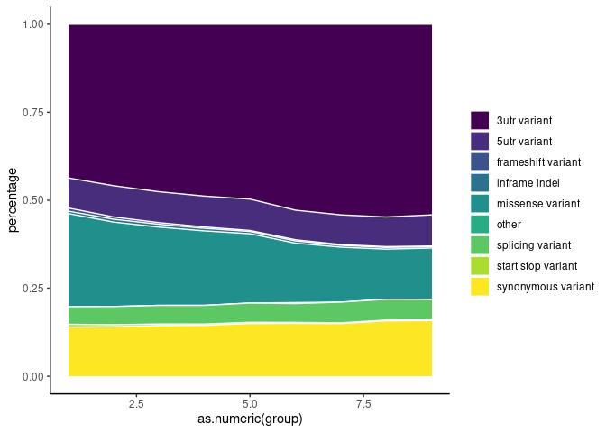

Variants in disease causing genes ewline Results for 943 unrelated
individuals
================

### Samples count

    ## Warning: `funs()` was deprecated in dplyr 0.8.0.
    ## Please use a list of either functions or lambdas: 
    ## 
    ##   # Simple named list: 
    ##   list(mean = mean, median = median)
    ## 
    ##   # Auto named with `tibble::lst()`: 
    ##   tibble::lst(mean, median)
    ## 
    ##   # Using lambdas
    ##   list(~ mean(., trim = .2), ~ median(., na.rm = TRUE))

| Variant    | min\_count | mean\_count | max\_count |
|:-----------|-----------:|------------:|-----------:|
| Indels     |     751498 |      768905 |     781426 |
| Singletons |        436 |       16473 |      82329 |
| SNP        |    3637424 |     3715552 |    3776871 |

## 1. Cummulative allele frequency

<!-- ```{r af_hist,echo=FALSE} -->
<!-- af <- read.table('../input/multisample_20210519.dv.bcfnorm.filtered.ACgt0.AF_list.tsv') -->
<!-- colnames(af) <- c('AF','id', 'allele_frequency', 'SNP', 'number_of_transitions', 'number_of transversions', 'indel', 'repeat-consistent','repeat-inconsistent', 'not_applicable') -->
<!-- af$allele_frequency[1] <- 0.000530223 -->
<!-- af_plot <- af %>% select(allele_frequency,SNP,indel)  -->
<!-- af_plot$SNP <- cumsum(af_plot$SNP)/1e+6 -->
<!-- af_plot$indel <- cumsum(af_plot$indel)/1e+6 -->
<!-- type.colors <- c(SNP = "#27384A", indel ="#48C095") -->
<!-- af_plot %>% -->
<!--   pivot_longer(-allele_frequency,names_to = 'Variant class', -->
<!--                values_to = 'Cummulative number of variants (millions)') %>% -->
<!--   ggplot(aes(allele_frequency,`Cummulative number of variants (millions)`, -->
<!--              col=`Variant class`)) + -->
<!--   geom_line() + -->
<!--   xlab('Allele frequency') + -->
<!--   scale_color_manual(values = type.colors) + -->
<!--   scale_y_continuous(breaks = seq(0,30,2)) + -->
<!--   theme_classic() -->
<!-- ``` -->

<!-- -->

    ## `summarise()` has grouped output by 'svtype'. You can override using the `.groups` argument.
    ## `summarise()` has grouped output by 'svtype'. You can override using the `.groups` argument.

<!-- -->

## 3. ACMG

<!-- -->

### 4. ClinVar variants

<!-- -->

| stars |   n |
|:------|----:|
| 1     | 325 |
| 2     | 293 |
| 3     |  22 |
| 4     |   1 |
| NA    | 122 |

### 5. Putative variants

<!-- -->

    ## Rows: 10,577
    ## Columns: 12
    ## $ Uploaded_variation <chr> "chr1_935833_C_G", "chr1_939121_C_T", "chr1_939382_…
    ## $ Location           <chr> "chr1:935833", "chr1:939121", "chr1:939382", "chr1:…
    ## $ CLIN_SIG           <chr> "-", "-", "-", "-", "-", "-", "-", "-", "-", "-", "…
    ## $ ClinVar_CLNSIG     <chr> "Uncertain_significance", "Uncertain_significance",…
    ## $ ClinVar_CLNREVSTAT <chr> "_single_submitter", "_single_submitter", "_single_…
    ## $ ClinVar_CLNDN      <chr> "not_provided", "not_provided", "not_provided", "no…
    ## $ SYMBOL             <chr> "SAMD11", "SAMD11", "SAMD11", "SAMD11", "SAMD11", "…
    ## $ Gene               <chr> "ENSG00000187634", "ENSG00000187634", "ENSG00000187…
    ## $ PL_AC              <int> 1, 1, 1, 1, 1, 1, 1, 1, 1, 1, 1, 1, 1, 1, 1, 1, 1, …
    ## $ PL_AF              <dbl> 0.000530223, 0.000530223, 0.000530223, 0.000548246,…
    ## $ gnomADg_AF_NFE     <dbl> 2.66916e-04, 2.67344e-04, 1.20643e-03, 6.83153e-05,…
    ## $ gnomADg_AF         <dbl> 1.29282e-04, 1.94238e-04, 9.40886e-04, 6.96980e-04,…

### 6. % IMPACT variants

<!-- -->

### 7. Variants per functional category

## 8. Number of variants per impact

| VARIANT\_CLASS | AF       | HIGH |   LOW | MODERATE | MODIFIER |
|:---------------|:---------|-----:|------:|---------:|---------:|
| deletion       | &gt;0.5% |  500 |  1090 |      680 |  1697005 |
| indel          | &gt;0.5% |    0 |     2 |        2 |     4929 |
| insertion      | &gt;0.5% |  327 |  1280 |      630 |  1934758 |
| SNV            | &gt;0.5% | 1446 | 45903 |    39096 | 15294308 |
| deletion       | 0.1-0.5% |  813 |   582 |      859 |   885811 |
| indel          | 0.1-0.5% |    0 |     1 |        1 |    10935 |
| insertion      | 0.1-0.5% |  407 |   648 |      573 |  1010671 |
| SNV            | 0.1-0.5% | 1723 | 32131 |    41239 |  9509163 |
| deletion       | &lt;0.1% | 2662 |   978 |     1731 |  1423061 |
| indel          | &lt;0.1% |    1 |     1 |        4 |     8770 |
| insertion      | &lt;0.1% | 1252 |   800 |     1015 |  1102882 |
| SNV            | &lt;0.1% | 5109 | 69962 |   103413 | 19741686 |

### 9. Variants per consequence

    ## Loading required package: viridisLite

    ## `summarise()` has grouped output by 'group'. You can override using the `.groups` argument.

<!-- -->

## 11. NBS

<!-- -->

## 12. Cystic fybrosis

<!-- -->
