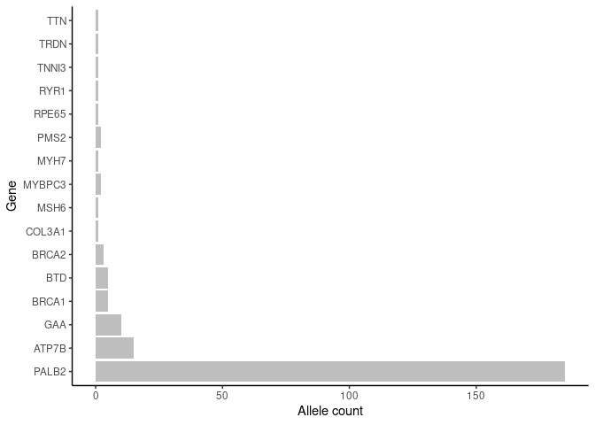
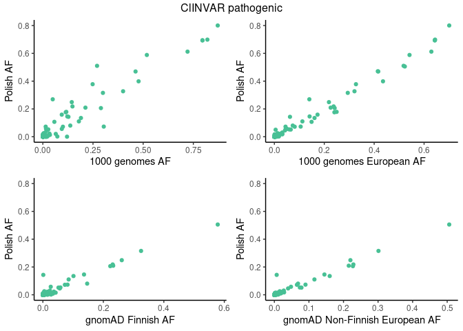
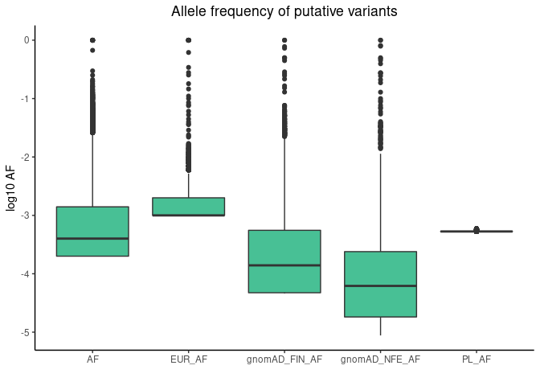
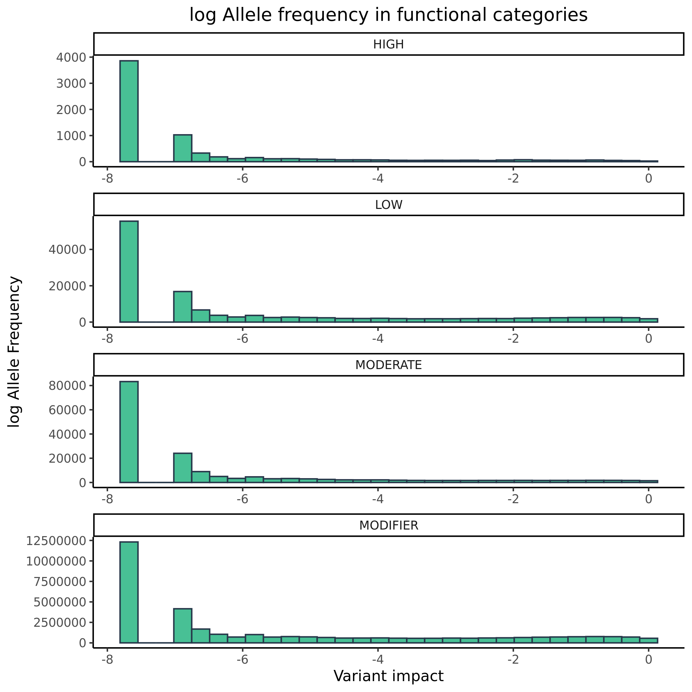

Variants in disease causing genes
================

## Variants distribution

<!-- -->

<!-- -->

<!-- -->

## Number of variants in functional categories

| VARIANT\_CLASS | AF        | HIGH |   LOW | MODERATE | MODIFIER |
|:---------------|:----------|-----:|------:|---------:|---------:|
| deletion       | &gt;0.5%  |   43 |    35 |        0 |   150334 |
| indel          | &gt;0.5%  |    0 |     9 |       34 |   143676 |
| insertion      | &gt;0.5%  |   13 |   531 |        1 |   508324 |
| SNV            | &gt;0.5%  | 1227 | 44112 |    39481 | 12521945 |
| deletion       | 0.1%-0.5% |    9 |     9 |        0 |    53728 |
| indel          | 0.1%-0.5% |    0 |     4 |       14 |    77320 |
| insertion      | 0.1%-0.5% |   18 |   181 |        0 |   172619 |
| SNV            | 0.1%-0.5% |  917 | 20302 |    26219 |  5148806 |
| deletion       | &lt;0.1%  |   21 |    30 |        0 |    56961 |
| indel          | &lt;0.1%  |    1 |     2 |       25 |    74527 |
| insertion      | &lt;0.1%  |   10 |   201 |       13 |   189150 |
| SNV            | &lt;0.1%  | 4855 | 72138 |   107331 | 16155908 |
