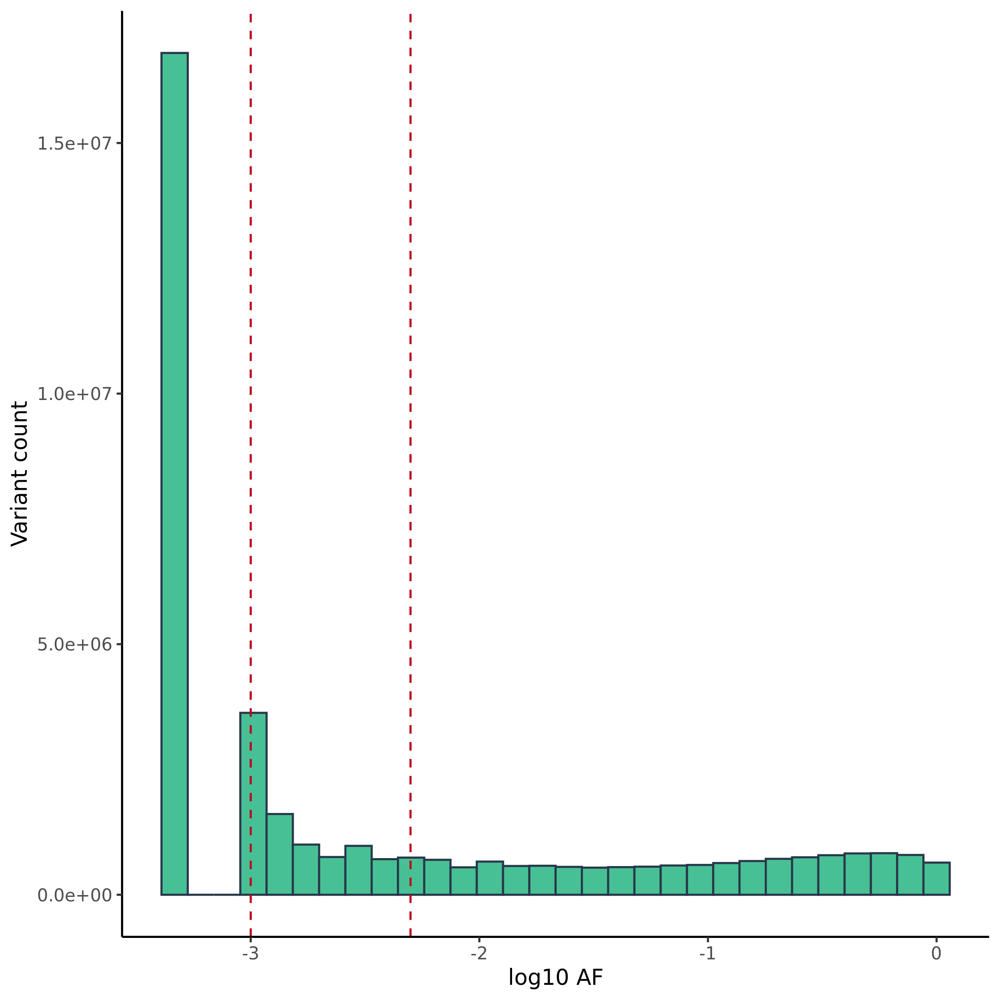

Variants in disease causing genes
================

## Variants distribution

| group           |   n |
|:----------------|----:|
| AF              |   1 |
| EUR\_AF         |   2 |
| gnomAD\_FIN\_AF |   5 |
| gnomAD\_NFE\_AF |  19 |
| PL\_AF          |  44 |

<!-- -->

<!-- -->

<!-- --><!-- -->

## Number of variants in functional categories

| VARIANT\_CLASS | AF        | HIGH |   LOW | MODERATE | MODIFIER |
|:---------------|:----------|-----:|------:|---------:|---------:|
| deletion       | &gt;0.5%  |  403 |   855 |      601 |  1210028 |
| indel          | &gt;0.5%  |    0 |     2 |        2 |     3484 |
| insertion      | &gt;0.5%  |  258 |   981 |      563 |  1384256 |
| SNV            | &gt;0.5%  | 1095 | 41158 |    35424 | 10817994 |
| deletion       | 0.1%-0.5% |  671 |   454 |      764 |   625283 |
| indel          | 0.1%-0.5% |    0 |     1 |        1 |     7912 |
| insertion      | 0.1%-0.5% |  347 |   507 |      513 |   717725 |
| SNV            | 0.1%-0.5% | 1392 | 28745 |    37598 |  6726111 |
| deletion       | &lt;0.1%  | 2308 |   776 |     1542 |   991868 |
| indel          | &lt;0.1%  |    1 |     0 |        4 |     6354 |
| insertion      | &lt;0.1%  | 1093 |   629 |      908 |   772858 |
| SNV            | &lt;0.1%  | 4349 | 62644 |    94482 | 13763231 |
| deletion       | 0%        |   57 |    25 |       40 |    27425 |
| indel          | 0%        |    0 |     0 |        0 |      703 |
| insertion      | 0%        |   29 |    18 |       29 |    28774 |
| SNV            | 0%        |  120 |  1474 |     2350 |   368281 |
