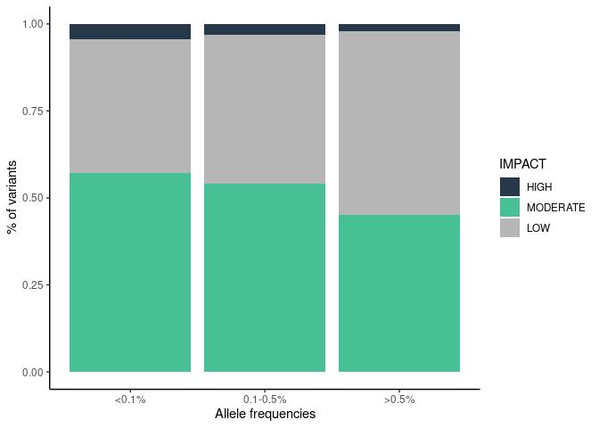

Variants in disease causing genes ewline Results for 943 unrelated
individuals
================

## 1. Allele frequency

fixing <!-- # ```{r af_hist,echo=FALSE} --> <!-- # library(png) -->
<!-- # img1_path <- "variants_af_files/figure-gfm/afhist.png" -->
<!-- # img1 <- readPNG(img1_path, native = TRUE, info = TRUE) -->
<!-- # include_graphics(img1_path) --> <!-- #  --> <!-- # ``` -->

## 2. Allele count

fixing

<!-- ```{r ac_hist,echo=FALSE} -->
<!-- library(png) -->
<!-- img1_path <- "variants_af_files/figure-gfm/ac_hist.png" -->
<!-- img1 <- readPNG(img1_path, native = TRUE, info = TRUE) -->
<!-- include_graphics(img1_path) -->
<!-- ``` -->

## 3. ACMG

<!-- -->

### 4. ClinVar variants

<!-- -->

    ## 
    ##   1   2   3   4 
    ## 700 611  32   2

### 5. Putative variants

<!-- -->

    ## Rows: 10,577
    ## Columns: 12
    ## $ Uploaded_variation <chr> "chr1_935833_C_G", "chr1_939121_C_T", "chr1_939382_…
    ## $ Location           <chr> "chr1:935833", "chr1:939121", "chr1:939382", "chr1:…
    ## $ CLIN_SIG           <chr> "-", "-", "-", "-", "-", "-", "-", "-", "-", "-", "…
    ## $ ClinVar_CLNSIG     <chr> "Uncertain_significance", "Uncertain_significance",…
    ## $ ClinVar_CLNREVSTAT <chr> "_single_submitter", "_single_submitter", "_single_…
    ## $ ClinVar_CLNDN      <chr> "not_provided", "not_provided", "not_provided", "no…
    ## $ SYMBOL             <chr> "SAMD11", "SAMD11", "SAMD11", "SAMD11", "SAMD11", "…
    ## $ Gene               <chr> "ENSG00000187634", "ENSG00000187634", "ENSG00000187…
    ## $ PL_AC              <int> 1, 1, 1, 1, 1, 1, 1, 1, 1, 1, 1, 1, 1, 1, 1, 1, 1, …
    ## $ PL_AF              <dbl> 0.000530223, 0.000530223, 0.000530223, 0.000548246,…
    ## $ gnomADg_AF_NFE     <dbl> 2.66916e-04, 2.67344e-04, 1.20643e-03, 6.83153e-05,…
    ## $ gnomADg_AF         <dbl> 1.29282e-04, 1.94238e-04, 9.40886e-04, 6.96980e-04,…

### 6. % IMPACT variants

<!-- -->

### 7. Variants per functional category

<!-- -->

    ## Rows: 296
    ## Columns: 5
    ## $ group       <ord> <0.1%, <0.1%, <0.1%, <0.1%, <0.1%, <0.1%, <0.1%, <0.1%, <0…
    ## $ type        <fct> Exonic, Exonic, Exonic, Exonic, Exonic, Exonic, Exonic, Ex…
    ## $ IMPACT      <fct> HIGH, HIGH, HIGH, HIGH, HIGH, HIGH, HIGH, HIGH, HIGH, HIGH…
    ## $ Consequence <fct> "frameshift_variant", "frameshift_variant,NMD_transcript_v…
    ## $ n           <int> 3241, 36, 86, 2, 7, 5, 11, 5, 248, 2, 2, 2, 9, 1, 2, 1, 23…

### 9. Variants per consequence

<!-- -->

| category                      |  millions |
|:------------------------------|----------:|
| downstream gene variant       |  4.197780 |
| exonic                        |  0.352255 |
| intergenic variant            | 12.398470 |
| intron variant                | 14.546413 |
| non coding transcript variant |  8.306713 |
| regulatory region variant     |  6.685747 |
| TF binding site variant       |  1.270847 |
| upstream gene variant         |  4.180143 |
| UTR                           |  0.441846 |

| Consequence                                                                           |        n | category                      |
|:--------------------------------------------------------------------------------------|---------:|:------------------------------|
| 3 prime UTR variant                                                                   |   365663 | UTR                           |
| 3 prime UTR variant,NMD transcript variant                                            |     7654 | UTR                           |
| 5 prime UTR variant                                                                   |    67920 | UTR                           |
| 5 prime UTR variant,NMD transcript variant                                            |      609 | UTR                           |
| frameshift variant                                                                    |     4790 | exonic                        |
| frameshift variant,NMD transcript variant                                             |       47 | exonic                        |
| frameshift variant,splice region variant                                              |      152 | exonic                        |
| frameshift variant,splice region variant,intron variant                               |        1 | exonic                        |
| frameshift variant,splice region variant,NMD transcript variant                       |        3 | exonic                        |
| frameshift variant,start lost                                                         |       10 | exonic                        |
| frameshift variant,start lost,start retained variant                                  |       11 | exonic                        |
| frameshift variant,stop lost                                                          |       21 | exonic                        |
| frameshift variant,stop retained variant                                              |       11 | exonic                        |
| inframe deletion                                                                      |     3174 | exonic                        |
| inframe deletion,NMD transcript variant                                               |       11 | exonic                        |
| inframe deletion,splice region variant                                                |       33 | exonic                        |
| inframe insertion                                                                     |     2150 | exonic                        |
| inframe insertion,NMD transcript variant                                              |        9 | exonic                        |
| inframe insertion,splice region variant                                               |       11 | exonic                        |
| inframe insertion,stop retained variant                                               |        1 | exonic                        |
| missense variant                                                                      |   175557 | exonic                        |
| missense variant,NMD transcript variant                                               |     1077 | exonic                        |
| missense variant,splice region variant                                                |     4495 | exonic                        |
| missense variant,splice region variant,NMD transcript variant                         |       44 | exonic                        |
| mature miRNA variant                                                                  |      596 | non coding transcript variant |
| non coding transcript exon variant                                                    |   516086 | non coding transcript variant |
| non coding transcript variant                                                         |        2 | non coding transcript variant |
| intron variant,NMD transcript variant                                                 |   408475 | non coding transcript variant |
| intron variant,non coding transcript variant                                          |  7381554 | non coding transcript variant |
| regulatory region variant                                                             |  6685747 | regulatory region variant     |
| intron variant                                                                        | 14546413 | intron variant                |
| splice acceptor variant                                                               |      831 | exonic                        |
| splice acceptor variant,3 prime UTR variant,intron variant,NMD transcript variant     |        1 | exonic                        |
| splice acceptor variant,3 prime UTR variant,NMD transcript variant                    |        1 | exonic                        |
| splice acceptor variant,5 prime UTR variant                                           |        2 | exonic                        |
| splice acceptor variant,5 prime UTR variant,intron variant                            |        8 | exonic                        |
| splice acceptor variant,coding sequence variant                                       |       15 | exonic                        |
| splice acceptor variant,coding sequence variant,5 prime UTR variant,intron variant    |        1 | exonic                        |
| splice acceptor variant,coding sequence variant,intron variant                        |       28 | exonic                        |
| splice acceptor variant,coding sequence variant,intron variant,NMD transcript variant |        1 | exonic                        |
| splice acceptor variant,frameshift variant                                            |        2 | exonic                        |
| splice acceptor variant,intron variant                                                |       26 | exonic                        |
| splice acceptor variant,intron variant,NMD transcript variant                         |        4 | exonic                        |
| splice acceptor variant,intron variant,non coding transcript variant                  |       24 | exonic                        |
| splice acceptor variant,NMD transcript variant                                        |       28 | exonic                        |
| splice acceptor variant,non coding transcript exon variant                            |       19 | exonic                        |
| splice acceptor variant,non coding transcript exon variant,intron variant             |       32 | exonic                        |
| splice acceptor variant,non coding transcript variant                                 |      916 | exonic                        |
| splice donor variant                                                                  |     1170 | exonic                        |
| splice donor variant,3 prime UTR variant                                              |        1 | exonic                        |
| splice donor variant,3 prime UTR variant,intron variant,NMD transcript variant        |        2 | exonic                        |
| splice donor variant,3 prime UTR variant,NMD transcript variant                       |        1 | exonic                        |
| splice donor variant,5 prime UTR variant                                              |        3 | exonic                        |
| splice donor variant,5 prime UTR variant,intron variant                               |        6 | exonic                        |
| splice donor variant,coding sequence variant                                          |       31 | exonic                        |
| splice donor variant,coding sequence variant,3 prime UTR variant                      |        1 | exonic                        |
| splice donor variant,coding sequence variant,intron variant                           |       51 | exonic                        |
| splice donor variant,coding sequence variant,NMD transcript variant                   |        1 | exonic                        |
| splice donor variant,intron variant                                                   |       45 | exonic                        |
| splice donor variant,intron variant,NMD transcript variant                            |        2 | exonic                        |
| splice donor variant,intron variant,non coding transcript variant                     |       36 | exonic                        |
| splice donor variant,NMD transcript variant                                           |       31 | exonic                        |
| splice donor variant,non coding transcript exon variant                               |       28 | exonic                        |
| splice donor variant,non coding transcript exon variant,intron variant                |       34 | exonic                        |
| splice donor variant,non coding transcript variant                                    |     1216 | exonic                        |
| splice region variant,3 prime UTR variant                                             |       57 | exonic                        |
| splice region variant,3 prime UTR variant,NMD transcript variant                      |      101 | exonic                        |
| splice region variant,5 prime UTR variant                                             |      670 | exonic                        |
| splice region variant,5 prime UTR variant,NMD transcript variant                      |       11 | exonic                        |
| splice region variant,intron variant                                                  |    21328 | exonic                        |
| splice region variant,intron variant,NMD transcript variant                           |      508 | exonic                        |
| splice region variant,intron variant,non coding transcript variant                    |     7745 | exonic                        |
| splice region variant,non coding transcript exon variant                              |     3654 | exonic                        |
| splice region variant,non coding transcript variant                                   |       63 | exonic                        |
| splice region variant,synonymous variant                                              |     2925 | exonic                        |
| splice region variant,synonymous variant,NMD transcript variant                       |       22 | exonic                        |
| start lost                                                                            |      380 | exonic                        |
| start lost,5 prime UTR variant                                                        |        4 | exonic                        |
| start lost,inframe deletion                                                           |        5 | exonic                        |
| start lost,NMD transcript variant                                                     |        3 | exonic                        |
| start lost,splice region variant                                                      |       12 | exonic                        |
| start lost,splice region variant,5 prime UTR variant                                  |        1 | exonic                        |
| start lost,start retained variant                                                     |        1 | exonic                        |
| start lost,start retained variant,5 prime UTR variant                                 |        3 | exonic                        |
| start lost,synonymous variant                                                         |        1 | exonic                        |
| stop gained                                                                           |     3517 | exonic                        |
| stop gained,frameshift variant                                                        |       76 | exonic                        |
| stop gained,frameshift variant,splice region variant                                  |        7 | exonic                        |
| stop gained,inframe deletion                                                          |        2 | exonic                        |
| stop gained,inframe insertion                                                         |        8 | exonic                        |
| stop gained,inframe insertion,splice region variant                                   |        2 | exonic                        |
| stop gained,NMD transcript variant                                                    |       22 | exonic                        |
| stop gained,protein altering variant                                                  |        1 | exonic                        |
| stop gained,splice region variant                                                     |      117 | exonic                        |
| stop gained,splice region variant,NMD transcript variant                              |        2 | exonic                        |
| stop lost                                                                             |      177 | exonic                        |
| stop lost,3 prime UTR variant                                                         |       12 | exonic                        |
| stop lost,3 prime UTR variant,NMD transcript variant                                  |        2 | exonic                        |
| stop lost,NMD transcript variant                                                      |        3 | exonic                        |
| stop lost,splice region variant                                                       |        1 | exonic                        |
| synonymous variant                                                                    |   113773 | exonic                        |
| synonymous variant,NMD transcript variant                                             |      682 | exonic                        |
| TF binding site variant                                                               |  1270842 | TF binding site variant       |
| TFBS ablation,TF binding site variant                                                 |        5 | TF binding site variant       |
| upstream gene variant                                                                 |  4180143 | upstream gene variant         |
| downstream gene variant                                                               |  4197780 | downstream gene variant       |
| intergenic variant                                                                    | 12398470 | intergenic variant            |
| coding sequence variant                                                               |       11 | exonic                        |
| coding sequence variant,3 prime UTR variant                                           |        2 | exonic                        |
| coding sequence variant,5 prime UTR variant                                           |        3 | exonic                        |
| coding sequence variant,NMD transcript variant                                        |        2 | exonic                        |
| stop retained variant                                                                 |       91 | exonic                        |
| stop retained variant,3 prime UTR variant                                             |       13 | exonic                        |
| stop retained variant,NMD transcript variant                                          |        3 | exonic                        |
| protein altering variant                                                              |       21 | exonic                        |
| protein altering variant,splice region variant                                        |        1 | exonic                        |
| incomplete terminal codon variant,coding sequence variant                             |        4 | exonic                        |

<!-- ## 9. Number of variants per impact -->
<!-- ```{r AF and IMPACT, echo=FALSE} -->
<!-- common <- read.table('../output/common_summary.tsv',header = T) -->
<!-- mediumrare <- read.table('../output/mediumrare_summary.tsv',header = T) -->
<!-- rare <- read.table('../output/rare_summary.tsv',header=T) -->
<!-- missing <- read.table('../output/missing_summary.tsv',header=T) -->
<!-- variants <- rbind(common,mediumrare,rare,missing) -->
<!-- kable(variants %>% pivot_wider(names_from = IMPACT, values_from = n, values_fill = 0) %>% -->
<!--         relocate(MODERATE, .before = MODIFIER) %>% filter(AF != '0%') -->
<!--         ) -->
<!-- ``` -->

## 9. NBS

<!-- -->

## 10. Mucoviscidosis

<!-- -->
