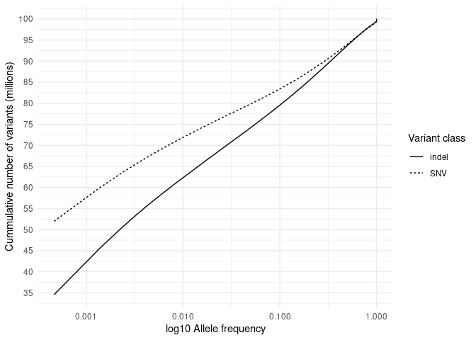
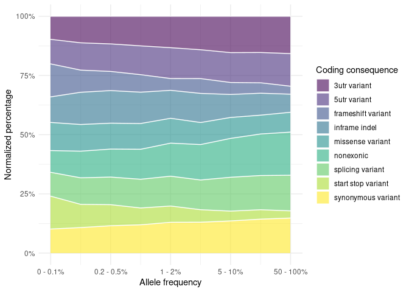

Variants in disease causing genes (1076 unrelated individuals)
================

### Samples count

| Variant    | min\_count | mean\_count | max\_count |
|:-----------|-----------:|------------:|-----------:|
| Indels     |     737369 |      764797 |     777759 |
| Singletons |       3202 |       15877 |     123142 |
| SNV        |    3596077 |     3714733 |    3807218 |

## Cummulative allele frequency

<!-- -->

| svtype |     n |
|:-------|------:|
| BND    |  3964 |
| DEL    | 19808 |
| DUP    |  2270 |
| INV    |   998 |

    ## `summarise()` has grouped output by 'svtype'. You can override using the `.groups` argument.
    ## `summarise()` has grouped output by 'svtype'. You can override using the `.groups` argument.

<!-- -->

## 3. ACMG

<!-- -->

### ClinVar variants pathogenic & likely pathogenic  filtered with gnomad3g AF &lt; 0.001

<!-- -->

| stars |   n |
|------:|----:|
|     1 | 309 |
|     2 | 473 |
|     3 |  23 |
|     4 |   3 |

variants with Clinvar stars

<!-- ### ClinVar variants pathogenic & likely pathogenic \ filtered with gnomad3g AF < 0.01 -->
<!-- ```{r clinvar_01, echo=FALSE, warning=FALSE} -->
<!-- clinsig <- fread('../input/diseases/clin_sig_ready.tsv',header=T)  -->
<!-- clinsig$gnomAD3g_AF <- ifelse(clinsig$gnomAD3g_AF == '-',0,clinsig$gnomAD3g_AF) -->
<!-- clinsig$gnomAD3g_AF <-as.numeric(clinsig$gnomAD3g_AF) -->
<!-- clinsig <- clinsig %>% -->
<!--   filter(gnomAD3g_AF < 0.01) %>% na.omit() -->
<!-- clinsig %>% na.omit() %>% -->
<!--   separate(Uploaded_variation, into=c('x','y','REF','ALT'),sep = '_') %>% -->
<!--   select(-x,-y,-Allele) %>% -->
<!--   relocate(Existing_variation, .before = REF) %>% -->
<!--   arrange(desc(gnomAD3g_AF)) %>% -->
<!--   write.table('comp_clinsig01.tsv',quote = F,col.names = T,sep='\t',row.names = F) -->
<!-- clinsig %>% na.omit() %>% -->
<!--   select(Existing_variation,stars) %>%  -->
<!--   distinct() %>% -->
<!--   ggplot(aes(y=factor(stars))) + -->
<!--   geom_bar(fill="gray",width=0.5) +  -->
<!--   theme_classic() + -->
<!--   ylab('Number of gold stars') + -->
<!--   xlab('Variants count')  -->
<!-- kable((clinsig %>% na.omit() %>% -->
<!--         select(Existing_variation,stars) %>%  -->
<!--         group_by(stars) %>% -->
<!--         count()),caption = 'variants with Clinvar stars') -->
<!-- ``` -->
<!-- ### Putative variants -->
<!-- ```{r putative, echo=FALSE, warning=FALSE} -->
<!-- putative <- fread('../input/diseases/putative_ready.tsv',header=T) -->
<!-- comp_putative <- putative %>%  -->
<!--    select(Uploaded_variation,Location,CLIN_SIG,ClinVar_CLNSIG,ClinVar_CLNREVSTAT, -->
<!--           ClinVar_CLNDN, SYMBOL, Gene, PL_AC, all_of(af_list)) %>% -->
<!--   mutate(across(PL_AF:gnomADg_AF,as.character)) %>% -->
<!--    mutate(across(PL_AF:gnomADg_AF,as.numeric)) %>% -->
<!--   filter(ClinVar_CLNSIG != '-')  -->
<!-- ``` -->
<!-- ### % IMPACT variants -->
<!-- ```{r echo=FALSE,warning=FALSE} -->
<!-- group.colors <- c(HIGH = "#27384A", MODERATE ="gray", LOW = "#B6B6B6") -->
<!-- stacked <- read.table('../input/diseases/impact_stacked_ready.tsv',sep='\t',header=T) -->
<!-- stacked$group <- factor(stacked$group) -->
<!-- stacked$group <- ordered(stacked$group, levels = c("<0.1%", "0.1-0.5%", ">0.5%")) -->
<!-- stacked %>% -->
<!-- ggplot(aes(fill=IMPACT,y=n,x=group)) + -->
<!-- geom_bar(position="fill", stat="identity") + -->
<!-- theme_classic() + -->
<!-- scale_fill_manual(values = group.colors) + -->
<!-- xlab('Allele frequencies') + -->
<!-- ylab('% of variants')  -->
<!-- ``` -->

## Number of variants per impact

| VARIANT\_CLASS | AF       | HIGH |   LOW | MODERATE | MODIFIER |
|:---------------|:---------|-----:|------:|---------:|---------:|
| deletion       | &gt;0.5% |  412 |   855 |      603 |  1208322 |
| insertion      | &gt;0.5% |  260 |   977 |      573 |  1380654 |
| SNV            | &gt;0.5% | 1109 | 41402 |    35717 | 10877171 |
| deletion       | 0.1-0.5% |  392 |   316 |      492 |   433985 |
| insertion      | 0.1-0.5% |  197 |   376 |      345 |   529654 |
| SNV            | 0.1-0.5% |  852 | 18675 |    23682 |  4375036 |
| deletion       | &lt;0.1% | 2849 |  1003 |     1988 |  1295678 |
| insertion      | &lt;0.1% | 1382 |   826 |     1144 |  1037730 |
| SNV            | &lt;0.1% | 5432 | 80467 |   119843 | 17817903 |

| IMPACT   |        n |
|:---------|---------:|
| HIGH     |    12885 |
| LOW      |   144897 |
| MODERATE |   184387 |
| MODIFIER | 38956133 |

    ## `summarise()` has grouped output by 'IMPACT'. You can override using the `.groups` argument.

| IMPACT   | AF       |        n |
|:---------|:---------|---------:|
| HIGH     | &lt;0.1% |     9663 |
| HIGH     | &gt;0.5% |     1781 |
| HIGH     | 0.1-0.5% |     1441 |
| LOW      | &lt;0.1% |    82296 |
| LOW      | &gt;0.5% |    43234 |
| LOW      | 0.1-0.5% |    19367 |
| MODERATE | &lt;0.1% |   122975 |
| MODERATE | &gt;0.5% |    36893 |
| MODERATE | 0.1-0.5% |    24519 |
| MODIFIER | &lt;0.1% | 20151311 |
| MODIFIER | &gt;0.5% | 13466147 |
| MODIFIER | 0.1-0.5% |  5338675 |

### Variants per coding consequence

    ## `summarise()` has grouped output by 'Coding_var_category'. You can override using the `.groups` argument.

    ## `summarise()` has grouped output by 'Konsekwencje'. You can override using the `.groups` argument.

<!-- -->

### Variants per non-coding consequence

    ## `summarise()` has grouped output by 'noncoding.var_category'. You can override using the `.groups` argument.

<!-- -->

## NBS: chr8\_89971213\_ATTTGT\_A

<!-- -->

## Cystic fybrosis: chr7\_117559590\_ATCT\_A

<!-- -->

## DHCR7

<!-- -->
