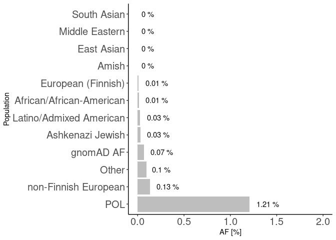

Variants in disease causing genes (1076 unrelated individuals)
================

### Samples count

| Variant    | min\_count | mean\_count | max\_count |
|:-----------|-----------:|------------:|-----------:|
| Indels     |     737369 |      764797 |     777759 |
| Singletons |       3202 |       15877 |     123142 |
| SNP        |    3596077 |     3714733 |    3807218 |

## Cummulative allele frequency

<!-- -->

    ## `summarise()` has grouped output by 'svtype'. You can override using the `.groups` argument.
    ## `summarise()` has grouped output by 'svtype'. You can override using the `.groups` argument.

<!-- -->

## ACMG

<!-- -->

### ClinVar variants pathogenic & likely pathogenic  filtered with gnomad3g AF &lt; 0.001

<!-- -->

| stars |   n |
|------:|----:|
|     1 | 309 |
|     2 | 473 |
|     3 |  23 |
|     4 |   3 |

variants with Clinvar stars

<!-- ### ClinVar variants pathogenic & likely pathogenic \ filtered with gnomad3g AF < 0.01 -->
<!-- ```{r clinvar_01, echo=FALSE, warning=FALSE} -->
<!-- clinsig <- fread('../input/diseases/clin_sig_ready.tsv',header=T)  -->
<!-- clinsig$gnomAD3g_AF <- ifelse(clinsig$gnomAD3g_AF == '-',0,clinsig$gnomAD3g_AF) -->
<!-- clinsig$gnomAD3g_AF <-as.numeric(clinsig$gnomAD3g_AF) -->
<!-- clinsig <- clinsig %>% -->
<!--   filter(gnomAD3g_AF < 0.01) %>% na.omit() -->
<!-- clinsig %>% na.omit() %>% -->
<!--   separate(Uploaded_variation, into=c('x','y','REF','ALT'),sep = '_') %>% -->
<!--   select(-x,-y,-Allele) %>% -->
<!--   relocate(Existing_variation, .before = REF) %>% -->
<!--   arrange(desc(gnomAD3g_AF)) %>% -->
<!--   write.table('comp_clinsig01.tsv',quote = F,col.names = T,sep='\t',row.names = F) -->
<!-- clinsig %>% na.omit() %>% -->
<!--   select(Existing_variation,stars) %>%  -->
<!--   distinct() %>% -->
<!--   ggplot(aes(y=factor(stars))) + -->
<!--   geom_bar(fill="gray",width=0.5) +  -->
<!--   theme_classic() + -->
<!--   ylab('Number of gold stars') + -->
<!--   xlab('Variants count')  -->
<!-- kable((clinsig %>% na.omit() %>% -->
<!--         select(Existing_variation,stars) %>%  -->
<!--         group_by(stars) %>% -->
<!--         count()),caption = 'variants with Clinvar stars') -->
<!-- ``` -->
<!-- ### Putative variants -->
<!-- ```{r putative, echo=FALSE, warning=FALSE} -->
<!-- putative <- fread('../input/diseases/putative_ready.tsv',header=T) -->
<!-- comp_putative <- putative %>%  -->
<!--    select(Uploaded_variation,Location,CLIN_SIG,ClinVar_CLNSIG,ClinVar_CLNREVSTAT, -->
<!--           ClinVar_CLNDN, SYMBOL, Gene, PL_AC, all_of(af_list)) %>% -->
<!--   mutate(across(PL_AF:gnomADg_AF,as.character)) %>% -->
<!--    mutate(across(PL_AF:gnomADg_AF,as.numeric)) %>% -->
<!--   filter(ClinVar_CLNSIG != '-')  -->
<!-- ``` -->
<!-- ### % IMPACT variants -->
<!-- ```{r echo=FALSE,warning=FALSE} -->
<!-- group.colors <- c(HIGH = "#27384A", MODERATE ="gray", LOW = "#B6B6B6") -->
<!-- stacked <- read.table('../input/diseases/impact_stacked_ready.tsv',sep='\t',header=T) -->
<!-- stacked$group <- factor(stacked$group) -->
<!-- stacked$group <- ordered(stacked$group, levels = c("<0.1%", "0.1-0.5%", ">0.5%")) -->
<!-- stacked %>% -->
<!-- ggplot(aes(fill=IMPACT,y=n,x=group)) + -->
<!-- geom_bar(position="fill", stat="identity") + -->
<!-- theme_classic() + -->
<!-- scale_fill_manual(values = group.colors) + -->
<!-- xlab('Allele frequencies') + -->
<!-- ylab('% of variants')  -->
<!-- ``` -->

## Number of variants per impact

| VARIANT\_CLASS | AF       | HIGH |   LOW | MODERATE | MODIFIER |
|:---------------|:---------|-----:|------:|---------:|---------:|
| deletion       | &gt;0.5% |  412 |   855 |      603 |  1208322 |
| indel          | &gt;0.5% |    0 |     2 |        3 |     3583 |
| insertion      | &gt;0.5% |  260 |   977 |      573 |  1380654 |
| SNV            | &gt;0.5% | 1109 | 41402 |    35717 | 10877171 |
| deletion       | 0.1-0.5% |  392 |   316 |      492 |   433985 |
| indel          | 0.1-0.5% |    0 |     1 |        0 |     6431 |
| insertion      | 0.1-0.5% |  197 |   376 |      345 |   529654 |
| SNV            | 0.1-0.5% |  852 | 18675 |    23682 |  4375036 |
| deletion       | &lt;0.1% | 2849 |  1003 |     1988 |  1295678 |
| indel          | &lt;0.1% |    1 |     0 |        4 |     8428 |
| insertion      | &lt;0.1% | 1382 |   826 |     1144 |  1037730 |
| SNV            | &lt;0.1% | 5432 | 80467 |   119843 | 17817903 |

<!-- ### Variants per coding consequence -->
<!-- ```{r, echo=FALSE,warning=F} -->
<!-- consequence <- read.table('plik_do_wykresu_consequence_data.tsv',header=T, -->
<!--                           sep='\t') -->
<!-- consequence$group <- factor( -->
<!--   consequence$group, levels = c('0 - 0.1%','0.1 - 0.2%', '0.2 - 0.5%', -->
<!--                                 '0.5 - 1%','1 - 2%','2 - 5%','5 - 10%', -->
<!--                                 '10 - 50%','50 - 100%')) -->
<!-- consequence$Konsekwencje <- consequence$Coding_var_category -->
<!-- levels(consequence$Konsekwencje) <-list(`wariant w regionie 3'UTR` = '3utr_variant',  -->
<!--                                         `wariant w regionie 5'UTR` = '5utr_variant', -->
<!--                                         `przesunięcie ramki odczytu` = 'frameshift_variant', -->
<!--                                         `insercja/delecja` = 'inframe_indel', -->
<!--                                         `wariant synonimiczny` = 'missense_variant', -->
<!--                                         `wariant niekodujący` = 'nonexonic', -->
<!--                                         inne = 'other', -->
<!--                                         `wariant splicingowy`='splicing_variant', -->
<!--                                         `wariant w kodonie start/stop` = 'start_stop_variant', -->
<!--                                         `wariant synonimiczny` = 'synonymous_variant') -->
<!-- consequence$Coding_var_category <- gsub('_',' ',consequence$Coding_var_category) -->
<!-- cons_plot <- consequence %>% group_by(Coding_var_category, group) %>% -->
<!--   summarise(n = sum(n)) %>%  -->
<!--   mutate(percentage = n/(sum(n)), -->
<!--          minmax = (n - min(n))/(max(n)-min(n)) -->
<!--            ) -->
<!-- cons_plot_pl <- consequence %>% group_by(Konsekwencje, group) %>% -->
<!--   summarise(n = sum(n)) %>%  -->
<!--   mutate(percentage = n/(sum(n)), -->
<!--          minmax = (n - min(n))/(max(n)-min(n)) -->
<!--            ) -->
<!-- cons_plot_pl %>% filter(Konsekwencje != 'inne') %>% -->
<!--   ggplot(aes(x=as.numeric(group),y=percentage,fill=Konsekwencje)) + -->
<!--   geom_area(alpha=0.6 , size=.5, colour="white",position = 'fill') + -->
<!--     scale_fill_viridis(discrete = T,'Typ wariantu') + -->
<!--   theme_minimal() + -->
<!--   scale_x_continuous(breaks = seq(1,9,2), labels = unique(cons_plot$group)[seq(1,9,2)]) + -->
<!--   scale_y_continuous(breaks = seq(0,1,0.25),labels = c('0%','25%','50%','75%','100%')) + -->
<!-- xlab('Przedziały częstości alleli') + -->
<!--   ylab('Procentowy udział wariantów w danym przedziale')  -->
<!-- cons_plot %>% filter(Coding_var_category != 'other') %>% -->
<!--   ggplot(aes(x=as.numeric(group),y=percentage,fill=Coding_var_category)) + -->
<!--   geom_area(alpha=0.6 , size=.5, colour="white",position = 'fill') + -->
<!--     scale_fill_viridis(discrete = T,'Coding consequence') + -->
<!--   theme_minimal() + -->
<!--   scale_x_continuous(breaks = seq(1,9,2), labels = unique(cons_plot$group)[seq(1,9,2)]) + -->
<!--   scale_y_continuous(breaks = seq(0,1,0.25),labels = c('0%','25%','50%','75%','100%')) + -->
<!-- xlab('Allele frequency') + -->
<!--   ylab('Normalized percentage')  -->
<!-- ``` -->
<!-- ### Variants per non-coding consequence -->
<!-- ```{r non-coding consequence, echo=FALSE} -->
<!-- consequence$noncoding.var_category <- gsub('_',' ',consequence$noncoding.var_category) -->
<!-- cons_plot <- consequence %>% group_by(noncoding.var_category, group) %>% -->
<!--   summarise(n = sum(n)) %>%  -->
<!--   mutate(percentage = n/(sum(n)), -->
<!--          minmax = (n - min(n))/(max(n)-min(n)) -->
<!--            ) -->
<!-- cons_plot %>%  -->
<!--   ggplot(aes(x=as.numeric(group),y=percentage,fill=noncoding.var_category)) + -->
<!--   geom_area(alpha=0.6 , size=.5, colour="white",position = 'fill') + -->
<!--     scale_fill_viridis(discrete = T, 'Coding consequence') + -->
<!--   theme_minimal() + -->
<!--   scale_x_continuous(breaks = seq(1,9,2), labels = unique(cons_plot$group)[seq(1,9,2)]) + -->
<!-- xlab('Allele frequency') + -->
<!--   ylab('Normalized percentage')  -->
<!-- ``` -->

## NBS: chr8\_89971213\_ATTTGT\_A

<!-- -->

## Cystic fybrosis: chr7\_117559590\_ATCT\_A

<!-- -->

## DHCR7

<!-- -->
