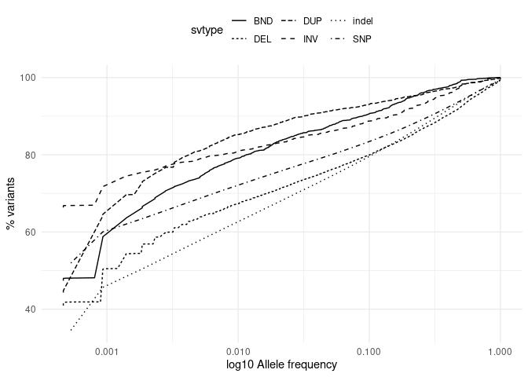
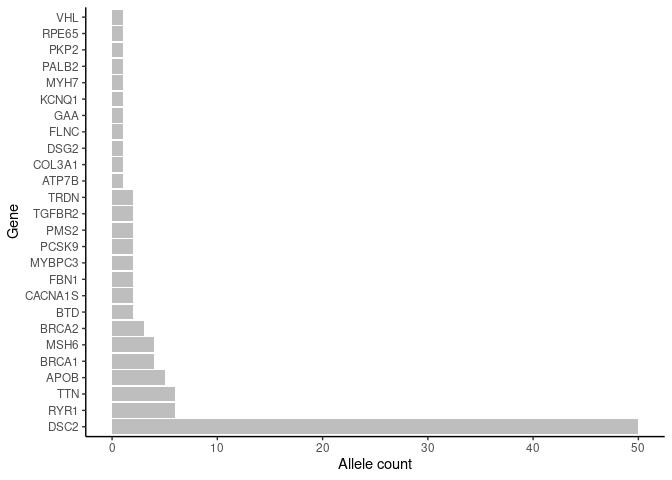
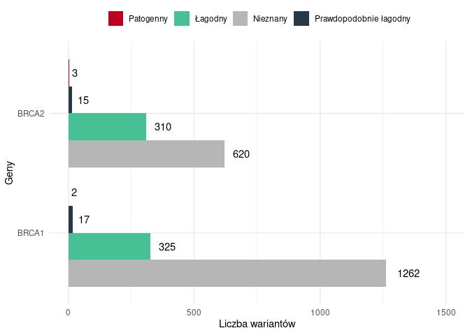
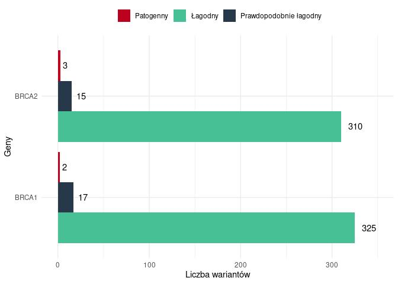

Variants in disease causing genes Results for 943 unrelated individuals
================

### Samples count

| Variant    | min\_count | mean\_count | max\_count |
|:-----------|-----------:|------------:|-----------:|
| Indels     |     751498 |      768905 |     781426 |
| Singletons |        436 |       16473 |      82329 |
| SNP        |    3637424 |     3715552 |    3776871 |

## Cummulative allele frequency

<!-- -->

    ## `summarise()` has grouped output by 'svtype'. You can override using the `.groups` argument.
    ## `summarise()` has grouped output by 'svtype'. You can override using the `.groups` argument.

<!-- -->

## ACMG

<!-- -->

## ClinVar variants pathogenic & likely pathogenic  filtered with gnomad3g AF &lt; 0.001

<!-- -->

| stars |   n |
|------:|----:|
|     1 | 282 |
|     2 | 432 |
|     3 |  20 |
|     4 |   2 |

variants with Clinvar stars

### BRCA for conference

    ## `summarise()` has grouped output by 'SYMBOL'. You can override using the `.groups` argument.

<!-- -->

    ## `summarise()` has grouped output by 'SYMBOL'. You can override using the `.groups` argument.

<!-- -->

## ClinVar variants pathogenic & likely pathogenic  filtered with gnomad3g AF &lt; 0.01

<!-- -->

| stars |   n |
|------:|----:|
|     1 | 299 |
|     2 | 487 |
|     3 |  24 |
|     4 |   4 |

variants with Clinvar stars

### Putative variants

### % IMPACT variants

<!-- -->

## Number of variants per impact

| VARIANT\_CLASS | AF       | HIGH |   LOW | MODERATE | MODIFIER |
|:---------------|:---------|-----:|------:|---------:|---------:|
| deletion       | &gt;0.5% |  500 |  1090 |      680 |  1697005 |
| indel          | &gt;0.5% |    0 |     2 |        2 |     4929 |
| insertion      | &gt;0.5% |  327 |  1280 |      630 |  1934758 |
| SNV            | &gt;0.5% | 1446 | 45903 |    39096 | 15294308 |
| deletion       | 0.1-0.5% |  813 |   582 |      859 |   885811 |
| indel          | 0.1-0.5% |    0 |     1 |        1 |    10935 |
| insertion      | 0.1-0.5% |  407 |   648 |      573 |  1010671 |
| SNV            | 0.1-0.5% | 1723 | 32131 |    41239 |  9509163 |
| deletion       | &lt;0.1% | 2600 |   946 |     1684 |  1383954 |
| indel          | &lt;0.1% |    1 |     1 |        4 |     7822 |
| insertion      | &lt;0.1% | 1219 |   773 |      983 |  1062161 |
| SNV            | &lt;0.1% | 4967 | 68293 |   100838 | 19225909 |

### Variants per coding consequence

    ## `summarise()` has grouped output by 'Coding_var_category'. You can override using the `.groups` argument.

    ## `summarise()` has grouped output by 'Konsekwencje'. You can override using the `.groups` argument.

<!-- --><!-- -->

### Variants per non-coding consequence

    ## `summarise()` has grouped output by 'noncoding.var_category'. You can override using the `.groups` argument.

<!-- -->

## NBS: chr8\_89971213\_ATTTGT\_A

<!-- -->

## Cystic fybrosis: chr7\_117559590\_ATCT\_A

<!-- -->

## DHCR7

<!-- -->
