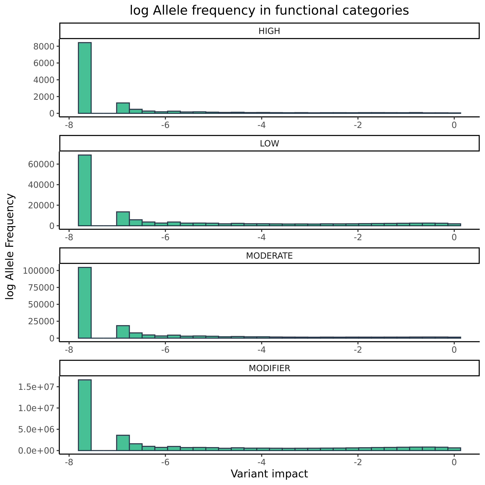

Variants in disease causing genes
================

<!-- -->

<!-- -->

<!-- -->

## Number of variants in functional categories

| VARIANT\_CLASS | AF        | HIGH |   LOW | MODERATE | MODIFIER |
|:---------------|:----------|-----:|------:|---------:|---------:|
| deletion       | &gt;0.5%  |  143 |   451 |      197 |   542334 |
| insertion      | &gt;0.5%  |   87 |   286 |      121 |   353952 |
| SNV            | &gt;0.5%  |  514 | 22991 |    16169 |  6585339 |
| deletion       | 0.1%-0.5% |  126 |   114 |      159 |   183224 |
| insertion      | 0.1%-0.5% |   45 |   109 |       91 |   113500 |
| SNV            | 0.1%-0.5% |  385 | 14143 |    12975 |  3358319 |
| deletion       | &lt;0.1%  |  248 |   150 |      288 |   191783 |
| insertion      | &lt;0.1%  |  122 |    90 |       92 |    86088 |
| SNV            | &lt;0.1%  | 1260 | 33172 |    42126 |  6189009 |
